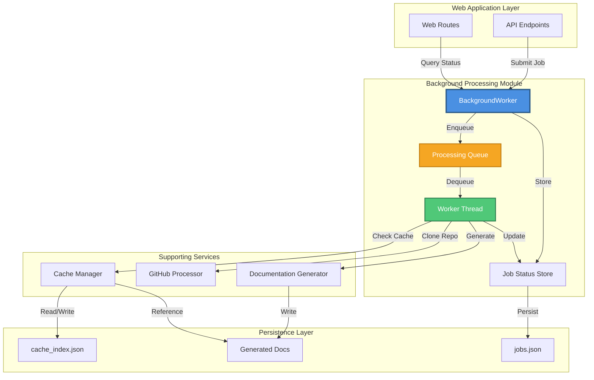
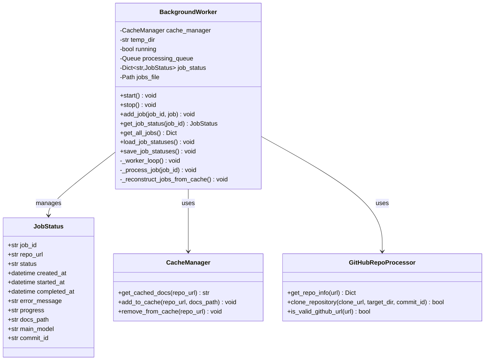
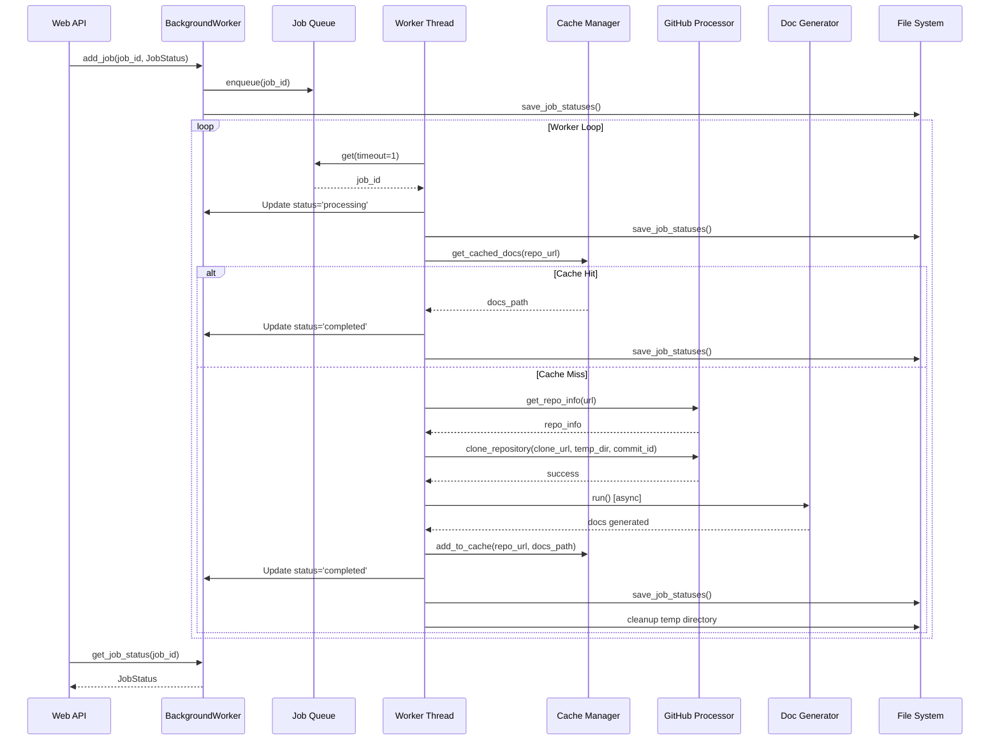
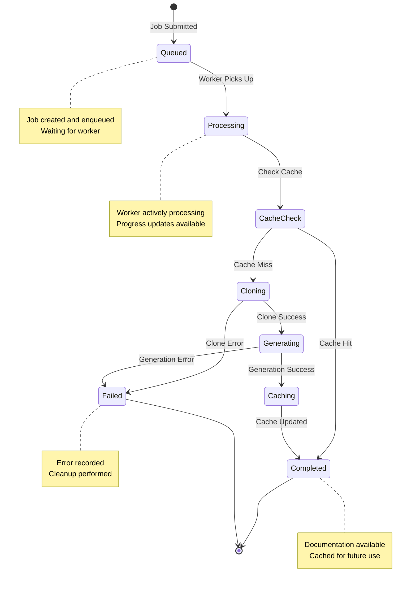
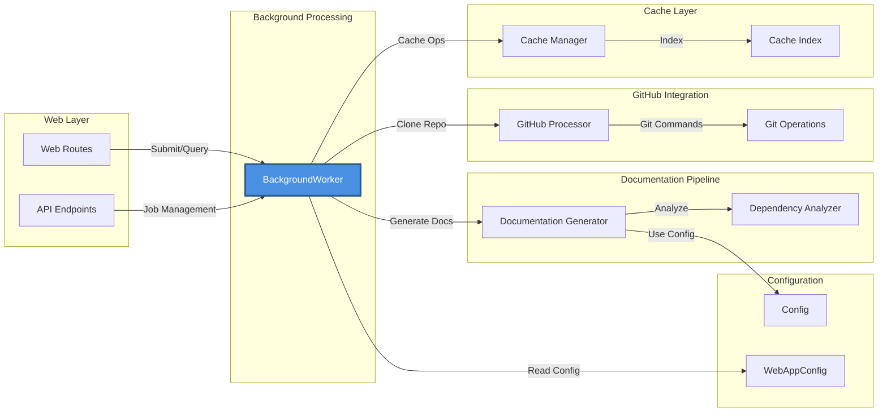
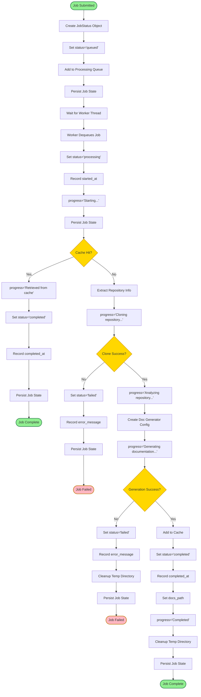
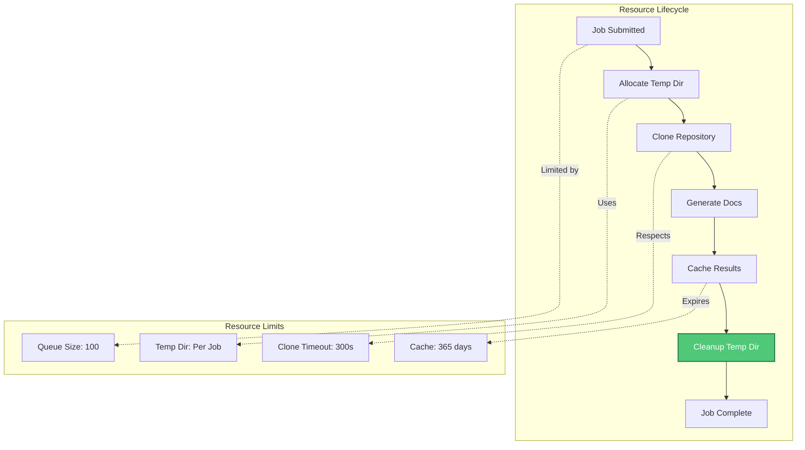
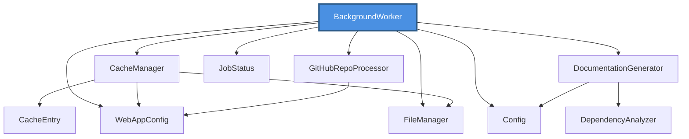
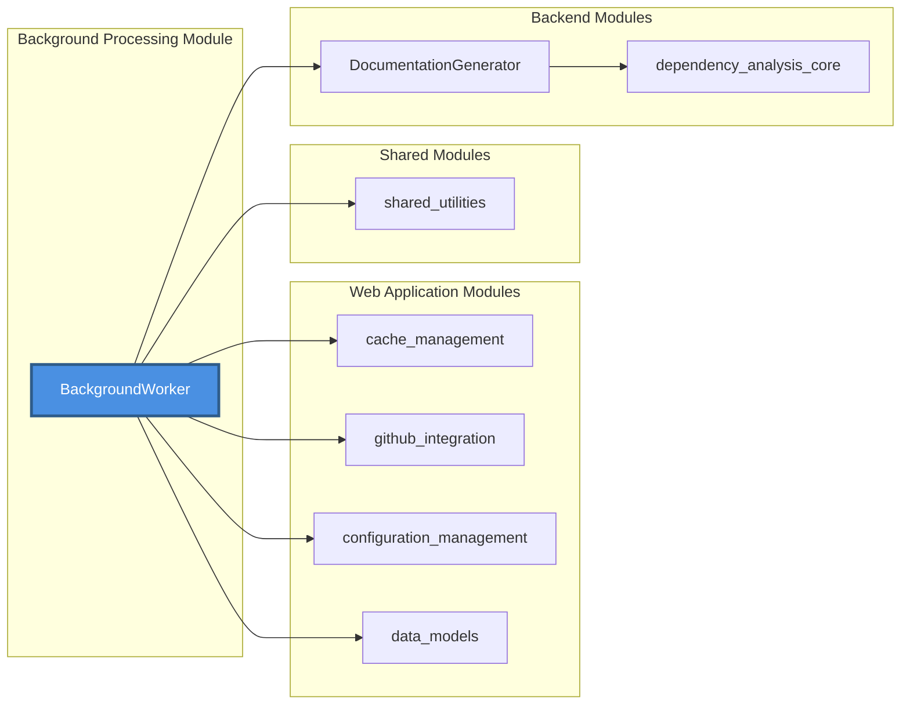

# Background Processing Module

## Overview

The **background_processing** module is a critical component of the CodeWiki web application that manages asynchronous documentation generation jobs. It provides a robust, thread-based background worker system that processes repository documentation requests without blocking the main web application, enabling scalable and efficient handling of long-running documentation generation tasks.

This module serves as the orchestration layer between user requests and the actual documentation generation pipeline, managing job lifecycle, state persistence, cache integration, and repository processing.

---

## Table of Contents

- [Architecture](#architecture)
- [Core Components](#core-components)
- [Job Processing Workflow](#job-processing-workflow)
- [State Management](#state-management)
- [Integration Points](#integration-points)
- [Job Lifecycle](#job-lifecycle)
- [Error Handling](#error-handling)
- [Performance Considerations](#performance-considerations)
- [Dependencies](#dependencies)

---

## Architecture

The background processing module implements a producer-consumer pattern with persistent state management, enabling reliable asynchronous job processing.



### Architectural Principles

1. **Asynchronous Processing**: Jobs are processed in a separate daemon thread to avoid blocking the web server
2. **State Persistence**: Job statuses are persisted to disk for recovery across restarts
3. **Cache-First Strategy**: Checks cache before initiating expensive documentation generation
4. **Queue-Based Scheduling**: FIFO queue ensures fair processing of submitted jobs
5. **Graceful Degradation**: Failed jobs are marked appropriately without affecting other jobs

---

## Core Components

### BackgroundWorker

The `BackgroundWorker` class is the central orchestrator for all background processing operations.



#### Key Responsibilities

- **Job Queue Management**: Maintains a bounded queue of pending jobs
- **Worker Thread Lifecycle**: Starts and stops the background processing thread
- **Status Tracking**: Tracks all jobs with detailed status information
- **Persistence**: Saves and loads job states from disk
- **Cache Integration**: Coordinates with cache manager to avoid redundant work
- **Repository Processing**: Orchestrates repository cloning and documentation generation

#### Configuration

The worker is configured through `WebAppConfig`:

| Parameter | Default | Description |
|-----------|---------|-------------|
| `QUEUE_SIZE` | 100 | Maximum number of jobs in queue |
| `TEMP_DIR` | `./output/temp` | Temporary directory for cloned repositories |
| `CACHE_DIR` | `./output/cache` | Directory for cache and job persistence |
| `CLONE_TIMEOUT` | 300 seconds | Timeout for git clone operations |

---

## Job Processing Workflow

The background worker follows a well-defined workflow for processing each documentation generation job.



### Processing Stages

1. **Job Submission**
   - Job is created with status `queued`
   - Added to processing queue
   - Initial state persisted to disk

2. **Job Pickup**
   - Worker thread dequeues job
   - Status updated to `processing`
   - Start time recorded

3. **Cache Check**
   - Query cache manager for existing documentation
   - If found and valid, skip to completion
   - If not found, proceed to generation

4. **Repository Cloning**
   - Extract repository information from URL
   - Clone repository to temporary directory
   - Optionally checkout specific commit

5. **Documentation Generation**
   - Create configuration for doc generator
   - Run async documentation generation
   - Generate complete documentation set

6. **Cache Update**
   - Add generated documentation to cache
   - Update cache index

7. **Completion**
   - Update job status to `completed` or `failed`
   - Record completion time and results
   - Persist final state
   - Cleanup temporary files

---

## State Management

The module implements comprehensive state management to ensure reliability and recoverability.



### Job Status States

| State | Description | Next States |
|-------|-------------|-------------|
| `queued` | Job submitted, waiting in queue | `processing` |
| `processing` | Worker actively processing job | `completed`, `failed` |
| `completed` | Documentation successfully generated | Terminal state |
| `failed` | Job failed with error | Terminal state |

### Persistence Strategy

The module persists job states to `jobs.json` in the cache directory:

```json
{
  "owner--repo": {
    "job_id": "owner--repo",
    "repo_url": "https://github.com/owner/repo",
    "status": "completed",
    "created_at": "2024-01-15T10:30:00",
    "started_at": "2024-01-15T10:30:05",
    "completed_at": "2024-01-15T10:35:20",
    "error_message": null,
    "progress": "Documentation generation completed",
    "docs_path": "/path/to/docs",
    "main_model": "gpt-4",
    "commit_id": "abc123"
  }
}
```

### State Recovery

On startup, the worker:
1. Loads completed jobs from `jobs.json`
2. If no job file exists, reconstructs from cache index
3. Only loads completed jobs to avoid inconsistent states
4. Discards in-progress jobs (they will be resubmitted if needed)

---

## Integration Points

The background processing module integrates with multiple system components.



### Module Dependencies

- **[cache_management](cache_management.md)**: Provides caching functionality to avoid redundant documentation generation
- **[github_integration](github_integration.md)**: Handles repository cloning and GitHub-specific operations
- **[configuration_management](configuration_management.md)**: Supplies web application configuration
- **[data_models](data_models.md)**: Defines JobStatus and other data structures
- **[shared_utilities](shared_utilities.md)**: Provides Config and FileManager utilities

### External Dependencies

- **DocumentationGenerator**: Core documentation generation engine (from backend)
- **Queue**: Python standard library for thread-safe job queue
- **threading**: Python standard library for background worker thread
- **subprocess**: For git operations and cleanup
- **asyncio**: For running async documentation generation

---

## Job Lifecycle

A detailed view of the complete job lifecycle from submission to completion.



---

## Error Handling

The module implements comprehensive error handling at multiple levels.

### Error Categories

1. **Queue Errors**
   - Queue full: Job rejected with appropriate error
   - Queue timeout: Worker continues to next iteration

2. **Clone Errors**
   - Invalid URL: Caught during validation
   - Clone timeout: Subprocess timeout after 300 seconds
   - Network errors: Captured in stderr and logged

3. **Generation Errors**
   - Configuration errors: Caught and recorded
   - Analysis failures: Propagated from documentation generator
   - File system errors: Caught during output writing

4. **Cleanup Errors**
   - Logged but don't fail the job
   - Temporary directories cleaned on best-effort basis

### Error Recovery

```mermaid
flowchart LR
    Error[Error Occurs] --> Catch[Exception Caught]
    Catch --> UpdateStatus[Update Job Status]
    UpdateStatus --> RecordError[Record Error Message]
    RecordError --> UpdateProgress[Update Progress]
    UpdateProgress --> Persist[Persist State]
    Persist --> Cleanup[Attempt Cleanup]
    Cleanup --> Log[Log Error]
    Log --> Continue[Continue Processing]
    
    style Error fill:#FFB6C1,stroke:#C17D11,stroke-width:2px
    style Continue fill:#90EE90,stroke:#2E7D4E,stroke-width:2px
```



### Error Information

Failed jobs include:
- `error_message`: Human-readable error description
- `progress`: Last known progress state
- `completed_at`: Time when failure occurred
- Full stack trace in application logs

---

## Performance Considerations

### Optimization Strategies

1. **Cache-First Approach**
   - Checks cache before expensive operations
   - Reduces redundant documentation generation
   - Configurable cache expiry (default: 365 days)

2. **Shallow Cloning**
   - Uses `--depth 1` for faster clones
   - Full clone only when specific commit requested
   - Reduces network transfer and disk usage

3. **Async Documentation Generation**
   - Runs in separate event loop
   - Non-blocking I/O operations
   - Efficient resource utilization

4. **Bounded Queue**
   - Prevents memory exhaustion
   - Configurable queue size (default: 100)
   - Backpressure mechanism

5. **Cleanup Strategy**
   - Immediate cleanup of temporary directories
   - Prevents disk space accumulation
   - Best-effort cleanup on errors

### Resource Management



### Scalability Considerations

- **Single Worker Thread**: Current implementation uses one worker thread
- **Sequential Processing**: Jobs processed one at a time
- **Future Enhancement**: Could be extended to multi-worker pool
- **Disk I/O**: Main bottleneck for large repositories
- **Network I/O**: Clone operations depend on network speed

---

## Dependencies

### Internal Dependencies



### External Dependencies

- **Python Standard Library**
  - `threading`: Background worker thread
  - `queue.Queue`: Thread-safe job queue
  - `subprocess`: Git operations and cleanup
  - `asyncio`: Async documentation generation
  - `json`: Job state serialization
  - `pathlib`: Path operations
  - `datetime`: Timestamp management

- **Backend Components**
  - `DocumentationGenerator`: Core documentation engine
  - `DependencyAnalyzer`: Code analysis (via DocumentationGenerator)

### Dependency Graph



---

## Usage Examples

### Starting the Background Worker

```python
from codewiki.src.fe.background_worker import BackgroundWorker
from codewiki.src.fe.cache_manager import CacheManager

# Initialize cache manager
cache_manager = CacheManager()

# Create and start background worker
worker = BackgroundWorker(cache_manager)
worker.start()
```

### Submitting a Job

```python
from codewiki.src.fe.models import JobStatus
from datetime import datetime

# Create job status
job = JobStatus(
    job_id="owner--repo",
    repo_url="https://github.com/owner/repo",
    status="queued",
    created_at=datetime.now(),
    progress="Job queued for processing"
)

# Submit job
worker.add_job(job.job_id, job)
```

### Querying Job Status

```python
# Get specific job status
job_status = worker.get_job_status("owner--repo")

if job_status:
    print(f"Status: {job_status.status}")
    print(f"Progress: {job_status.progress}")
    if job_status.status == "completed":
        print(f"Docs path: {job_status.docs_path}")
    elif job_status.status == "failed":
        print(f"Error: {job_status.error_message}")

# Get all jobs
all_jobs = worker.get_all_jobs()
for job_id, job in all_jobs.items():
    print(f"{job_id}: {job.status}")
```

### Graceful Shutdown

```python
# Stop the worker
worker.stop()
```

---

## Related Documentation

- **[web_application](web_application.md)**: Parent module containing the complete web application
- **[cache_management](cache_management.md)**: Caching system used by background worker
- **[github_integration](github_integration.md)**: Repository cloning and GitHub operations
- **[configuration_management](configuration_management.md)**: Web application configuration
- **[data_models](data_models.md)**: JobStatus and other data structures
- **[web_routes_api](web_routes_api.md)**: API endpoints that interact with background worker
- **[shared_utilities](shared_utilities.md)**: Common utilities and configuration

---

## Future Enhancements

1. **Multi-Worker Support**: Implement worker pool for parallel job processing
2. **Priority Queue**: Support job prioritization based on user tier or request type
3. **Job Cancellation**: Allow users to cancel in-progress jobs
4. **Progress Streaming**: Real-time progress updates via WebSocket
5. **Retry Logic**: Automatic retry for transient failures
6. **Resource Limits**: Per-job memory and CPU limits
7. **Metrics Collection**: Job processing metrics and analytics
8. **Job Scheduling**: Support for scheduled/recurring documentation updates

---

*This documentation is part of the CodeWiki system documentation. For more information about the overall system architecture, see the main documentation index.*
