# Cache Management Module

## Overview

The **cache_management** module is a critical component of the CodeWiki web application that manages the caching of generated documentation results. It provides efficient storage, retrieval, and lifecycle management of documentation artifacts to minimize redundant processing and improve response times for frequently accessed repositories.

This module implements a hash-based caching system with automatic expiration, persistence, and cleanup capabilities, ensuring optimal resource utilization while maintaining data freshness.

---

## Table of Contents

- [Architecture](#architecture)
- [Core Components](#core-components)
- [Cache Management System](#cache-management-system)
- [Data Flow](#data-flow)
- [Cache Lifecycle](#cache-lifecycle)
- [Integration Points](#integration-points)
- [Configuration](#configuration)
- [Usage Examples](#usage-examples)
- [Performance Considerations](#performance-considerations)
- [Error Handling](#error-handling)

---

## Architecture

### System Context

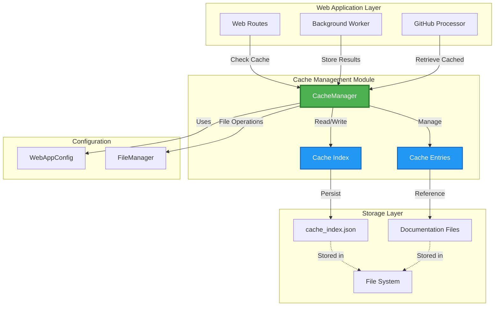

### Module Dependencies

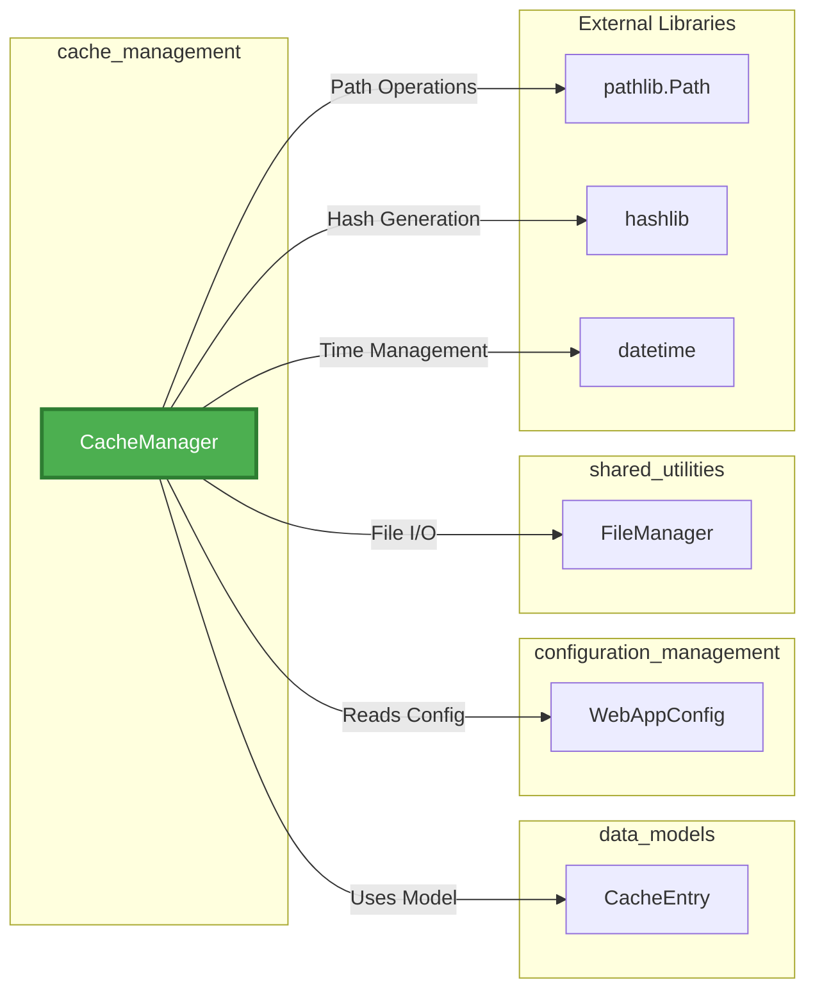

---

## Core Components

### CacheManager

The `CacheManager` class is the central component responsible for all cache operations.

**Key Responsibilities:**
- **Cache Storage**: Persist documentation results with metadata
- **Cache Retrieval**: Quickly locate and return cached documentation
- **Expiration Management**: Automatically invalidate stale cache entries
- **Index Persistence**: Maintain a searchable index of all cached items
- **Hash Generation**: Create unique identifiers for repository URLs
- **Cleanup Operations**: Remove expired entries to free resources

**Attributes:**

| Attribute | Type | Description |
|-----------|------|-------------|
| `cache_dir` | `Path` | Directory where cache files are stored |
| `cache_expiry_days` | `int` | Number of days before cache entries expire |
| `cache_index` | `Dict[str, CacheEntry]` | In-memory index of all cache entries |

**Methods:**

| Method | Parameters | Returns | Description |
|--------|------------|---------|-------------|
| `__init__` | `cache_dir: str`, `cache_expiry_days: int` | - | Initialize cache manager with configuration |
| `load_cache_index` | - | `None` | Load cache index from persistent storage |
| `save_cache_index` | - | `None` | Save cache index to persistent storage |
| `get_repo_hash` | `repo_url: str` | `str` | Generate unique hash for repository URL |
| `get_cached_docs` | `repo_url: str` | `Optional[str]` | Retrieve cached documentation path |
| `add_to_cache` | `repo_url: str`, `docs_path: str` | `None` | Add new documentation to cache |
| `remove_from_cache` | `repo_url: str` | `None` | Remove documentation from cache |
| `cleanup_expired_cache` | - | `None` | Remove all expired cache entries |

---

## Cache Management System

### Hash-Based Indexing

The cache system uses SHA-256 hashing to create unique, deterministic identifiers for repository URLs:


**Hash Generation Process:**
1. Repository URL is encoded to bytes
2. SHA-256 hash is computed
3. Hash is truncated to first 16 hexadecimal characters
4. Result is used as cache index key

**Benefits:**
- **Deterministic**: Same URL always produces same hash
- **Collision-Resistant**: SHA-256 provides strong uniqueness guarantees
- **Compact**: 16-character keys are efficient for storage and lookup
- **URL-Safe**: Hash contains only hexadecimal characters

### Cache Index Structure

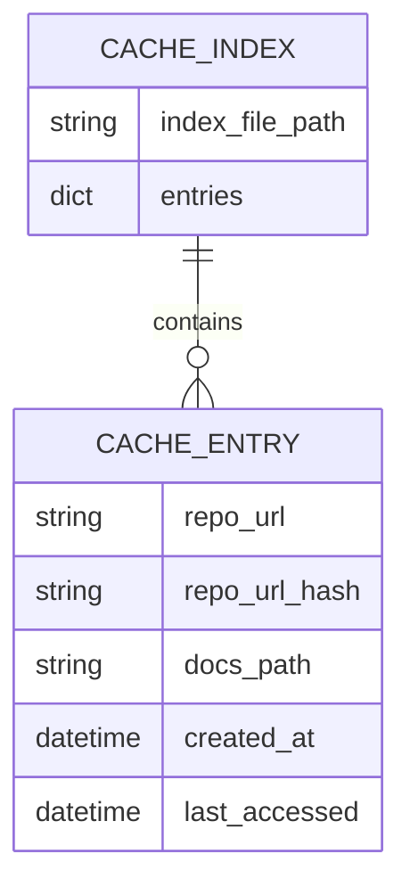

The cache index is a JSON file (`cache_index.json`) that maps repository hashes to cache entry metadata:

```json
{
  "a1b2c3d4e5f6g7h8": {
    "repo_url": "https://github.com/user/repo",
    "repo_url_hash": "a1b2c3d4e5f6g7h8",
    "docs_path": "./output/cache/a1b2c3d4e5f6g7h8/docs",
    "created_at": "2024-01-15T10:30:00",
    "last_accessed": "2024-01-20T14:45:00"
  }
}
```

---

## Data Flow

### Cache Write Operation

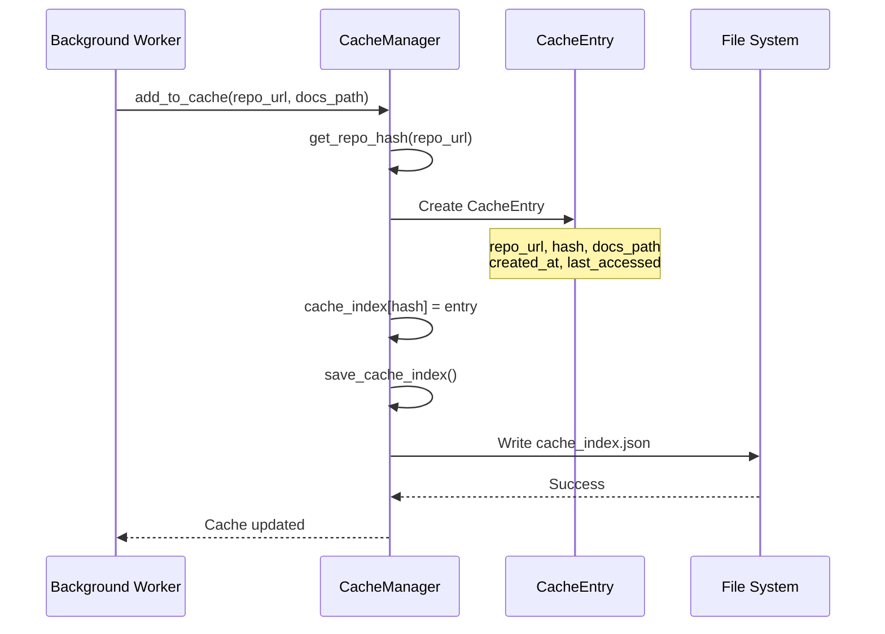

### Cache Read Operation

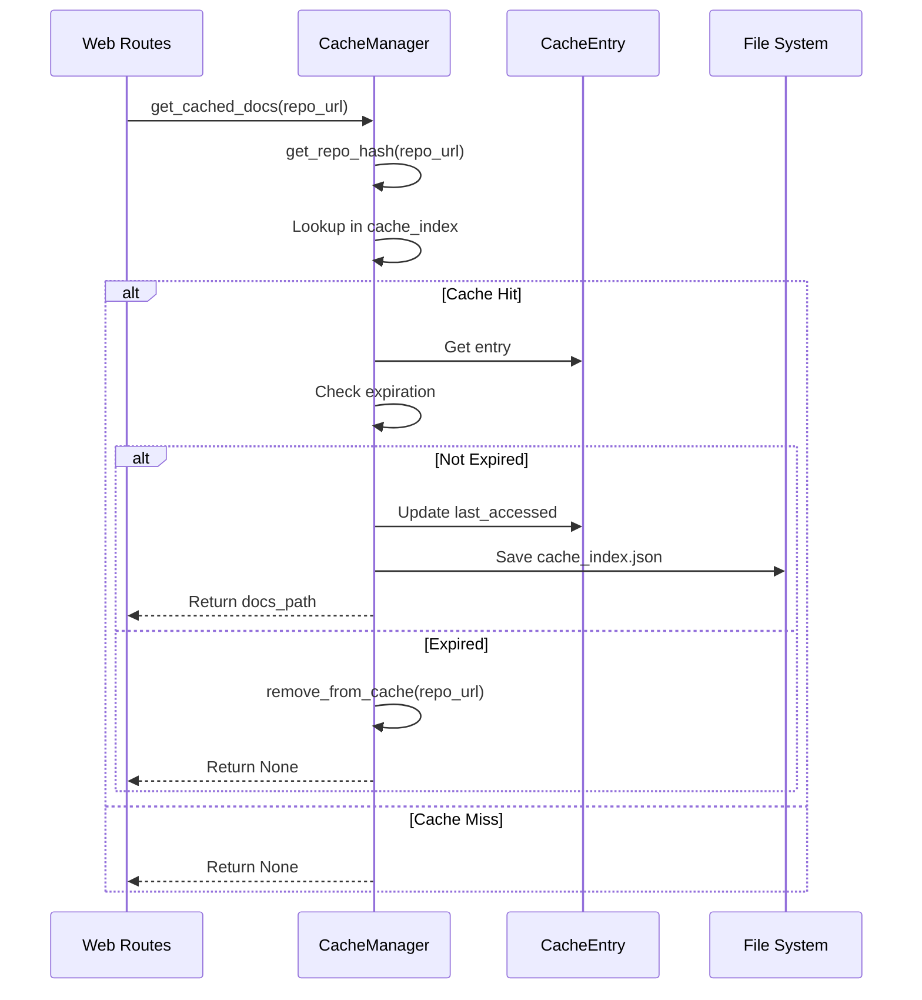

### Cache Cleanup Operation

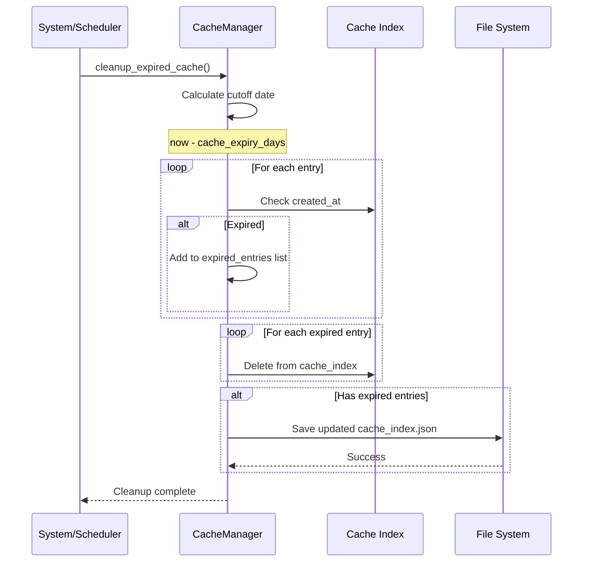

---

## Cache Lifecycle

### Entry States and Transitions

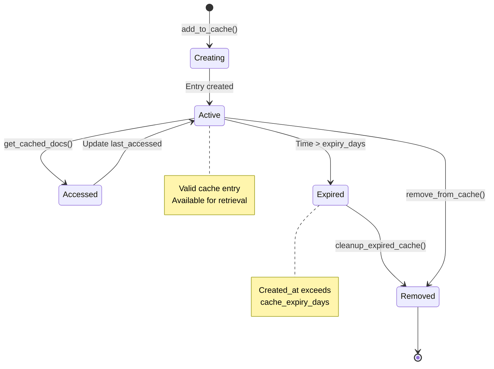

### Cache Entry Lifecycle Timeline

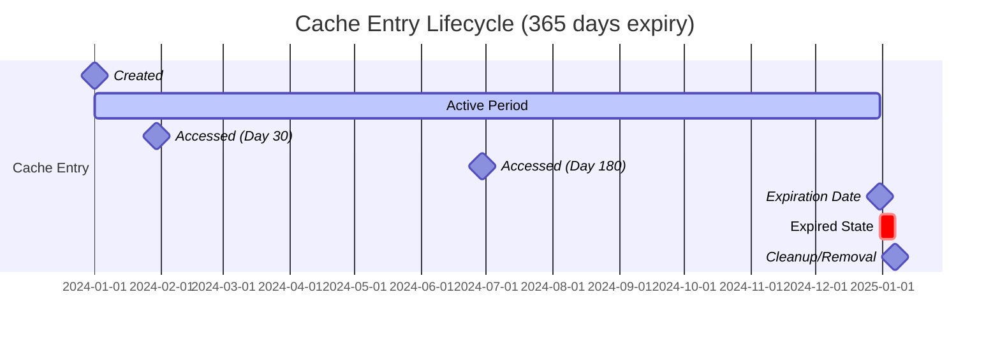

---

## Integration Points

### Integration with Web Application Components

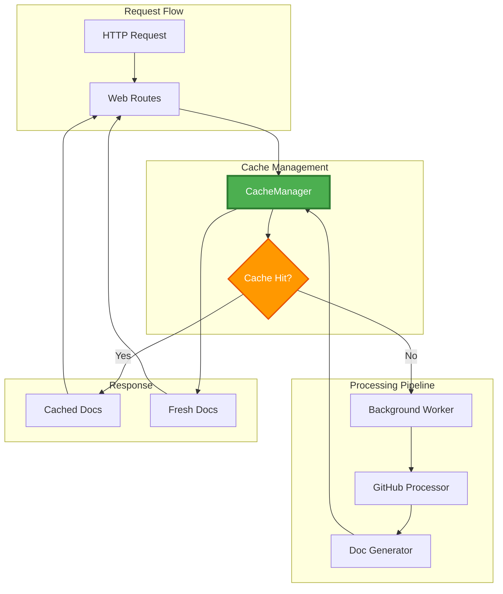

### Component Interaction Flow

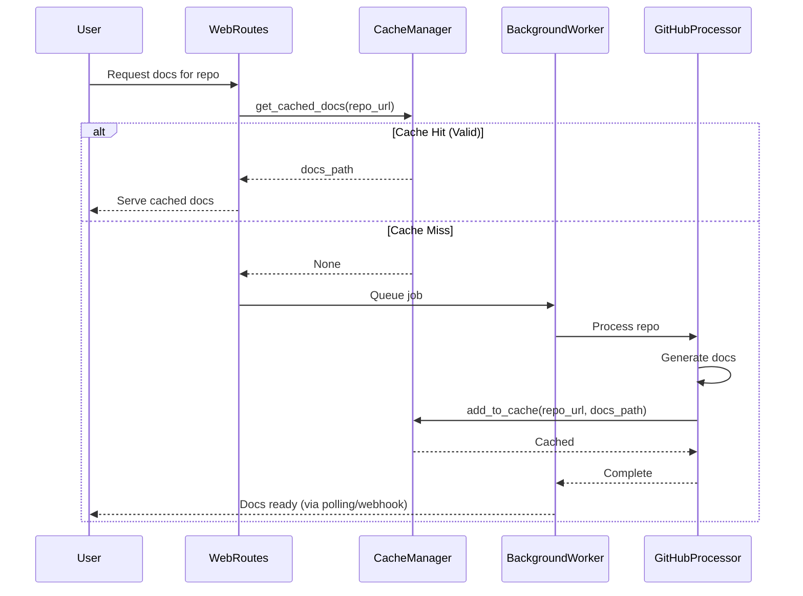

---

## Configuration

### Configuration Parameters

The cache management module relies on configuration from [WebAppConfig](configuration_management.md):

| Parameter | Default Value | Description |
|-----------|---------------|-------------|
| `CACHE_DIR` | `"./output/cache"` | Directory for storing cache files |
| `CACHE_EXPIRY_DAYS` | `365` | Number of days before cache expires |

### Directory Structure

```
output/
├── cache/
│   ├── cache_index.json          # Cache metadata index
│   ├── a1b2c3d4e5f6g7h8/         # Cached repo (hash-based)
│   │   └── docs/                  # Generated documentation
│   ├── 9z8y7x6w5v4u3t2s/
│   │   └── docs/
│   └── ...
├── temp/                          # Temporary processing files
└── ...
```

### Initialization

```python
# Default initialization (uses WebAppConfig)
cache_manager = CacheManager()

# Custom configuration
cache_manager = CacheManager(
    cache_dir="./custom/cache",
    cache_expiry_days=180
)
```

---

## Usage Examples

### Basic Cache Operations

#### Adding Documentation to Cache

```python
from codewiki.src.fe.cache_manager import CacheManager

# Initialize cache manager
cache_manager = CacheManager()

# Add generated documentation to cache
repo_url = "https://github.com/user/awesome-project"
docs_path = "./output/cache/a1b2c3d4e5f6g7h8/docs"

cache_manager.add_to_cache(repo_url, docs_path)
print(f"Documentation cached for {repo_url}")
```

#### Retrieving Cached Documentation

```python
# Check if documentation is cached
repo_url = "https://github.com/user/awesome-project"
cached_path = cache_manager.get_cached_docs(repo_url)

if cached_path:
    print(f"Cache hit! Documentation at: {cached_path}")
    # Serve documentation from cached_path
else:
    print("Cache miss. Need to generate documentation.")
    # Trigger documentation generation
```

#### Manual Cache Removal

```python
# Remove specific repository from cache
repo_url = "https://github.com/user/old-project"
cache_manager.remove_from_cache(repo_url)
print(f"Cache cleared for {repo_url}")
```

#### Cleanup Expired Entries

```python
# Remove all expired cache entries
cache_manager.cleanup_expired_cache()
print("Expired cache entries removed")
```

### Advanced Usage Patterns

#### Cache-First Request Handler

```python
from codewiki.src.fe.cache_manager import CacheManager
from codewiki.src.fe.background_worker import BackgroundWorker

def handle_documentation_request(repo_url: str):
    """Handle documentation request with cache-first strategy."""
    cache_manager = CacheManager()
    
    # Try cache first
    cached_docs = cache_manager.get_cached_docs(repo_url)
    
    if cached_docs:
        return {
            "status": "ready",
            "source": "cache",
            "docs_path": cached_docs
        }
    
    # Cache miss - queue for processing
    background_worker = BackgroundWorker()
    job_id = background_worker.submit_job(repo_url)
    
    return {
        "status": "processing",
        "source": "fresh",
        "job_id": job_id
    }
```

#### Scheduled Cache Maintenance

```python
import schedule
import time

def scheduled_cache_cleanup():
    """Perform scheduled cache cleanup."""
    cache_manager = CacheManager()
    
    print("Starting cache cleanup...")
    initial_count = len(cache_manager.cache_index)
    
    cache_manager.cleanup_expired_cache()
    
    final_count = len(cache_manager.cache_index)
    removed = initial_count - final_count
    
    print(f"Cleanup complete. Removed {removed} expired entries.")
    print(f"Active cache entries: {final_count}")

# Schedule cleanup daily at 2 AM
schedule.every().day.at("02:00").do(scheduled_cache_cleanup)

# Run scheduler
while True:
    schedule.run_pending()
    time.sleep(60)
```

#### Cache Statistics

```python
from datetime import datetime, timedelta

def get_cache_statistics(cache_manager: CacheManager):
    """Generate cache usage statistics."""
    total_entries = len(cache_manager.cache_index)
    
    now = datetime.now()
    cutoff = now - timedelta(days=cache_manager.cache_expiry_days)
    
    active_entries = 0
    expired_entries = 0
    recently_accessed = 0
    
    for entry in cache_manager.cache_index.values():
        if entry.created_at >= cutoff:
            active_entries += 1
        else:
            expired_entries += 1
        
        if entry.last_accessed >= now - timedelta(days=7):
            recently_accessed += 1
    
    return {
        "total_entries": total_entries,
        "active_entries": active_entries,
        "expired_entries": expired_entries,
        "recently_accessed_7d": recently_accessed,
        "cache_hit_potential": f"{(active_entries/total_entries*100):.1f}%" if total_entries > 0 else "0%"
    }

# Usage
cache_manager = CacheManager()
stats = get_cache_statistics(cache_manager)
print(f"Cache Statistics: {stats}")
```

---

## Performance Considerations

### Optimization Strategies

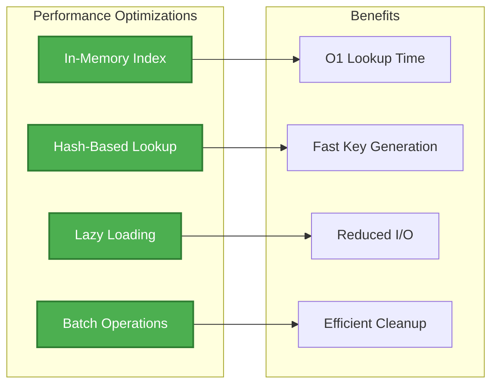

### Performance Characteristics

| Operation | Time Complexity | Space Complexity | Notes |
|-----------|----------------|------------------|-------|
| `get_cached_docs()` | O(1) | O(1) | Hash-based dictionary lookup |
| `add_to_cache()` | O(1) + I/O | O(1) | Dictionary insert + file write |
| `remove_from_cache()` | O(1) + I/O | O(1) | Dictionary delete + file write |
| `cleanup_expired_cache()` | O(n) + I/O | O(n) | Iterate all entries + file write |
| `load_cache_index()` | O(n) + I/O | O(n) | Load and parse JSON file |
| `get_repo_hash()` | O(m) | O(1) | m = length of repo URL |

### Memory Management

**In-Memory Index:**
- Cache index is loaded into memory on initialization
- Provides fast O(1) lookups without disk I/O
- Memory usage scales linearly with number of cached repositories
- Estimated: ~500 bytes per cache entry

**Disk Persistence:**
- Index is persisted to `cache_index.json` after modifications
- Documentation files remain on disk
- Only metadata is kept in memory

### Scalability Considerations

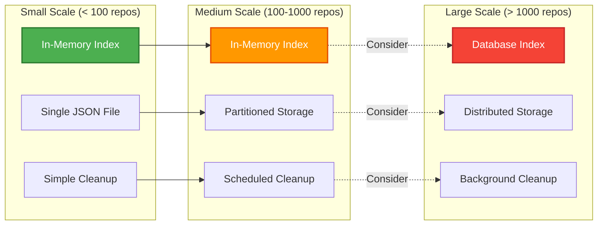

**Recommendations:**
- **< 100 repositories**: Current implementation is optimal
- **100-1000 repositories**: Consider partitioning cache index by hash prefix
- **> 1000 repositories**: Consider migrating to database-backed cache (Redis, SQLite)

---

## Error Handling

### Error Scenarios and Recovery

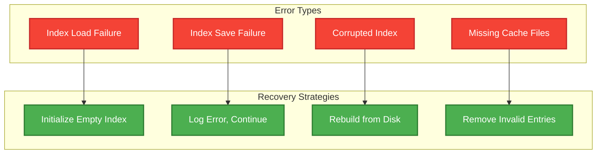

### Error Handling Implementation

#### Index Load Errors

```python
def load_cache_index(self):
    """Load cache index from disk."""
    index_file = self.cache_dir / "cache_index.json"
    if index_file.exists():
        try:
            data = file_manager.load_json(index_file)
            for key, value in data.items():
                self.cache_index[key] = CacheEntry(...)
        except Exception as e:
            # Graceful degradation: start with empty index
            print(f"Error loading cache index: {e}")
            self.cache_index = {}
```

**Recovery Strategy:**
- Log error for debugging
- Initialize with empty cache index
- System continues to function (cache misses until rebuilt)

#### Index Save Errors

```python
def save_cache_index(self):
    """Save cache index to disk."""
    index_file = self.cache_dir / "cache_index.json"
    try:
        data = {...}
        file_manager.save_json(data, index_file)
    except Exception as e:
        # Log error but don't crash
        print(f"Error saving cache index: {e}")
```

**Recovery Strategy:**
- Log error for monitoring
- In-memory index remains intact
- Next successful save will persist changes

### Defensive Programming Patterns

```python
def get_cached_docs(self, repo_url: str) -> Optional[str]:
    """Get cached documentation path if available."""
    try:
        repo_hash = self.get_repo_hash(repo_url)
        
        if repo_hash in self.cache_index:
            entry = self.cache_index[repo_hash]
            
            # Verify cache file still exists
            if not Path(entry.docs_path).exists():
                self.remove_from_cache(repo_url)
                return None
            
            # Check expiration
            if datetime.now() - entry.created_at < timedelta(days=self.cache_expiry_days):
                entry.last_accessed = datetime.now()
                self.save_cache_index()
                return entry.docs_path
            else:
                self.remove_from_cache(repo_url)
        
        return None
    except Exception as e:
        print(f"Error retrieving cached docs: {e}")
        return None  # Fail gracefully
```

---

## Related Documentation

- **[configuration_management](configuration_management.md)**: WebAppConfig settings and directory management
- **[data_models](data_models.md)**: CacheEntry model structure and validation
- **[web_routes_api](web_routes_api.md)**: HTTP endpoints that utilize cache
- **[background_processing](background_processing.md)**: Job processing and cache population
- **[github_integration](github_integration.md)**: Repository processing and documentation generation
- **[shared_utilities](shared_utilities.md)**: FileManager for JSON persistence

---

## Summary

The **cache_management** module provides a robust, efficient caching layer for the CodeWiki web application. Key features include:

✅ **Hash-based indexing** for fast O(1) lookups  
✅ **Automatic expiration** with configurable TTL  
✅ **Persistent storage** with JSON-based index  
✅ **Graceful error handling** with degradation strategies  
✅ **Memory-efficient** in-memory index design  
✅ **Cleanup utilities** for resource management  
✅ **Integration-ready** with web application components  

The module balances performance, reliability, and simplicity, making it suitable for small to medium-scale deployments while providing clear paths for scaling to larger workloads.
