# CLI Interface Module

## Overview

The CLI Interface module (`codewiki/cli`) provides the command-line interface layer for the CodeWiki system. It serves as the primary entry point for users interacting with the application through terminal commands, offering configuration management and visual progress tracking capabilities for long-running operations.

This module acts as a bridge between user commands and the underlying system components, orchestrating interactions with the dependency analysis engine, web frontend services, and core configuration systems.

---

## Table of Contents

- [Architecture](#architecture)
- [Core Components](#core-components)
- [Configuration Management](#configuration-management)
- [Progress Tracking](#progress-tracking)
- [Integration with Other Modules](#integration-with-other-modules)
- [Data Flow](#data-flow)
- [Usage Patterns](#usage-patterns)
- [Dependencies](#dependencies)

---

## Architecture

The CLI Interface module follows a layered architecture pattern, separating concerns between configuration management, user interaction, and progress visualization.

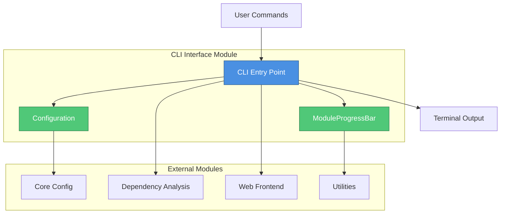

### Architectural Principles

1. **Separation of Concerns**: Configuration logic is isolated from progress tracking and command execution
2. **User-Centric Design**: Provides clear feedback and intuitive command structures
3. **Modularity**: Components can be used independently or composed together
4. **Extensibility**: Easy to add new commands and configuration options

---

## Core Components

### Component Hierarchy

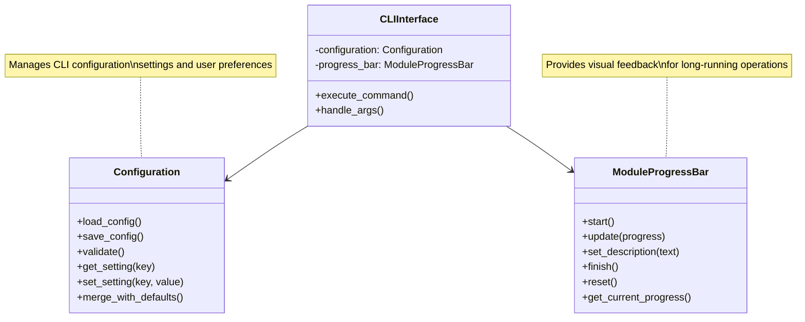

### Configuration (`codewiki.cli.models.config.Configuration`)

The Configuration component is responsible for managing all CLI-related settings, user preferences, and runtime parameters.

**Key Responsibilities:**
- Loading and parsing configuration files
- Validating configuration parameters
- Providing default values for missing settings
- Persisting user preferences
- Managing environment-specific configurations

**Configuration Scope:**
- CLI command defaults
- Output formatting preferences
- Logging levels and destinations
- Integration endpoints (web frontend, analysis engine)
- File system paths and working directories
- Performance tuning parameters

### ModuleProgressBar (`codewiki.cli.utils.progress.ModuleProgressBar`)

The ModuleProgressBar component provides visual feedback for operations that may take significant time to complete.

**Key Responsibilities:**
- Displaying progress indicators in the terminal
- Updating progress based on operation status
- Showing descriptive messages for current operations
- Managing multiple concurrent progress bars
- Graceful handling of terminal resize events

**Features:**
- Real-time progress updates
- Customizable progress bar styles
- Support for indeterminate progress (spinners)
- Module-specific progress tracking
- Clean terminal output management

---

## Configuration Management

### Configuration Flow

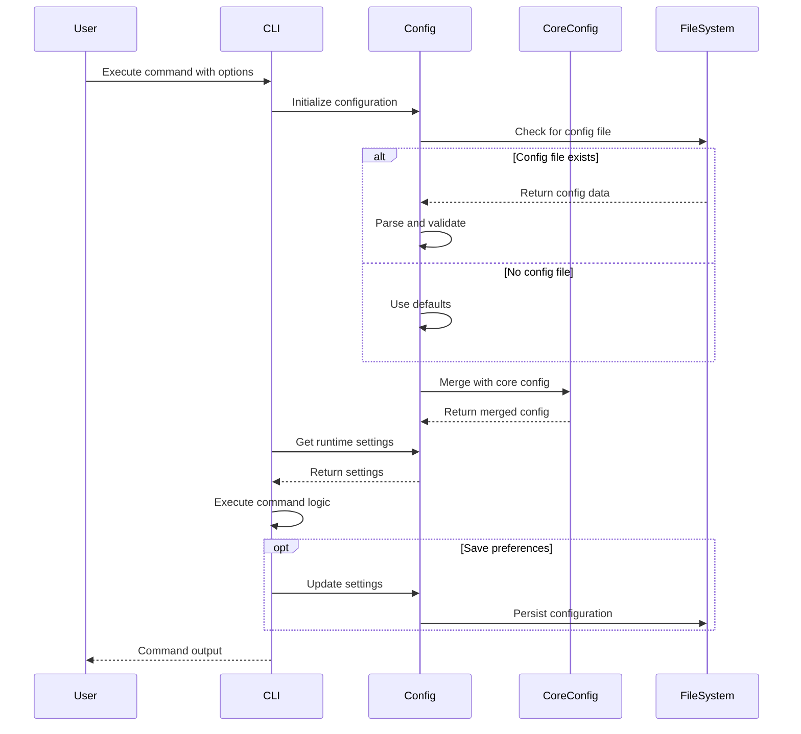

### Configuration Hierarchy

The CLI configuration system follows a hierarchical approach:

1. **System Defaults**: Built-in default values
2. **Global Configuration**: System-wide settings from [core_config](core_config.md)
3. **User Configuration**: User-specific preferences
4. **Command-Line Arguments**: Runtime overrides with highest priority

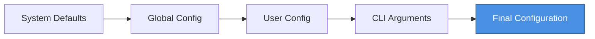

---

## Progress Tracking

### Progress Bar Architecture

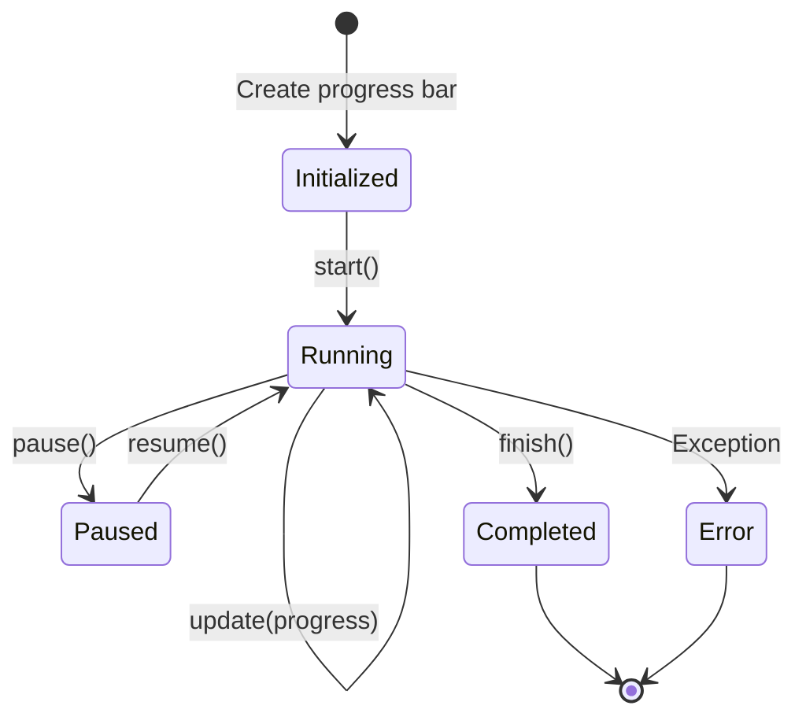

### Multi-Module Progress Tracking

When processing multiple modules (e.g., analyzing dependencies across modules), the progress bar system provides hierarchical tracking:

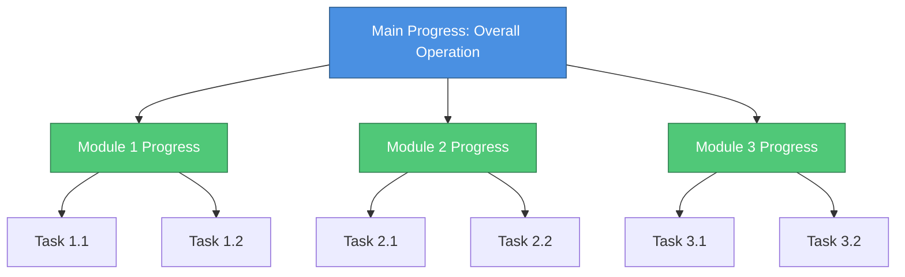

---

## Integration with Other Modules

### Module Dependencies

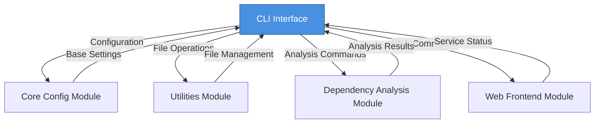

### Integration Points

#### With Core Config Module
- Inherits base configuration schema from [core_config](core_config.md)
- Extends configuration with CLI-specific settings
- Validates configuration against core constraints

#### With Utilities Module
- Uses FileManager from [utilities](utilities.md) for file operations
- Leverages utility functions for path resolution
- Integrates with logging utilities

#### With Dependency Analysis Module
- Triggers dependency analysis operations via [dependency_analysis](dependency_analysis.md)
- Receives Repository and Node data for display
- Processes NodeSelection results for output formatting

#### With Web Frontend Module
- Can start/stop web services from [web_frontend](web_frontend.md)
- Monitors BackgroundWorker job status
- Manages CacheManager operations
- Submits repositories for processing via GitHubRepoProcessor

---

## Data Flow

### Command Execution Flow

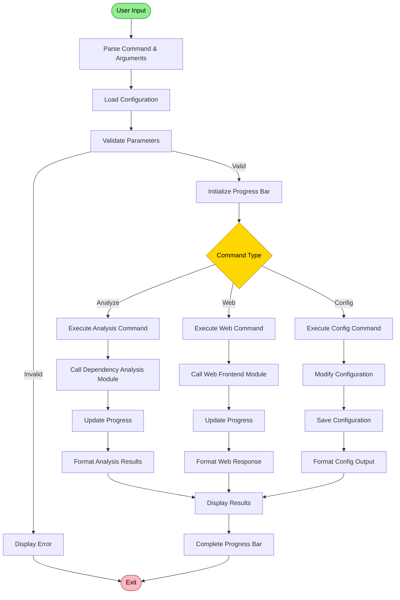

### Configuration Data Flow

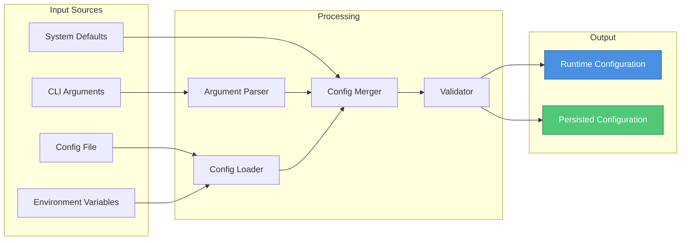

---

## Usage Patterns

### Common CLI Workflows

#### 1. Repository Analysis Workflow

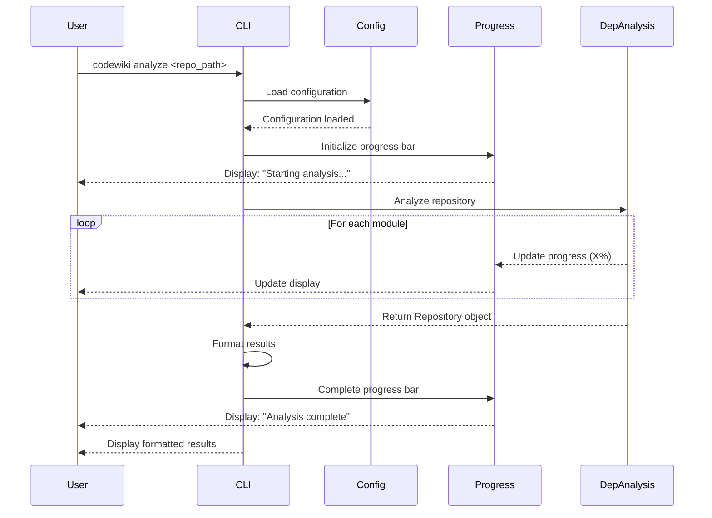

#### 2. Web Service Management Workflow

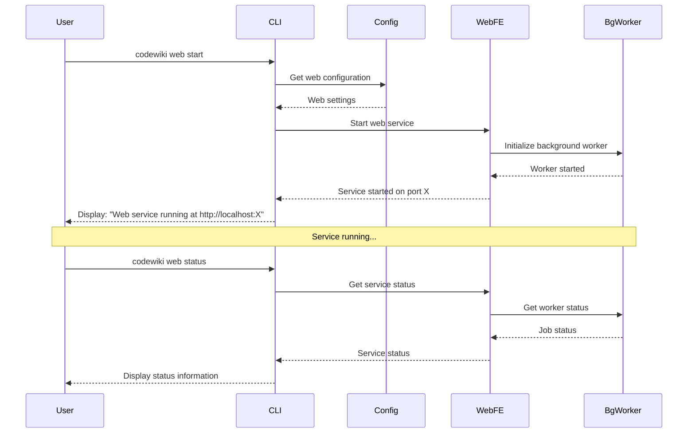

#### 3. Configuration Management Workflow

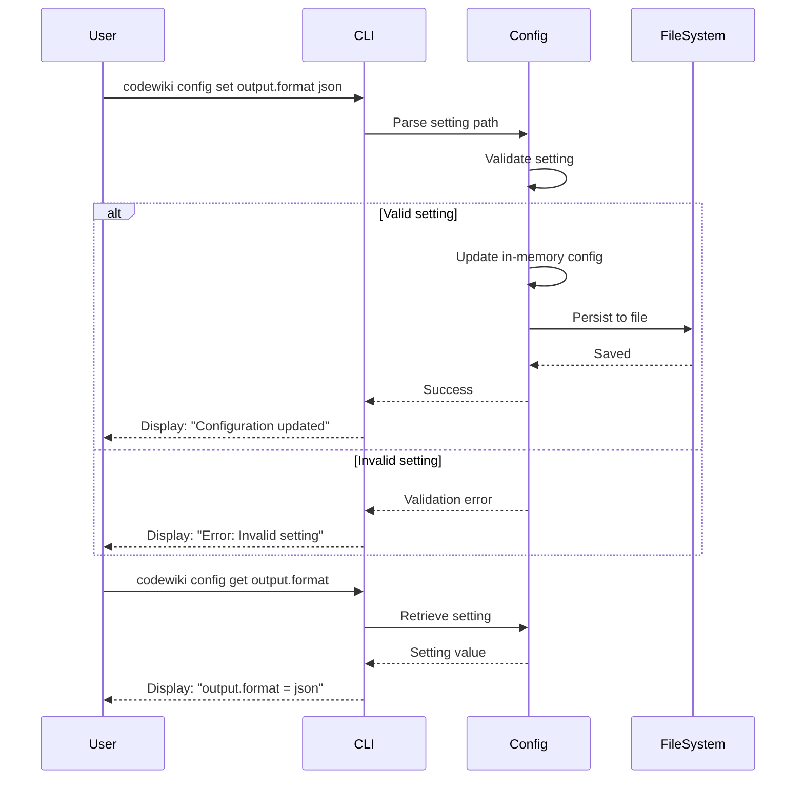

### Progress Bar Usage Patterns

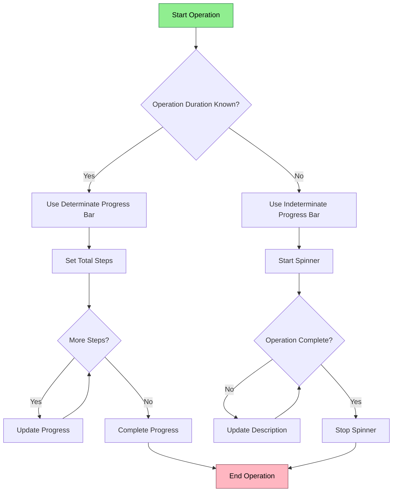

---

## Dependencies

### External Dependencies

The CLI Interface module relies on the following system modules:

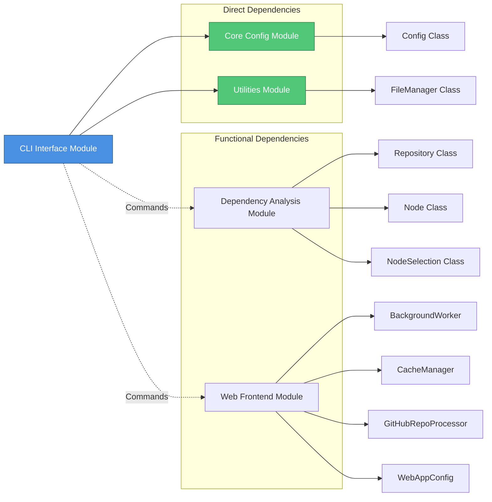

### Dependency Details

| Module | Components Used | Purpose |
|--------|----------------|---------|
| [core_config](core_config.md) | `Config` | Base configuration management and validation |
| [utilities](utilities.md) | `FileManager` | File system operations and path management |
| [dependency_analysis](dependency_analysis.md) | `Repository`, `Node`, `NodeSelection` | Repository analysis and dependency graph generation |
| [web_frontend](web_frontend.md) | `BackgroundWorker`, `CacheManager`, `GitHubRepoProcessor`, `WebAppConfig` | Web service management and repository processing |

### Component Interaction Map

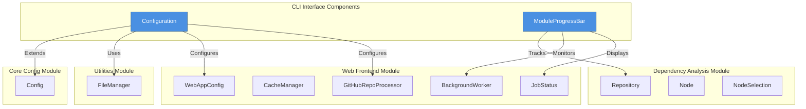

---

## Command Structure

### Typical Command Patterns

The CLI Interface module likely supports the following command patterns:

```
codewiki <command> [subcommand] [options] [arguments]
```

#### Analysis Commands
```bash
# Analyze a repository
codewiki analyze <repo_path> [--output <format>] [--depth <level>]

# Analyze specific modules
codewiki analyze <repo_path> --modules <module1,module2>

# Generate dependency graph
codewiki analyze <repo_path> --graph [--format <dot|json|svg>]
```

#### Web Service Commands
```bash
# Start web service
codewiki web start [--port <port>] [--host <host>]

# Stop web service
codewiki web stop

# Check service status
codewiki web status

# Process repository via web interface
codewiki web process <github_url>
```

#### Configuration Commands
```bash
# View all configuration
codewiki config list

# Get specific setting
codewiki config get <key>

# Set configuration value
codewiki config set <key> <value>

# Reset to defaults
codewiki config reset [--all]
```

#### Utility Commands
```bash
# Display version information
codewiki version

# Show help
codewiki help [command]

# Validate configuration
codewiki validate
```

---

## Error Handling

### Error Handling Flow

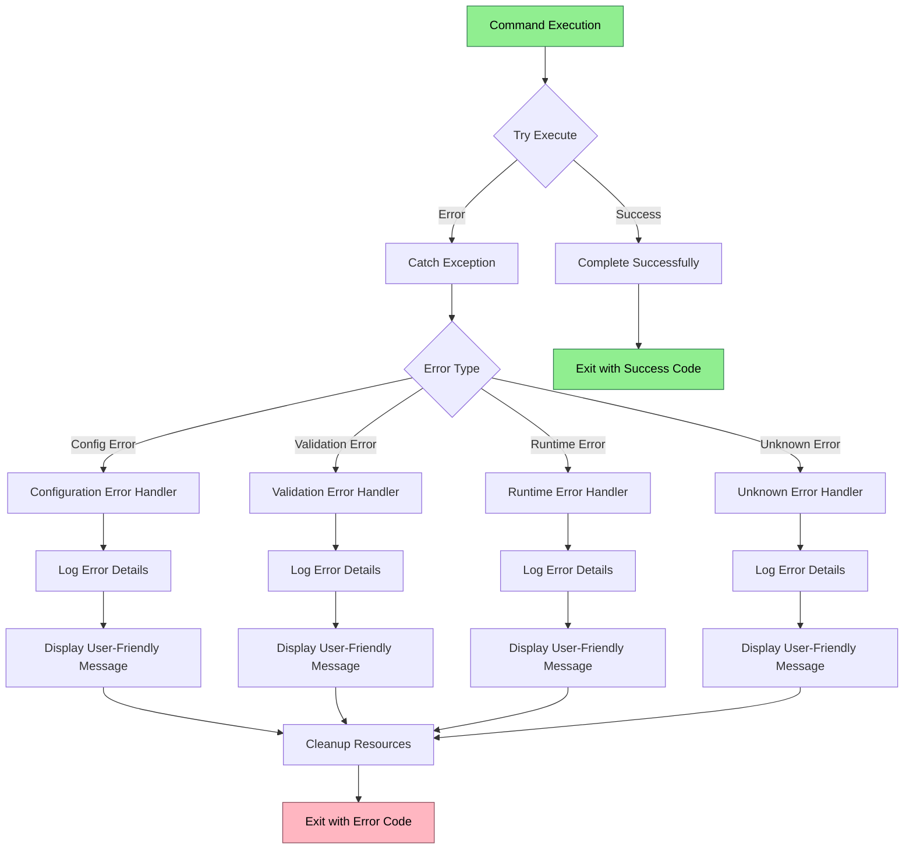

---

## Performance Considerations

### Progress Bar Performance

The ModuleProgressBar is designed to minimize performance impact:

1. **Throttled Updates**: Progress updates are throttled to avoid excessive terminal I/O
2. **Async Updates**: Progress updates don't block main operation execution
3. **Efficient Rendering**: Only changed portions of the display are redrawn
4. **Resource Cleanup**: Proper cleanup of terminal resources on completion

### Configuration Caching

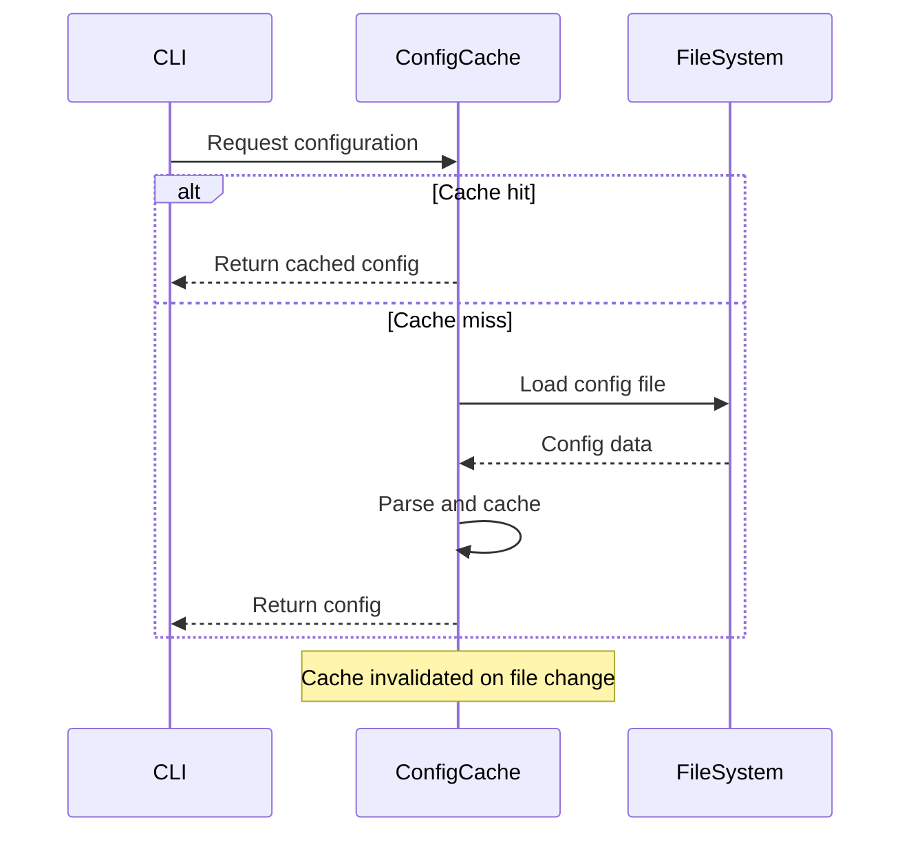

---

## Best Practices

### Configuration Management
1. **Use hierarchical configuration**: Override defaults progressively
2. **Validate early**: Validate configuration before executing commands
3. **Provide sensible defaults**: Ensure the CLI works out-of-the-box
4. **Document settings**: Include help text for all configuration options

### Progress Tracking
1. **Always provide feedback**: Use progress bars for operations > 1 second
2. **Use appropriate indicators**: Determinate for known duration, indeterminate otherwise
3. **Update descriptions**: Keep users informed of current operation
4. **Handle interruptions**: Gracefully handle Ctrl+C and cleanup properly

### Error Handling
1. **User-friendly messages**: Translate technical errors to actionable messages
2. **Provide context**: Include relevant details (file paths, settings, etc.)
3. **Suggest solutions**: When possible, suggest how to fix the error
4. **Log details**: Log full error details for debugging while showing summary to user

---

## Future Enhancements

Potential areas for future development:

1. **Interactive Mode**: REPL-style interactive command interface
2. **Command Aliases**: User-defined command shortcuts
3. **Plugin System**: Support for third-party command extensions
4. **Shell Completion**: Auto-completion for bash/zsh/fish
5. **Configuration Profiles**: Multiple named configuration profiles
6. **Advanced Progress**: Nested progress bars for complex operations
7. **Output Templating**: Customizable output formats using templates
8. **Command History**: Track and replay previous commands

---

## Related Documentation

- [Core Config Module](core_config.md) - Base configuration system
- [Utilities Module](utilities.md) - File management and utilities
- [Dependency Analysis Module](dependency_analysis.md) - Repository analysis engine
- [Web Frontend Module](web_frontend.md) - Web interface and services

---

## Summary

The CLI Interface module serves as the primary user interaction layer for the CodeWiki system, providing:

- **Configuration Management**: Flexible, hierarchical configuration system via the `Configuration` component
- **Progress Tracking**: Visual feedback for long-running operations via the `ModuleProgressBar` component
- **Command Orchestration**: Coordination between analysis, web services, and configuration management
- **User Experience**: Intuitive command structure with helpful error messages and feedback

The module integrates seamlessly with other system components, leveraging the [core_config](core_config.md) for base configuration, [utilities](utilities.md) for file operations, [dependency_analysis](dependency_analysis.md) for repository analysis, and [web_frontend](web_frontend.md) for web service management.
