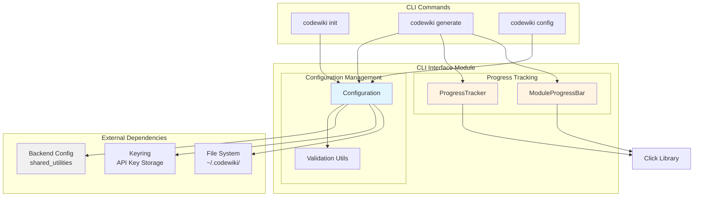
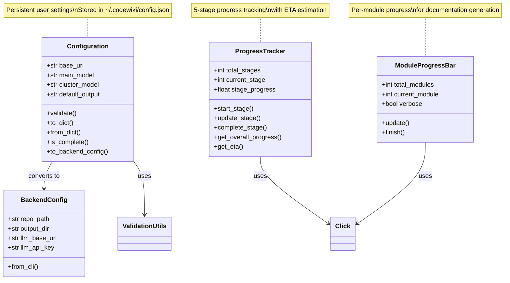
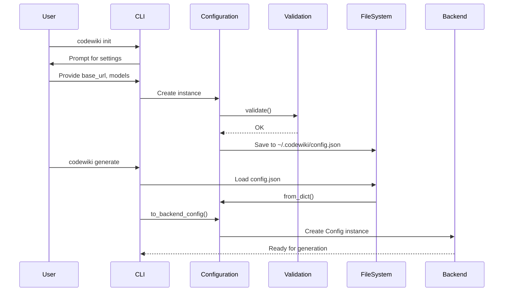
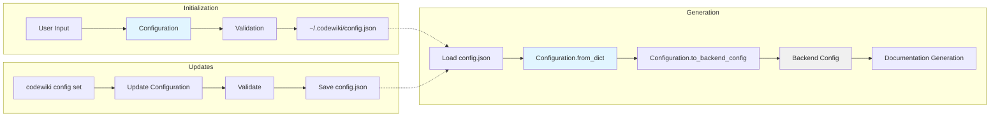
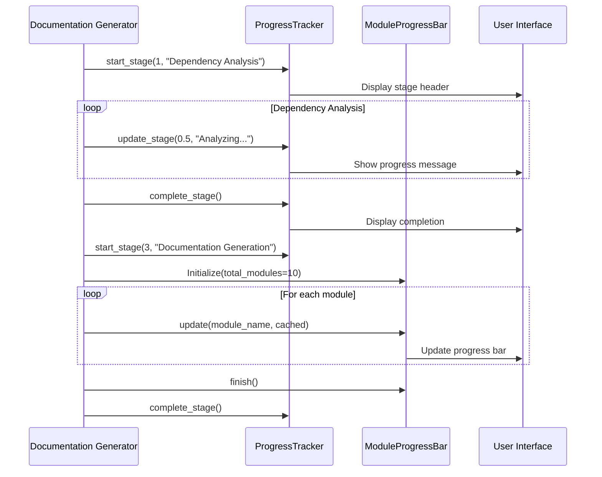
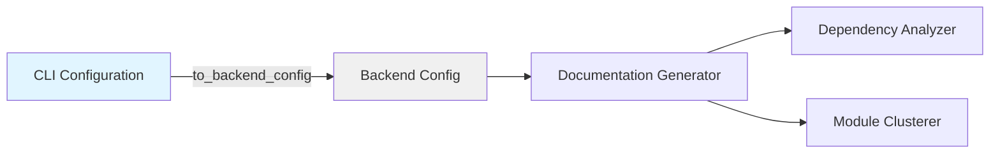
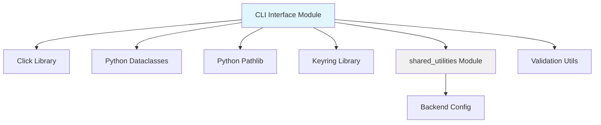

# CLI Interface Module

## Overview

The **CLI Interface** module provides the command-line interface layer for CodeWiki, managing user configuration, progress tracking, and the bridge between user-facing CLI commands and the backend documentation generation system. This module serves as the primary interaction point for users running CodeWiki from the command line.

### Purpose

The CLI Interface module is responsible for:

- **Configuration Management**: Storing and validating persistent user settings (LLM endpoints, models, output preferences)
- **Progress Visualization**: Providing real-time feedback during documentation generation with stage-based progress tracking
- **CLI-to-Backend Bridge**: Converting user-friendly CLI configurations to backend runtime configurations
- **User Experience**: Delivering clear, informative feedback during long-running documentation tasks

### Key Features

- ✅ Persistent configuration storage in `~/.codewiki/config.json`
- ✅ Multi-stage progress tracking with ETA estimation
- ✅ Verbose and quiet output modes
- ✅ Module-by-module progress visualization
- ✅ Seamless integration with backend [shared_utilities](shared_utilities.md) Config system
- ✅ Configuration validation and error handling

---

## Architecture Overview

The CLI Interface module consists of two primary sub-modules that work together to provide a seamless command-line experience:



### Component Relationships



---

## Sub-Modules

### 1. Configuration Management

**File**: `venv_codewiki/lib/python3.12/site-packages/codewiki/cli/models/config.py`

The Configuration Management sub-module handles persistent user settings and provides the bridge to backend configuration.

#### Core Component: Configuration

The `Configuration` class is a dataclass that represents user settings stored in `~/.codewiki/config.json`. It provides:

**Attributes**:
- `base_url` (str): LLM API base URL (e.g., OpenAI, Anthropic, or local endpoints)
- `main_model` (str): Primary model for documentation generation
- `cluster_model` (str): Model for module clustering and analysis
- `default_output` (str): Default output directory for generated documentation (default: "docs")

**Key Methods**:

| Method | Purpose | Returns |
|--------|---------|---------|
| `validate()` | Validates all configuration fields using validation utilities | None (raises on error) |
| `to_dict()` | Serializes configuration to dictionary for JSON storage | dict |
| `from_dict(data)` | Deserializes configuration from dictionary | Configuration |
| `is_complete()` | Checks if all required fields are populated | bool |
| `to_backend_config()` | Converts CLI config to backend Config for runtime execution | Backend Config |

**Configuration Flow**:



**Integration with Backend**:

The `to_backend_config()` method bridges the gap between persistent CLI settings and runtime backend configuration:

```python
# CLI Configuration (persistent)
cli_config = Configuration(
    base_url="https://api.openai.com/v1",
    main_model="gpt-4",
    cluster_model="gpt-3.5-turbo",
    default_output="docs"
)

# Convert to Backend Config (runtime)
backend_config = cli_config.to_backend_config(
    repo_path="/path/to/repo",
    output_dir="./docs",
    api_key="sk-..."  # Retrieved from keyring
)
```

This conversion ensures that:
- User preferences are preserved across sessions
- Runtime parameters (repo path, API keys) are injected at execution time
- Backend receives a complete, validated configuration

**Related**: See [shared_utilities](shared_utilities.md) for the backend `Config` class implementation.

---

### 2. Progress Tracking

**File**: `venv_codewiki/lib/python3.12/site-packages/codewiki/cli/utils/progress.py`

The Progress Tracking sub-module provides real-time feedback during documentation generation, which can be a time-consuming process.

#### Core Component: ProgressTracker

The `ProgressTracker` class implements a 5-stage progress tracking system with time estimation.

**Stage Breakdown**:

| Stage | Name | Weight | Description |
|-------|------|--------|-------------|
| 1 | Dependency Analysis | 40% | Analyzing code dependencies and building the dependency graph |
| 2 | Module Clustering | 20% | Grouping related components into logical modules |
| 3 | Documentation Generation | 30% | Generating markdown documentation using LLMs |
| 4 | HTML Generation | 5% | Converting markdown to HTML (optional) |
| 5 | Finalization | 5% | Cleanup and final processing |

**Key Methods**:

| Method | Purpose | Parameters |
|--------|---------|------------|
| `start_stage(stage, description)` | Begin a new stage | stage number (1-5), optional description |
| `update_stage(progress, message)` | Update progress within stage | progress (0.0-1.0), optional message |
| `complete_stage(message)` | Mark stage as complete | optional completion message |
| `get_overall_progress()` | Calculate total progress | Returns float (0.0-1.0) |
| `get_eta()` | Estimate time remaining | Returns formatted string |

**Progress Calculation**:

The overall progress is calculated as a weighted sum:

```
Overall Progress = Σ(completed_stage_weights) + (current_stage_weight × stage_progress)
```

**Output Modes**:

1. **Verbose Mode** (`verbose=True`):
   ```
   [00:15] Phase 1/5: Dependency Analysis
   [00:16]   Analyzing module: core.models
   [00:18]   Analyzing module: core.utils
   [00:20]   Dependency Analysis complete (5.2s)
   ```

2. **Quiet Mode** (`verbose=False`):
   ```
   [1/5] Dependency Analysis
   [2/5] Module Clustering
   ```

#### Core Component: ModuleProgressBar

The `ModuleProgressBar` class provides granular progress tracking for module-by-module documentation generation.

**Features**:
- Progress bar with percentage and ETA (quiet mode)
- Per-module status messages (verbose mode)
- Cache hit indicators (shows when modules are loaded from cache vs. regenerated)

**Usage Example**:

```python
# Initialize for 10 modules
progress = ModuleProgressBar(total_modules=10, verbose=False)

# Update for each module
progress.update("core_module", cached=False)  # Generating
progress.update("utils_module", cached=True)   # From cache

# Finish
progress.finish()
```

**Output Examples**:

*Quiet Mode*:
```
Generating modules  [################------------]  55%  ETA: 00:02:15
```

*Verbose Mode*:
```
  [1/10] core_module... ⟳ (generating)
  [2/10] utils_module... ✓ (cached)
  [3/10] api_module... ⟳ (generating)
```

---

## Data Flow

### Configuration Lifecycle



### Progress Tracking Flow



---

## Integration Points

### 1. Backend Integration

The CLI Interface integrates with the [shared_utilities](shared_utilities.md) module through the `Configuration.to_backend_config()` method:



**Key Mappings**:
- `base_url` → `llm_base_url`
- `main_model` → `main_model`
- `cluster_model` → `cluster_model`
- Runtime parameters (repo_path, output_dir, api_key) are injected during conversion

### 2. Dependency Analysis Integration

Progress tracking integrates with the [dependency_analysis_core](dependency_analysis_core.md) module during Stage 1:

```python
tracker.start_stage(1, "Dependency Analysis")
# Dependency analyzer runs here
tracker.update_stage(0.5, "Building dependency graph...")
tracker.complete_stage(f"Analyzed {node_count} nodes")
```

### 3. Web Application Integration

While the CLI Interface is primarily for command-line usage, the configuration model is shared with the [web_application](web_application.md) module for consistency in LLM settings.

---

## Usage Examples

### Example 1: First-Time Setup

```bash
# Initialize configuration
$ codewiki init

Welcome to CodeWiki!
Let's set up your configuration.

LLM API Base URL: https://api.openai.com/v1
Main Model (for documentation): gpt-4
Cluster Model (for analysis): gpt-3.5-turbo
Default Output Directory [docs]: ./documentation

Configuration saved to ~/.codewiki/config.json
```

### Example 2: Generate Documentation with Progress

```bash
$ codewiki generate /path/to/repo --verbose

[00:00] Phase 1/5: Dependency Analysis
[00:02]   Analyzing Python files...
[00:05]   Building dependency graph...
[00:08]   Dependency Analysis complete (8.2s)

[00:08] Phase 2/5: Module Clustering
[00:10]   Clustering 45 components into modules...
[00:12]   Module Clustering complete (4.1s)

[00:12] Phase 3/5: Documentation Generation
  [1/8] core_module... ⟳ (generating)
  [2/8] utils_module... ✓ (cached)
  [3/8] api_module... ⟳ (generating)
  ...
[00:45]   Documentation Generation complete (33.2s)

[00:45] Phase 4/5: HTML Generation
[00:47]   HTML Generation complete (2.1s)

[00:47] Phase 5/5: Finalization
[00:48]   Finalization complete (1.0s)

✓ Documentation generated successfully in ./docs
```

### Example 3: Update Configuration

```bash
# Update a specific setting
$ codewiki config set main_model gpt-4-turbo

✓ Configuration updated: main_model = gpt-4-turbo

# View current configuration
$ codewiki config show

Current Configuration:
  Base URL: https://api.openai.com/v1
  Main Model: gpt-4-turbo
  Cluster Model: gpt-3.5-turbo
  Default Output: docs
```

---

## Configuration File Format

The configuration is stored in JSON format at `~/.codewiki/config.json`:

```json
{
  "base_url": "https://api.openai.com/v1",
  "main_model": "gpt-4",
  "cluster_model": "gpt-3.5-turbo",
  "default_output": "docs"
}
```

**Security Note**: API keys are NOT stored in the configuration file. They are managed separately using the system keyring for security.

---

## Error Handling

### Configuration Validation

The Configuration class validates settings before saving:

```python
try:
    config.validate()
except ConfigurationError as e:
    click.secho(f"✗ Invalid configuration: {e}", fg="red")
    sys.exit(1)
```

**Validation Checks**:
- ✅ `base_url`: Must be a valid URL format
- ✅ `main_model`: Must be a non-empty string
- ✅ `cluster_model`: Must be a non-empty string
- ✅ `default_output`: Must be a valid directory path

### Progress Tracking Error Handling

Progress tracking is designed to be non-blocking:

```python
try:
    tracker.update_stage(0.5, "Processing...")
except Exception as e:
    # Log error but continue generation
    logger.warning(f"Progress update failed: {e}")
```

---

## Performance Considerations

### Progress Tracking Overhead

- **Minimal Impact**: Progress updates are lightweight (< 1ms per update)
- **Async-Safe**: Can be called from background threads
- **Buffered Output**: Uses Click's buffering to minimize I/O overhead

### Configuration Loading

- **Cached**: Configuration is loaded once at startup
- **Fast Validation**: Validation uses simple regex patterns
- **Lazy Conversion**: Backend config is created only when needed

---

## Design Patterns

### 1. Data Transfer Object (DTO)

The `Configuration` class serves as a DTO between the CLI layer and backend:

```python
# CLI Layer
cli_config = Configuration.from_dict(json_data)

# Transfer to Backend
backend_config = cli_config.to_backend_config(...)
```

### 2. Builder Pattern

The `to_backend_config()` method acts as a builder, constructing complex backend configurations:

```python
def to_backend_config(self, repo_path, output_dir, api_key):
    return Config.from_cli(
        repo_path=repo_path,
        output_dir=output_dir,
        llm_base_url=self.base_url,
        llm_api_key=api_key,
        main_model=self.main_model,
        cluster_model=self.cluster_model
    )
```

### 3. Observer Pattern

Progress tracking implements an observer-like pattern where the generator notifies progress trackers:

```python
# Generator (Subject)
tracker.start_stage(1)
# ... do work ...
tracker.update_stage(0.5)
# ... more work ...
tracker.complete_stage()

# Tracker (Observer)
# Automatically updates UI based on notifications
```

---

## Dependencies

### External Libraries

- **click**: Command-line interface creation and progress bars
- **dataclasses**: Configuration data modeling
- **pathlib**: File path handling
- **keyring**: Secure API key storage (not shown in provided code)

### Internal Dependencies

- **shared_utilities**: Backend `Config` class for runtime configuration
- **validation utilities**: URL and model name validation (referenced but not provided)

### Dependency Graph



---

## Testing Considerations

### Unit Testing

**Configuration Tests**:
```python
def test_configuration_validation():
    config = Configuration(
        base_url="https://api.openai.com/v1",
        main_model="gpt-4",
        cluster_model="gpt-3.5-turbo"
    )
    config.validate()  # Should not raise

def test_configuration_to_backend():
    cli_config = Configuration(...)
    backend_config = cli_config.to_backend_config(
        repo_path="/repo",
        output_dir="./docs",
        api_key="test-key"
    )
    assert backend_config.llm_api_key == "test-key"
```

**Progress Tracking Tests**:
```python
def test_progress_calculation():
    tracker = ProgressTracker(total_stages=5)
    tracker.start_stage(1)
    tracker.update_stage(0.5)
    
    # Stage 1 is 40% of total, at 50% completion
    assert tracker.get_overall_progress() == 0.20

def test_module_progress_bar():
    progress = ModuleProgressBar(total_modules=10, verbose=True)
    progress.update("test_module", cached=False)
    assert progress.current_module == 1
```

### Integration Testing

Test the full CLI-to-backend flow:

```python
def test_cli_to_backend_integration():
    # Create CLI config
    cli_config = Configuration.from_dict({
        "base_url": "https://api.test.com",
        "main_model": "test-model",
        "cluster_model": "test-cluster",
        "default_output": "docs"
    })
    
    # Convert to backend
    backend_config = cli_config.to_backend_config(
        repo_path="/test/repo",
        output_dir="./output",
        api_key="test-key"
    )
    
    # Verify mapping
    assert backend_config.llm_base_url == "https://api.test.com"
    assert backend_config.main_model == "test-model"
```

---

## Future Enhancements

### Planned Features

1. **Configuration Profiles**: Support multiple named configurations (e.g., "openai", "anthropic", "local")
2. **Progress Persistence**: Save progress state to resume interrupted generations
3. **Advanced ETA**: Machine learning-based ETA prediction based on repository characteristics
4. **Interactive Mode**: Real-time progress updates with rich terminal UI
5. **Configuration Validation**: Enhanced validation with model availability checks

### Extensibility Points

- **Custom Progress Renderers**: Plugin system for different progress visualization styles
- **Configuration Backends**: Support for environment variables, YAML, TOML formats
- **Progress Callbacks**: Webhook support for progress notifications

---

## Related Modules

- **[shared_utilities](shared_utilities.md)**: Backend configuration and file management
- **[dependency_analysis_core](dependency_analysis_core.md)**: Dependency analysis (Stage 1 of progress tracking)
- **[web_application](web_application.md)**: Web interface alternative to CLI

---

## Summary

The CLI Interface module provides a robust, user-friendly command-line experience for CodeWiki:

- **Configuration Management**: Persistent, validated user settings with seamless backend integration
- **Progress Tracking**: Multi-stage progress visualization with accurate ETA estimation
- **User Experience**: Clear feedback during long-running operations with verbose and quiet modes
- **Maintainability**: Clean separation between CLI concerns and backend logic

This module serves as the primary entry point for users interacting with CodeWiki via the command line, ensuring a smooth and informative documentation generation experience.
