# Configuration Management Module

## Overview

The **configuration_management** module provides centralized configuration settings for the CodeWiki web application. It manages application-wide settings including directory structures, queue configurations, cache policies, server parameters, and Git operations. This module is a critical component of the [web_application](web_application.md) module, ensuring consistent configuration across all web application components.

**Key Responsibilities:**
- Define and manage web application configuration settings
- Ensure required directory structures exist
- Provide path resolution utilities
- Configure cache, queue, and job management parameters
- Set server and Git operation defaults

---

## Architecture

### Component Overview

```mermaid
graph TB
    subgraph "Configuration Management Module"
        WAC[WebAppConfig]
        
        subgraph "Configuration Categories"
            DIR[Directory Settings]
            QUEUE[Queue Settings]
            CACHE[Cache Settings]
            JOB[Job Settings]
            SERVER[Server Settings]
            GIT[Git Settings]
        end
        
        subgraph "Utility Methods"
            ENSURE[ensure_directories]
            GETPATH[get_absolute_path]
        end
        
        WAC --> DIR
        WAC --> QUEUE
        WAC --> CACHE
        WAC --> JOB
        WAC --> SERVER
        WAC --> GIT
        WAC --> ENSURE
        WAC --> GETPATH
    end
    
    subgraph "Dependent Modules"
        WR[Web Routes]
        BG[Background Worker]
        CM[Cache Manager]
        GH[GitHub Processor]
    end
    
    WAC --> WR
    WAC --> BG
    WAC --> CM
    WAC --> GH
    
    style WAC fill:#4CAF50,stroke:#2E7D32,color:#fff
    style DIR fill:#90CAF9,stroke:#1976D2
    style QUEUE fill:#90CAF9,stroke:#1976D2
    style CACHE fill:#90CAF9,stroke:#1976D2
    style JOB fill:#90CAF9,stroke:#1976D2
    style SERVER fill:#90CAF9,stroke:#1976D2
    style GIT fill:#90CAF9,stroke:#1976D2
    style ENSURE fill:#FFE082,stroke:#F57C00
    style GETPATH fill:#FFE082,stroke:#F57C00
```

### Module Dependencies

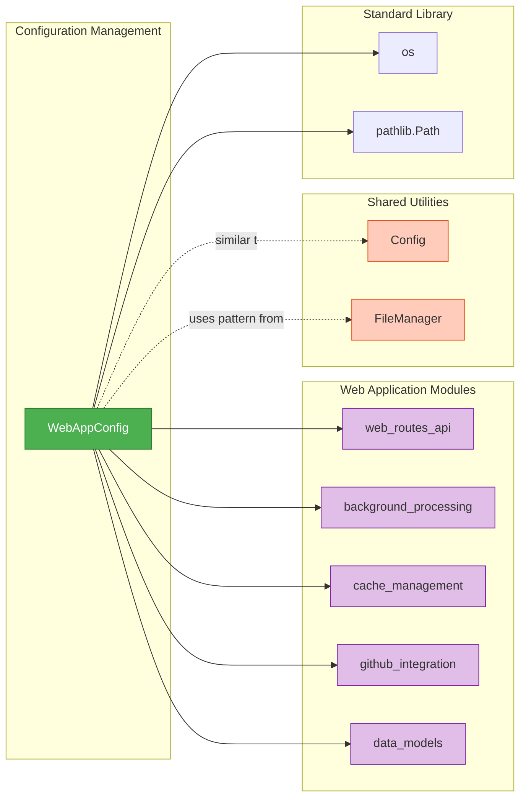

---

## Core Components

### WebAppConfig

The `WebAppConfig` class is the central configuration component that defines all web application settings as class-level constants.

#### Configuration Categories

##### 1. Directory Settings
```python
CACHE_DIR = "./output/cache"      # Cache storage location
TEMP_DIR = "./output/temp"        # Temporary file storage
OUTPUT_DIR = "./output"           # Base output directory
```

**Purpose:** Define the directory structure for web application file operations.

##### 2. Queue Settings
```python
QUEUE_SIZE = 100                  # Maximum queue capacity
```

**Purpose:** Configure the background job queue capacity for processing repository analysis requests.

##### 3. Cache Settings
```python
CACHE_EXPIRY_DAYS = 365          # Cache entry lifetime
```

**Purpose:** Define cache retention policies for generated documentation and analysis results.

##### 4. Job Cleanup Settings
```python
JOB_CLEANUP_HOURS = 24000        # Job retention period
RETRY_COOLDOWN_MINUTES = 3       # Retry delay for failed jobs
```

**Purpose:** Manage job lifecycle and retry behavior for background processing.

##### 5. Server Settings
```python
DEFAULT_HOST = "127.0.0.1"       # Default server host
DEFAULT_PORT = 8000              # Default server port
```

**Purpose:** Configure default web server binding parameters.

##### 6. Git Settings
```python
CLONE_TIMEOUT = 300              # Git clone timeout (seconds)
CLONE_DEPTH = 1                  # Shallow clone depth
```

**Purpose:** Configure Git repository cloning behavior for efficient repository processing.

#### Class Methods

##### ensure_directories()
```python
@classmethod
def ensure_directories(cls):
    """Ensure all required directories exist."""
```

**Purpose:** Create all required directories if they don't exist, ensuring the application can start successfully.

**Process Flow:**
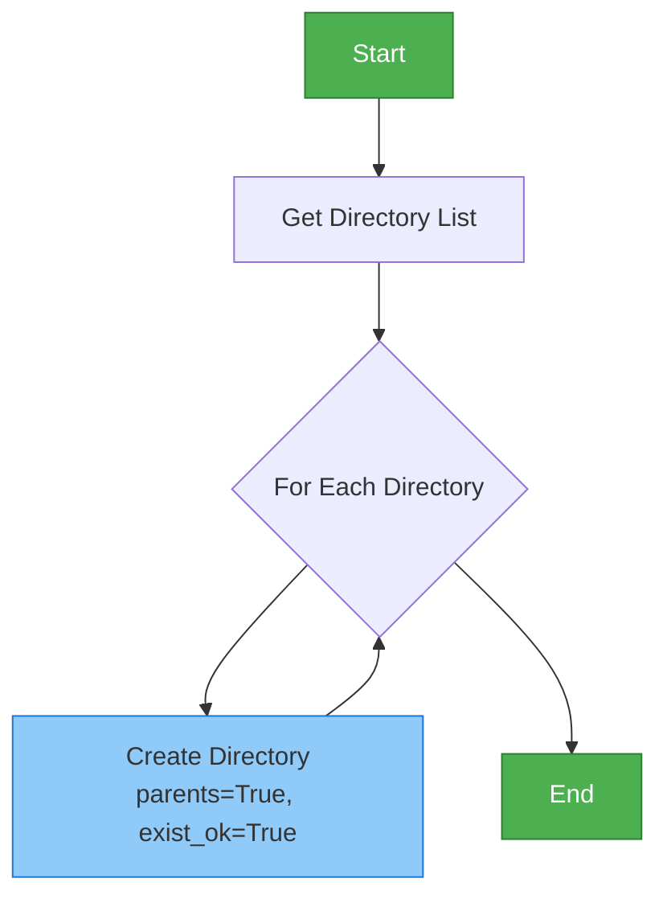

**Directories Created:**
- `CACHE_DIR`: For storing cached documentation
- `TEMP_DIR`: For temporary repository clones
- `OUTPUT_DIR`: Base directory for all outputs

##### get_absolute_path()
```python
@classmethod
def get_absolute_path(cls, path: str) -> str:
    """Get absolute path for a given relative path."""
```

**Purpose:** Convert relative paths to absolute paths for consistent file operations.

**Usage Example:**
```python
abs_cache_path = WebAppConfig.get_absolute_path(WebAppConfig.CACHE_DIR)
```

---

## Configuration Usage Patterns

### Initialization Pattern

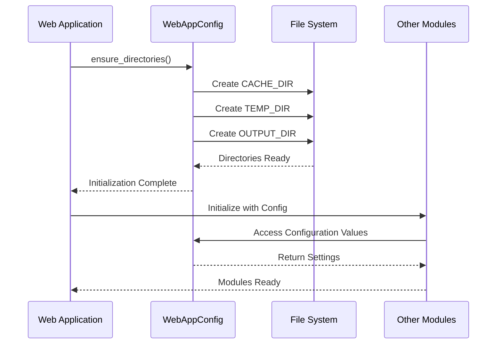

### Configuration Access Pattern

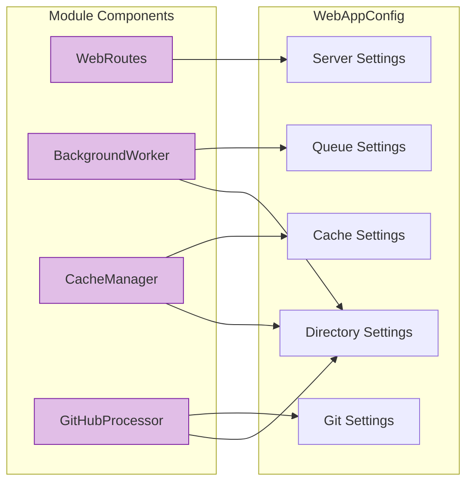

---

## Integration with Web Application

### Component Relationships

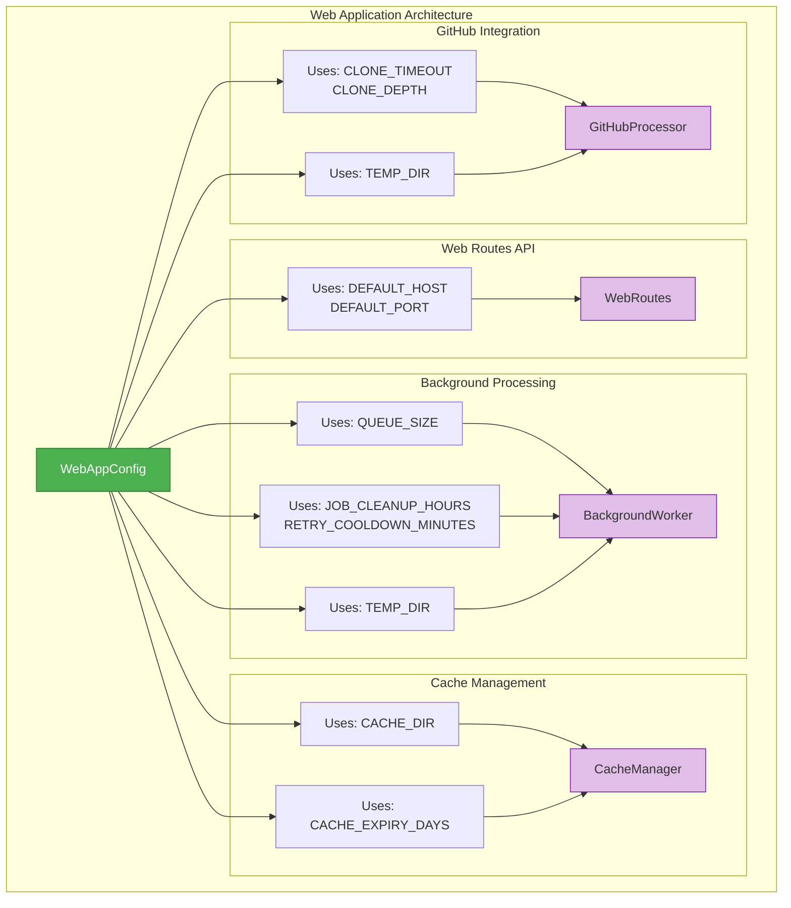

### Configuration Flow

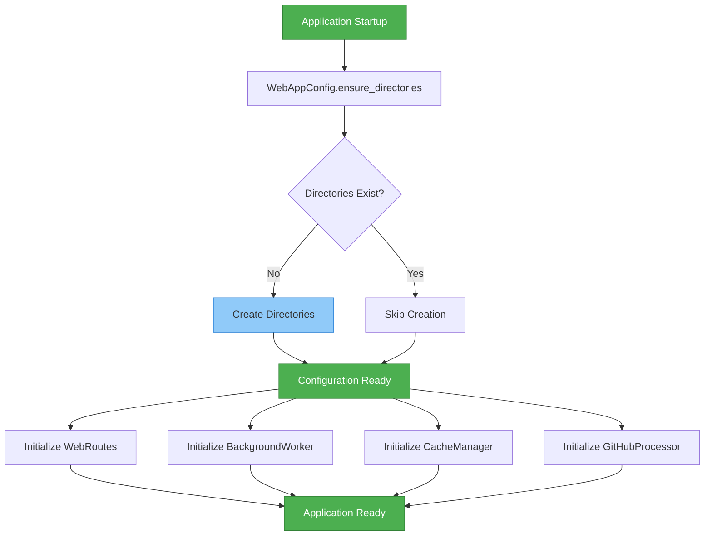

---

## Configuration vs. Shared Config

### Comparison with Shared Utilities Config

The CodeWiki system has two configuration classes serving different purposes:

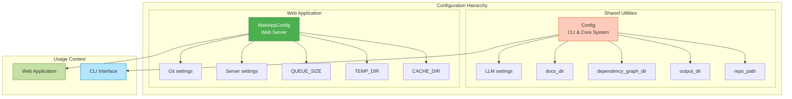

**Key Differences:**

| Aspect | WebAppConfig | Config (Shared) |
|--------|-------------|-----------------|
| **Purpose** | Web application settings | CLI and core system settings |
| **Scope** | Web server, cache, queue | Repository analysis, LLM |
| **Initialization** | Class-level constants | Instance from args/CLI |
| **Directory Focus** | Cache, temp, output | Docs, dependency graphs |
| **Additional Settings** | Server, queue, Git | LLM models, max depth |

---

## Directory Structure Management

### Directory Hierarchy

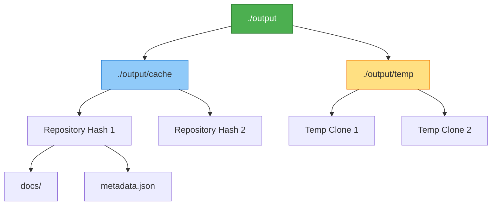

### Directory Usage by Component

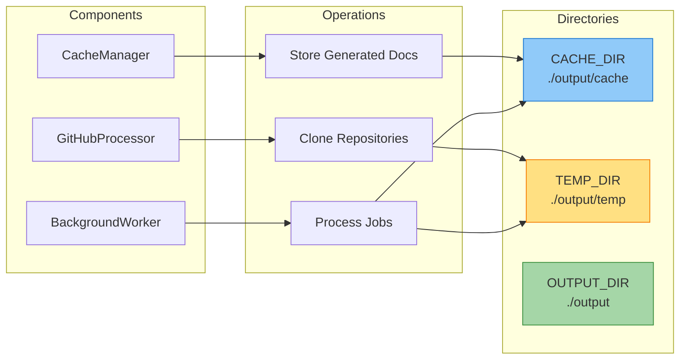

---

## Configuration Best Practices

### 1. Initialization Sequence

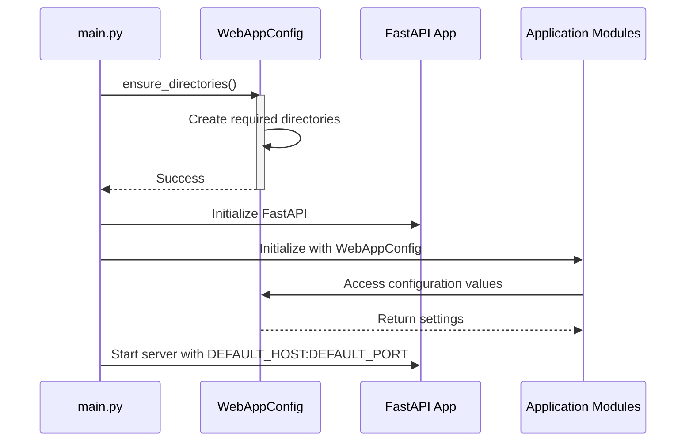

### 2. Configuration Access Pattern

**Recommended:**
```python
# Direct class-level access
cache_dir = WebAppConfig.CACHE_DIR
queue_size = WebAppConfig.QUEUE_SIZE

# Ensure directories before use
WebAppConfig.ensure_directories()
```

**Not Recommended:**
```python
# Don't instantiate the config class
config = WebAppConfig()  # Unnecessary

# Don't hardcode values
cache_dir = "./output/cache"  # Use WebAppConfig.CACHE_DIR instead
```

### 3. Path Resolution

```python
# Use get_absolute_path for file operations
abs_path = WebAppConfig.get_absolute_path(WebAppConfig.CACHE_DIR)

# Combine with pathlib for advanced operations
from pathlib import Path
cache_path = Path(WebAppConfig.CACHE_DIR)
```

---

## Configuration Settings Reference

### Complete Settings Table

| Category | Setting | Default Value | Used By | Purpose |
|----------|---------|---------------|---------|---------|
| **Directories** | `CACHE_DIR` | `"./output/cache"` | [cache_management](cache_management.md) | Store cached documentation |
| | `TEMP_DIR` | `"./output/temp"` | [github_integration](github_integration.md), [background_processing](background_processing.md) | Temporary repository clones |
| | `OUTPUT_DIR` | `"./output"` | All modules | Base output directory |
| **Queue** | `QUEUE_SIZE` | `100` | [background_processing](background_processing.md) | Maximum concurrent jobs |
| **Cache** | `CACHE_EXPIRY_DAYS` | `365` | [cache_management](cache_management.md) | Cache retention period |
| **Jobs** | `JOB_CLEANUP_HOURS` | `24000` | [background_processing](background_processing.md) | Job history retention |
| | `RETRY_COOLDOWN_MINUTES` | `3` | [background_processing](background_processing.md) | Retry delay for failures |
| **Server** | `DEFAULT_HOST` | `"127.0.0.1"` | [web_routes_api](web_routes_api.md) | Server bind address |
| | `DEFAULT_PORT` | `8000` | [web_routes_api](web_routes_api.md) | Server bind port |
| **Git** | `CLONE_TIMEOUT` | `300` | [github_integration](github_integration.md) | Clone operation timeout |
| | `CLONE_DEPTH` | `1` | [github_integration](github_integration.md) | Shallow clone depth |

---

## Extension and Customization

### Adding New Configuration Settings

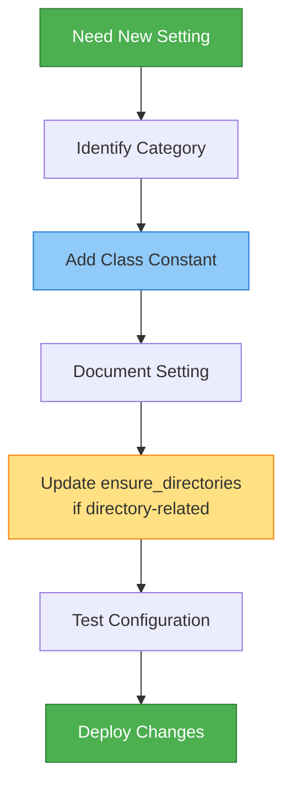

### Example: Adding a New Directory Setting

```python
class WebAppConfig:
    # ... existing settings ...
    
    # New directory setting
    LOGS_DIR = "./output/logs"
    
    @classmethod
    def ensure_directories(cls):
        """Ensure all required directories exist."""
        directories = [
            cls.CACHE_DIR,
            cls.TEMP_DIR,
            cls.OUTPUT_DIR,
            cls.LOGS_DIR,  # Add new directory
        ]
        
        for directory in directories:
            Path(directory).mkdir(parents=True, exist_ok=True)
```

---

## Error Handling and Validation

### Directory Creation Error Handling

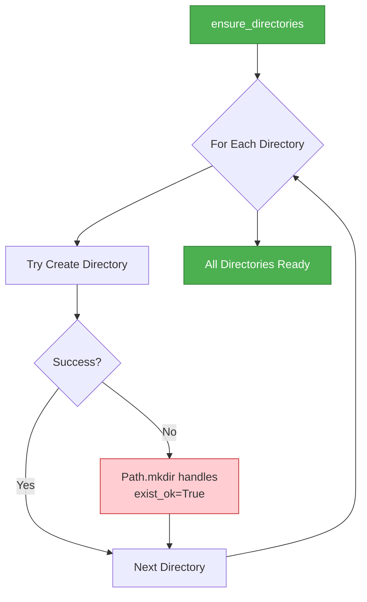

**Built-in Safety:**
- `parents=True`: Creates parent directories if needed
- `exist_ok=True`: No error if directory already exists
- Atomic operation: Each directory creation is independent

---

## Performance Considerations

### Configuration Access Performance

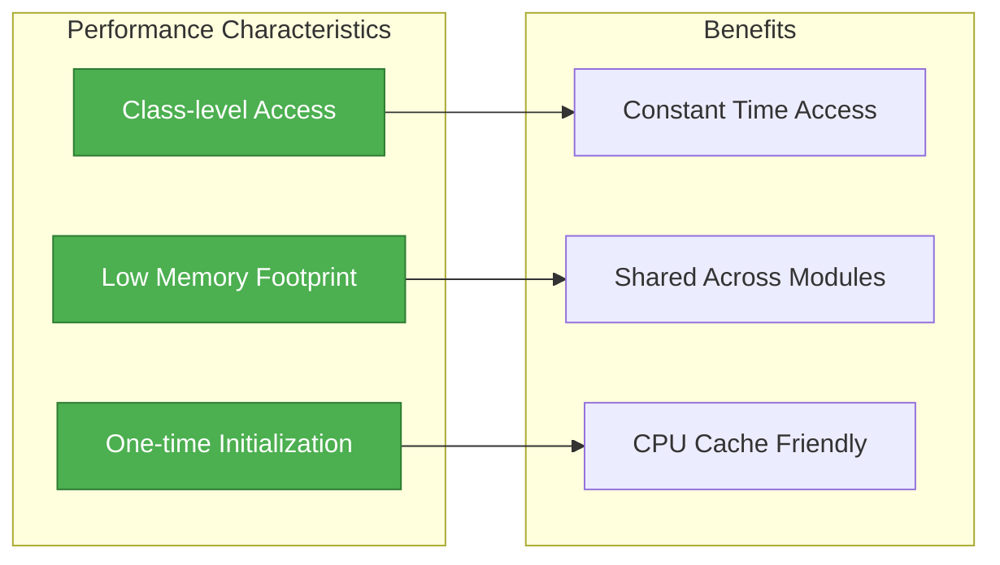

**Optimization Notes:**
- Class-level constants: No instantiation overhead
- Single directory creation: One-time startup cost
- No runtime configuration changes: Predictable behavior

---

## Testing Considerations

### Configuration Testing Strategy

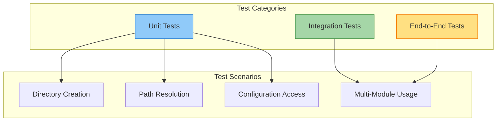

**Test Examples:**

```python
def test_ensure_directories():
    """Test directory creation."""
    WebAppConfig.ensure_directories()
    assert Path(WebAppConfig.CACHE_DIR).exists()
    assert Path(WebAppConfig.TEMP_DIR).exists()
    assert Path(WebAppConfig.OUTPUT_DIR).exists()

def test_get_absolute_path():
    """Test path resolution."""
    abs_path = WebAppConfig.get_absolute_path("./test")
    assert os.path.isabs(abs_path)

def test_configuration_values():
    """Test configuration constants."""
    assert WebAppConfig.QUEUE_SIZE == 100
    assert WebAppConfig.CACHE_EXPIRY_DAYS == 365
    assert WebAppConfig.DEFAULT_PORT == 8000
```

---

## Related Modules

### Direct Dependencies
- **[web_routes_api](web_routes_api.md)**: Uses server configuration settings
- **[background_processing](background_processing.md)**: Uses queue and job settings
- **[cache_management](cache_management.md)**: Uses cache directory and expiry settings
- **[github_integration](github_integration.md)**: Uses Git and temporary directory settings

### Related Configuration
- **[shared_utilities](shared_utilities.md)**: Contains `Config` class for CLI configuration
- **[cli_interface](cli_interface.md)**: Uses separate CLI configuration

### Parent Module
- **[web_application](web_application.md)**: Parent module containing all web components

---

## Summary

The **configuration_management** module provides a centralized, simple, and efficient configuration system for the CodeWiki web application. Key characteristics:

**Strengths:**
- ✅ Simple class-level constant design
- ✅ Clear separation of concerns by configuration category
- ✅ Built-in directory management utilities
- ✅ Zero-overhead configuration access
- ✅ Type-safe constant values

**Design Principles:**
- **Simplicity**: Class-level constants, no complex initialization
- **Reliability**: Built-in directory creation with error handling
- **Performance**: O(1) access time, minimal memory footprint
- **Maintainability**: Clear categorization and documentation

**Usage Pattern:**
```python
# Initialize once at startup
WebAppConfig.ensure_directories()

# Access anywhere in the application
cache_dir = WebAppConfig.CACHE_DIR
queue_size = WebAppConfig.QUEUE_SIZE
```

This module serves as the foundation for consistent configuration management across all web application components, ensuring reliable and predictable behavior.
