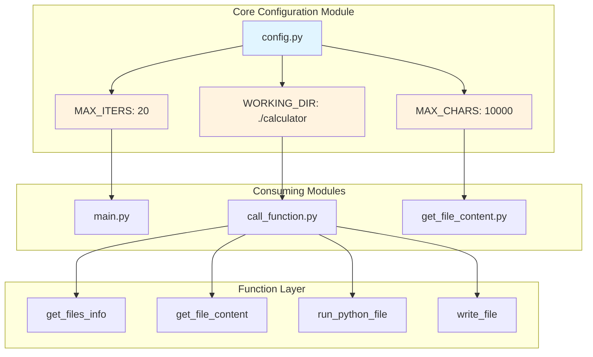
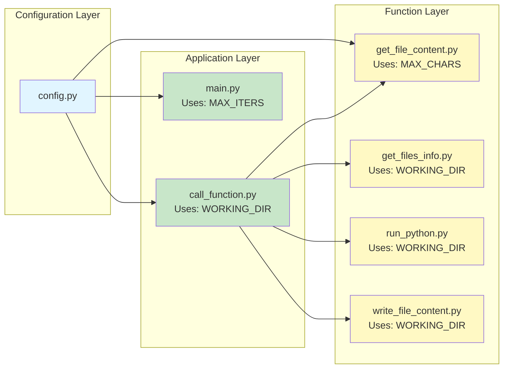
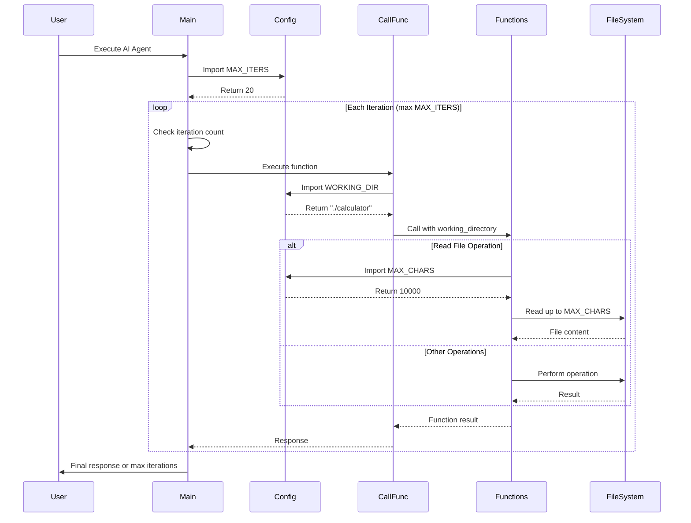
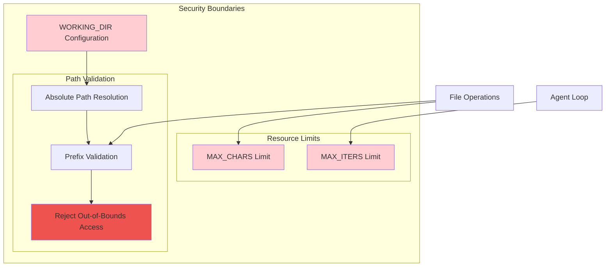
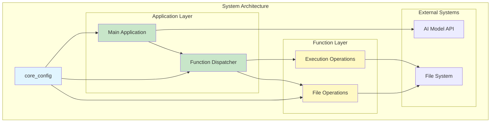

# Core Configuration Module

## Overview

The **core_config** module serves as the central configuration hub for the AI Agent system. It defines critical runtime parameters and constraints that govern the behavior of the AI coding agent, including file operation limits, working directory boundaries, and iteration controls. This module provides a simple yet essential configuration layer that ensures safe and controlled operation of the AI agent within defined boundaries.

---

## Table of Contents

- [Architecture](#architecture)
- [Core Components](#core-components)
- [Configuration Parameters](#configuration-parameters)
- [Integration Points](#integration-points)
- [Data Flow](#data-flow)
- [Security Considerations](#security-considerations)
- [Usage Examples](#usage-examples)
- [Best Practices](#best-practices)
- [Related Modules](#related-modules)

---

## Architecture

The core_config module implements a centralized configuration pattern using module-level constants. This design provides a single source of truth for system-wide parameters while maintaining simplicity and ease of modification.



### Design Principles

1. **Simplicity**: Module-level constants for easy access and modification
2. **Centralization**: Single source of truth for configuration values
3. **Security**: Enforces boundaries for file operations and execution limits
4. **Transparency**: Clear, self-documenting parameter names

---

## Core Components

### Configuration File: `config.py`

The configuration module consists of three primary constants that control different aspects of the AI agent's behavior:

```python
MAX_CHARS = 10000
WORKING_DIR = "./calculator"
MAX_ITERS = 20
```

#### Component Details

| Constant | Type | Default Value | Purpose |
|----------|------|---------------|---------|
| `MAX_CHARS` | int | 10000 | Maximum characters to read from a file |
| `WORKING_DIR` | str | "./calculator" | Root directory for all file operations |
| `MAX_ITERS` | int | 20 | Maximum AI agent iterations per session |

---

## Configuration Parameters

### MAX_CHARS

**Purpose**: Limits the amount of file content that can be read in a single operation.

**Rationale**:
- Prevents memory overflow from reading large files
- Controls token consumption in AI model interactions
- Ensures responsive system performance
- Provides predictable resource usage

**Impact**:
- Files larger than `MAX_CHARS` are truncated with a notification message
- Affects the `get_file_content` function behavior
- Influences AI model context window utilization

**Usage Context**:
```python
# In get_file_content.py
with open(abs_file_path, "r") as f:
    content = f.read(MAX_CHARS)
    if os.path.getsize(abs_file_path) > MAX_CHARS:
        content += f'[...File "{file_path}" truncated at {MAX_CHARS} characters]'
```

### WORKING_DIR

**Purpose**: Defines the sandboxed directory where all file operations are permitted.

**Rationale**:
- Security boundary to prevent unauthorized file system access
- Isolates AI agent operations to a specific project directory
- Prevents path traversal attacks
- Enables safe multi-project environments

**Impact**:
- All file paths are validated against this directory
- Operations outside this directory are rejected
- Automatically injected into all function calls
- Serves as the current working directory for Python execution

**Security Features**:
- Absolute path resolution prevents directory traversal
- Path validation using `startswith()` checks
- Consistent enforcement across all file operations

**Usage Context**:
```python
# In call_function.py
args["working_directory"] = WORKING_DIR
function_result = function_map[function_name](**args)

# In function implementations
abs_working_dir = os.path.abspath(working_directory)
abs_file_path = os.path.abspath(os.path.join(working_directory, file_path))
if not abs_file_path.startswith(abs_working_dir):
    return f'Error: Cannot access "{file_path}" as it is outside the permitted working directory'
```

### MAX_ITERS

**Purpose**: Limits the number of AI agent iterations in a single session.

**Rationale**:
- Prevents infinite loops in agent reasoning
- Controls API costs and resource consumption
- Ensures timely termination of stuck processes
- Provides predictable execution time bounds

**Impact**:
- Agent terminates after reaching the iteration limit
- Each iteration includes one AI model call and potential function executions
- Helps identify issues with agent logic or prompts

**Usage Context**:
```python
# In main.py
iters = 0
while True:
    iters += 1
    if iters > MAX_ITERS:
        print(f"Maximum iterations ({MAX_ITERS}) reached.")
        sys.exit(1)
    # ... agent logic
```

---

## Integration Points

The core_config module integrates with multiple system components:



### Direct Consumers

1. **main.py**: Imports `MAX_ITERS` for iteration control
2. **call_function.py**: Imports `WORKING_DIR` for function argument injection
3. **get_file_content.py**: Imports `MAX_CHARS` for file reading limits

### Indirect Consumers

All file operation functions receive `WORKING_DIR` through the `call_function` dispatcher:
- `get_files_info.py`
- `run_python.py`
- `write_file_content.py`

---

## Data Flow

The configuration values flow through the system in a hierarchical manner:



### Configuration Flow Patterns

1. **Import-Time Loading**: Configuration values are loaded when modules are imported
2. **Injection Pattern**: `WORKING_DIR` is injected into function calls by the dispatcher
3. **Direct Access**: `MAX_CHARS` and `MAX_ITERS` are accessed directly by consuming modules
4. **Validation Layer**: All file operations validate paths against `WORKING_DIR`

---

## Security Considerations

The core_config module plays a crucial role in system security:



### Security Features

#### 1. Directory Sandboxing

**Mechanism**:
```python
abs_working_dir = os.path.abspath(working_directory)
abs_file_path = os.path.abspath(os.path.join(working_directory, file_path))
if not abs_file_path.startswith(abs_working_dir):
    return f'Error: Cannot access "{file_path}" as it is outside the permitted working directory'
```

**Protection Against**:
- Path traversal attacks (e.g., `../../etc/passwd`)
- Symbolic link exploitation
- Absolute path injection
- Directory escape attempts

#### 2. Resource Exhaustion Prevention

**File Size Limits**:
- `MAX_CHARS` prevents reading entire large files into memory
- Protects against memory exhaustion attacks
- Ensures predictable resource consumption

**Iteration Limits**:
- `MAX_ITERS` prevents infinite loops
- Controls API costs
- Ensures timely process termination

#### 3. Execution Boundaries

**Python Execution**:
- Scripts execute within `WORKING_DIR` context
- 30-second timeout on subprocess execution
- Only `.py` files can be executed
- Output capture prevents resource leaks

### Security Best Practices

1. **Never use absolute paths** in `WORKING_DIR` from untrusted sources
2. **Validate `WORKING_DIR` exists** before starting the agent
3. **Monitor iteration counts** to detect potential issues
4. **Review file size limits** based on expected file types
5. **Use environment-specific configurations** for different deployment contexts

---

## Usage Examples

### Basic Configuration

```python
# config.py - Default configuration
MAX_CHARS = 10000
WORKING_DIR = "./calculator"
MAX_ITERS = 20
```

### Customizing for Different Environments

#### Development Environment
```python
# config.py - Development settings
MAX_CHARS = 50000  # Larger files for development
WORKING_DIR = "./dev_workspace"
MAX_ITERS = 50  # More iterations for debugging
```

#### Production Environment
```python
# config.py - Production settings
MAX_CHARS = 5000  # Stricter limits
WORKING_DIR = "./production_workspace"
MAX_ITERS = 10  # Faster termination
```

#### Testing Environment
```python
# config.py - Testing settings
MAX_CHARS = 1000  # Small files for tests
WORKING_DIR = "./test_workspace"
MAX_ITERS = 5  # Quick test cycles
```

### Dynamic Configuration (Advanced)

For more complex scenarios, you might extend the configuration:

```python
# config.py - Extended configuration
import os
from pathlib import Path

# Environment-based configuration
ENV = os.getenv("AI_AGENT_ENV", "development")

# Base configuration
BASE_CONFIG = {
    "development": {
        "MAX_CHARS": 50000,
        "WORKING_DIR": "./dev_workspace",
        "MAX_ITERS": 50,
    },
    "production": {
        "MAX_CHARS": 5000,
        "WORKING_DIR": "./production_workspace",
        "MAX_ITERS": 10,
    },
    "testing": {
        "MAX_CHARS": 1000,
        "WORKING_DIR": "./test_workspace",
        "MAX_ITERS": 5,
    }
}

# Load environment-specific configuration
config = BASE_CONFIG.get(ENV, BASE_CONFIG["development"])

MAX_CHARS = config["MAX_CHARS"]
WORKING_DIR = config["WORKING_DIR"]
MAX_ITERS = config["MAX_ITERS"]

# Ensure working directory exists
Path(WORKING_DIR).mkdir(parents=True, exist_ok=True)
```

### Configuration Validation

```python
# config_validator.py - Optional validation module
import os
from pathlib import Path
from config import MAX_CHARS, WORKING_DIR, MAX_ITERS

def validate_config():
    """Validate configuration parameters before starting the agent."""
    errors = []
    
    # Validate MAX_CHARS
    if not isinstance(MAX_CHARS, int) or MAX_CHARS <= 0:
        errors.append(f"MAX_CHARS must be a positive integer, got: {MAX_CHARS}")
    
    if MAX_CHARS > 1000000:
        errors.append(f"MAX_CHARS too large ({MAX_CHARS}), may cause memory issues")
    
    # Validate WORKING_DIR
    if not isinstance(WORKING_DIR, str):
        errors.append(f"WORKING_DIR must be a string, got: {type(WORKING_DIR)}")
    
    working_path = Path(WORKING_DIR)
    if not working_path.exists():
        errors.append(f"WORKING_DIR does not exist: {WORKING_DIR}")
    
    if not working_path.is_dir():
        errors.append(f"WORKING_DIR is not a directory: {WORKING_DIR}")
    
    # Validate MAX_ITERS
    if not isinstance(MAX_ITERS, int) or MAX_ITERS <= 0:
        errors.append(f"MAX_ITERS must be a positive integer, got: {MAX_ITERS}")
    
    if MAX_ITERS > 100:
        errors.append(f"MAX_ITERS very high ({MAX_ITERS}), may cause long execution times")
    
    return errors

# Usage in main.py
if __name__ == "__main__":
    validation_errors = validate_config()
    if validation_errors:
        print("Configuration errors:")
        for error in validation_errors:
            print(f"  - {error}")
        sys.exit(1)
    
    main()
```

---

## Best Practices

### Configuration Management

1. **Version Control**
   - Keep default configuration in version control
   - Use `.gitignore` for environment-specific overrides
   - Document configuration changes in commit messages

2. **Environment Separation**
   - Use different `WORKING_DIR` values for different environments
   - Never share working directories between environments
   - Implement environment-specific configuration files

3. **Security**
   - Never commit sensitive paths to version control
   - Validate `WORKING_DIR` exists and is accessible
   - Use relative paths when possible
   - Implement path validation in all file operations

4. **Performance**
   - Adjust `MAX_CHARS` based on expected file sizes
   - Monitor iteration counts to optimize `MAX_ITERS`
   - Profile memory usage with different `MAX_CHARS` values

5. **Monitoring**
   - Log configuration values at startup
   - Track iteration counts in production
   - Monitor file operation patterns
   - Alert on max iteration limit hits

### Configuration Tuning Guidelines

| Scenario | MAX_CHARS | WORKING_DIR | MAX_ITERS |
|----------|-----------|-------------|-----------|
| Small projects | 5,000 | `./project` | 10 |
| Medium projects | 10,000 | `./project` | 20 |
| Large projects | 20,000 | `./project` | 30 |
| Code review | 15,000 | `./review` | 15 |
| Testing | 1,000 | `./test` | 5 |
| Documentation | 50,000 | `./docs` | 25 |

### Common Pitfalls

1. **Setting MAX_CHARS too low**
   - Symptom: Frequent file truncation messages
   - Solution: Analyze typical file sizes and adjust accordingly

2. **Setting MAX_ITERS too low**
   - Symptom: Agent frequently hits iteration limit
   - Solution: Review agent prompts and increase limit if needed

3. **Using absolute paths in WORKING_DIR**
   - Symptom: Configuration not portable across systems
   - Solution: Use relative paths or environment variables

4. **Not validating WORKING_DIR existence**
   - Symptom: Runtime errors when agent starts
   - Solution: Implement startup validation

---

## Related Modules

The core_config module interacts with several other system modules:

### Direct Dependencies

- **None**: This module has no external dependencies within the system

### Dependent Modules

1. **[utilities](utilities.md)** (if FileManager exists)
   - May use configuration for file operation limits
   - Could extend file handling with config-aware utilities

2. **Main Application** (`main.py`)
   - Uses `MAX_ITERS` for agent loop control
   - Implements iteration counting and termination logic

3. **Function Dispatcher** (`call_function.py`)
   - Uses `WORKING_DIR` for security boundary enforcement
   - Injects working directory into all function calls

4. **File Operation Functions**
   - `get_file_content.py`: Uses `MAX_CHARS` for read limits
   - `get_files_info.py`: Uses `WORKING_DIR` for path validation
   - `run_python.py`: Uses `WORKING_DIR` for execution context
   - `write_file_content.py`: Uses `WORKING_DIR` for write validation

### Integration Patterns



### Cross-Module Configuration Flow

1. **Startup Phase**
   - Configuration loaded at module import time
   - Values validated (if validation implemented)
   - Working directory verified

2. **Runtime Phase**
   - `MAX_ITERS` controls main loop
   - `WORKING_DIR` enforces security boundaries
   - `MAX_CHARS` limits resource consumption

3. **Shutdown Phase**
   - Configuration values logged for audit
   - Iteration counts reported
   - Resource usage summarized

---

## Configuration Extension Points

For future enhancements, consider these extension points:

### 1. Configuration File Support

```python
# config.py - With YAML support
import yaml
from pathlib import Path

def load_config(config_file="config.yaml"):
    """Load configuration from YAML file."""
    if Path(config_file).exists():
        with open(config_file, 'r') as f:
            return yaml.safe_load(f)
    return {}

# Load from file or use defaults
file_config = load_config()
MAX_CHARS = file_config.get('max_chars', 10000)
WORKING_DIR = file_config.get('working_dir', './calculator')
MAX_ITERS = file_config.get('max_iters', 20)
```

### 2. Environment Variable Support

```python
# config.py - With environment variable support
import os

MAX_CHARS = int(os.getenv('AI_AGENT_MAX_CHARS', '10000'))
WORKING_DIR = os.getenv('AI_AGENT_WORKING_DIR', './calculator')
MAX_ITERS = int(os.getenv('AI_AGENT_MAX_ITERS', '20'))
```

### 3. Runtime Configuration Updates

```python
# config_manager.py - Dynamic configuration
class ConfigManager:
    """Manage runtime configuration updates."""
    
    def __init__(self):
        self._max_chars = 10000
        self._working_dir = './calculator'
        self._max_iters = 20
        self._listeners = []
    
    def update_max_chars(self, value):
        """Update MAX_CHARS with validation."""
        if value <= 0:
            raise ValueError("MAX_CHARS must be positive")
        old_value = self._max_chars
        self._max_chars = value
        self._notify_listeners('max_chars', old_value, value)
    
    def _notify_listeners(self, param, old_value, new_value):
        """Notify listeners of configuration changes."""
        for listener in self._listeners:
            listener(param, old_value, new_value)
```

### 4. Configuration Profiles

```python
# config_profiles.py - Profile-based configuration
PROFILES = {
    'minimal': {
        'MAX_CHARS': 1000,
        'WORKING_DIR': './minimal',
        'MAX_ITERS': 5,
    },
    'standard': {
        'MAX_CHARS': 10000,
        'WORKING_DIR': './calculator',
        'MAX_ITERS': 20,
    },
    'extended': {
        'MAX_CHARS': 50000,
        'WORKING_DIR': './extended',
        'MAX_ITERS': 50,
    }
}

def load_profile(profile_name='standard'):
    """Load configuration from a named profile."""
    return PROFILES.get(profile_name, PROFILES['standard'])
```

---

## Conclusion

The core_config module, despite its simplicity, is a critical component of the AI Agent system. It provides:

- **Security boundaries** through `WORKING_DIR` sandboxing
- **Resource management** through `MAX_CHARS` and `MAX_ITERS` limits
- **Centralized configuration** for easy system-wide adjustments
- **Clear separation of concerns** between configuration and implementation

By maintaining a simple, focused configuration module, the system achieves a balance between flexibility and security, making it easy to adapt to different use cases while maintaining robust operational boundaries.

For questions or contributions related to configuration management, please refer to the project's contribution guidelines.
