# Data Models Module

## Overview

The **data_models** module defines the core data structures and schemas used throughout the CodeWiki web application. It provides type-safe, validated models for repository submissions, job status tracking, cache entries, and API responses. This module serves as the foundational data layer that ensures consistency and type safety across all web application components.

Built using both Pydantic (for validation and API schemas) and Python dataclasses (for internal state management), this module bridges the gap between external API contracts and internal application state, providing robust data validation, serialization, and type checking capabilities.

---

## Table of Contents

- [Architecture](#architecture)
- [Core Components](#core-components)
- [Data Model Relationships](#data-model-relationships)
- [Model Lifecycle](#model-lifecycle)
- [Validation and Serialization](#validation-and-serialization)
- [Integration Points](#integration-points)
- [Usage Patterns](#usage-patterns)
- [Type Safety](#type-safety)
- [Dependencies](#dependencies)

---

## Architecture

### System Context

The data models module serves as the central data contract layer for the entire web application, ensuring type safety and validation across all components.

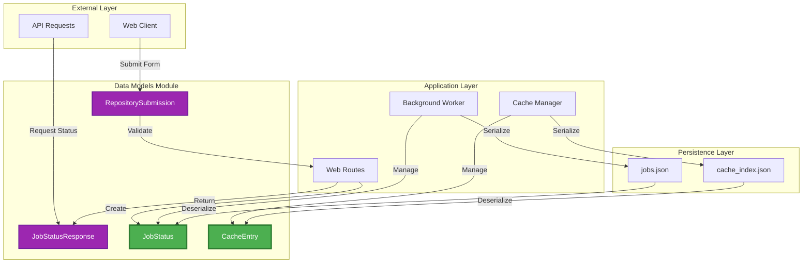

### Module Dependencies

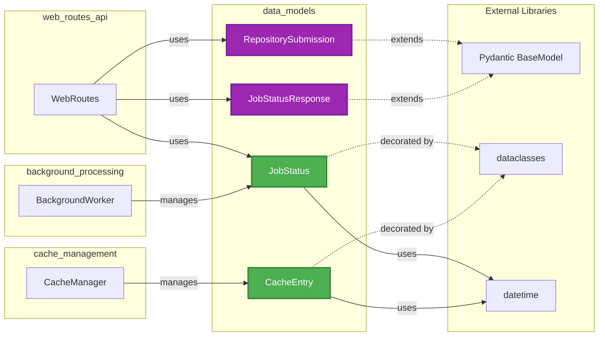

---

## Core Components

### Class Diagram

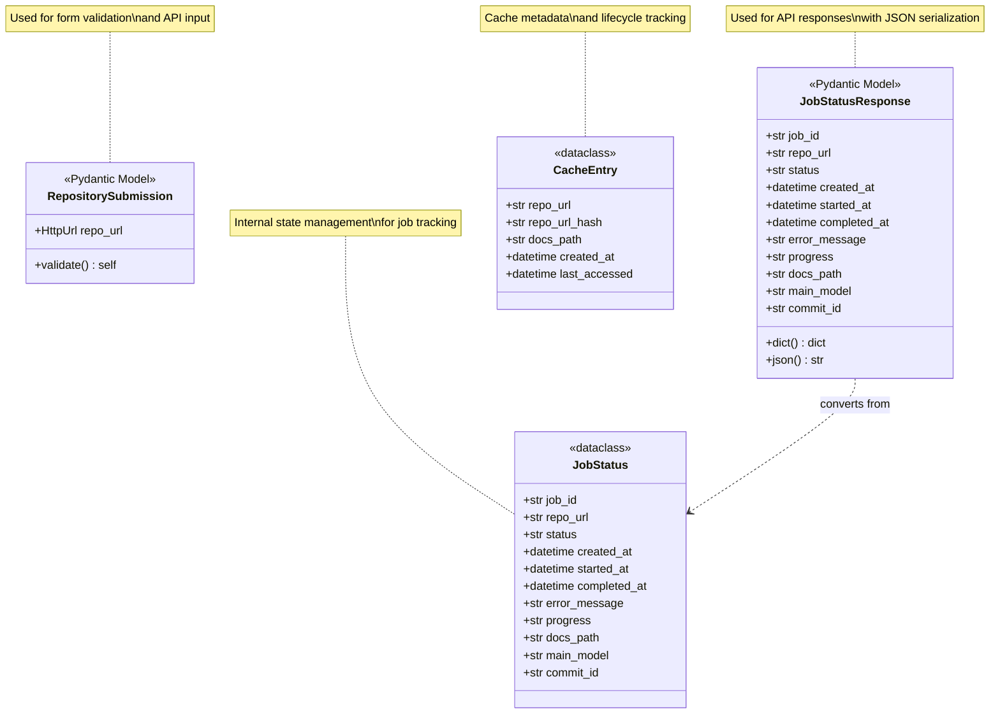

### 1. RepositorySubmission

**Purpose**: Validates and parses repository submission form data from web clients.

**Type**: Pydantic BaseModel (validation model)

**Attributes**:
- `repo_url` (HttpUrl): GitHub repository URL with automatic validation

**Key Features**:
- Automatic URL validation using Pydantic's HttpUrl type
- Ensures well-formed URLs before processing
- Provides clear validation error messages
- Serializable to/from JSON

**Usage Context**: 
- Web form submissions via POST requests
- API endpoint input validation
- See [web_routes_api](web_routes_api.md) for integration details

---

### 2. JobStatusResponse

**Purpose**: Provides a serializable API response model for job status queries.

**Type**: Pydantic BaseModel (response model)

**Attributes**:
- `job_id` (str): Unique identifier for the job
- `repo_url` (str): Repository URL being processed
- `status` (str): Current job status ('queued', 'processing', 'completed', 'failed')
- `created_at` (datetime): Job creation timestamp
- `started_at` (Optional[datetime]): Processing start time
- `completed_at` (Optional[datetime]): Completion/failure time
- `error_message` (Optional[str]): Error details if failed
- `progress` (str): Human-readable progress description
- `docs_path` (Optional[str]): Path to generated documentation
- `main_model` (Optional[str]): AI model used for generation
- `commit_id` (Optional[str]): Specific commit hash if provided

**Key Features**:
- Automatic JSON serialization via Pydantic
- ISO 8601 datetime formatting
- Optional field handling
- Type validation on construction

**Usage Context**:
- API endpoint responses
- Real-time status polling
- Job history queries
- See [web_routes_api](web_routes_api.md) for API implementation

---

### 3. JobStatus

**Purpose**: Tracks the complete lifecycle and state of documentation generation jobs.

**Type**: Python dataclass (internal state model)

**Attributes**:
- `job_id` (str): Unique identifier derived from repository full name
- `repo_url` (str): Normalized GitHub repository URL
- `status` (str): Job state indicator
  - `'queued'`: Waiting in processing queue
  - `'processing'`: Currently being processed
  - `'completed'`: Successfully finished
  - `'failed'`: Encountered an error
- `created_at` (datetime): Job submission timestamp
- `started_at` (Optional[datetime]): When processing began
- `completed_at` (Optional[datetime]): When job finished (success or failure)
- `error_message` (Optional[str]): Detailed error information
- `progress` (str): Current operation description (default: "")
- `docs_path` (Optional[str]): Absolute path to generated documentation
- `main_model` (Optional[str]): AI model identifier used
- `commit_id` (Optional[str]): Git commit hash for specific version

**Key Features**:
- Mutable state for tracking job progression
- Comprehensive lifecycle tracking
- Error context preservation
- Progress reporting capability
- Persistence-friendly structure

**State Transitions**:

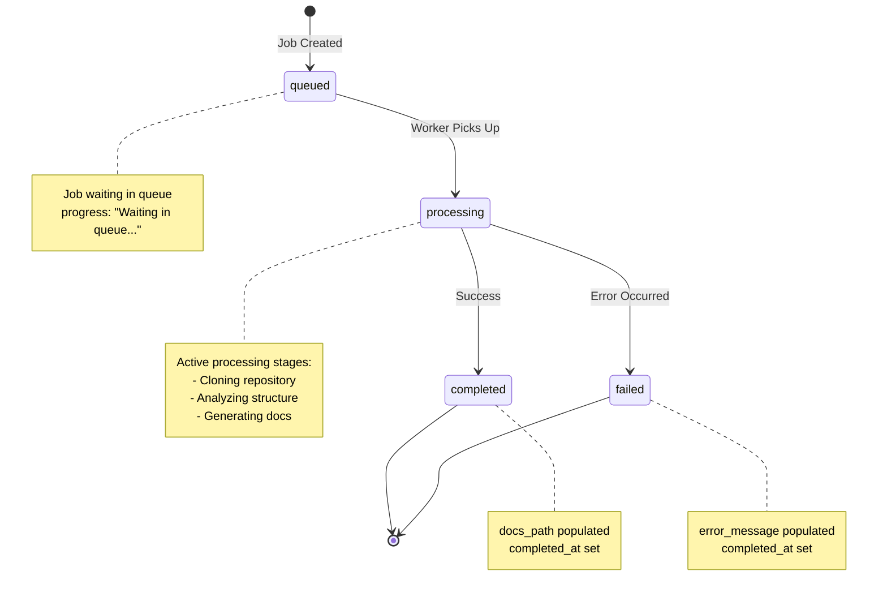

**Usage Context**:
- Job queue management in [background_processing](background_processing.md)
- Status tracking and updates
- Persistence to jobs.json
- Cache coordination

---

### 4. CacheEntry

**Purpose**: Represents cached documentation results with metadata for lifecycle management.

**Type**: Python dataclass (cache metadata model)

**Attributes**:
- `repo_url` (str): Original repository URL (cache key)
- `repo_url_hash` (str): SHA-256 hash of URL (16 characters)
- `docs_path` (str): Absolute path to cached documentation directory
- `created_at` (datetime): When documentation was generated
- `last_accessed` (datetime): Most recent access timestamp

**Key Features**:
- Hash-based cache key generation
- Access tracking for LRU strategies
- Expiration support via timestamps
- Path reference management

**Usage Context**:
- Cache lookup and storage in [cache_management](cache_management.md)
- Expiration policy enforcement
- Cache index persistence
- Access pattern tracking

---

## Data Model Relationships

### Model Interaction Flow

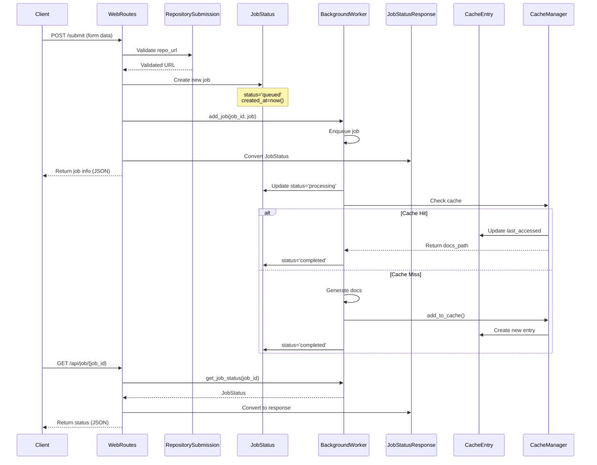

### Data Transformation Pipeline

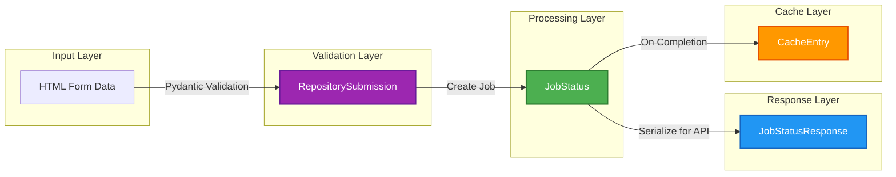

---

## Model Lifecycle

### JobStatus Lifecycle

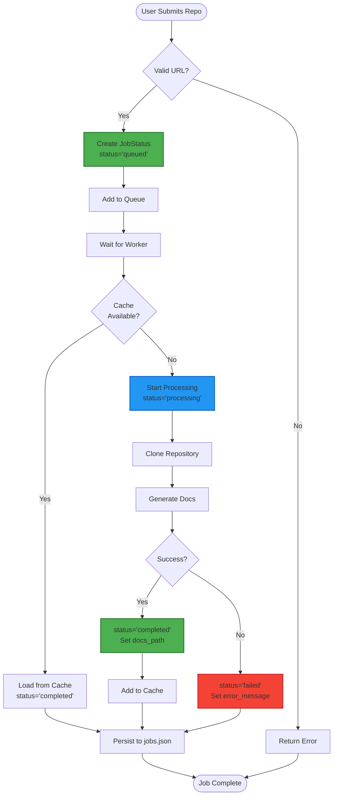

### CacheEntry Lifecycle

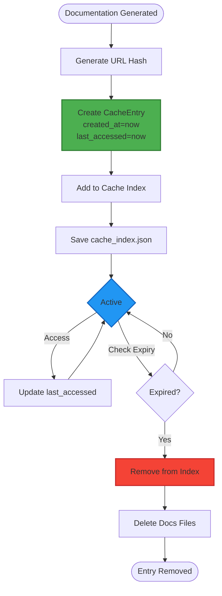

---

## Validation and Serialization

### Pydantic Models (RepositorySubmission, JobStatusResponse)

**Validation Features**:
- Automatic type checking
- URL format validation
- Required field enforcement
- Custom validators support

**Serialization**:
```python
# Automatic JSON serialization
response = JobStatusResponse(
    job_id="owner--repo",
    repo_url="https://github.com/owner/repo",
    status="completed",
    created_at=datetime.now()
)

# Convert to JSON
json_data = response.json()  # ISO 8601 datetime formatting

# Convert to dict
dict_data = response.dict()
```

### Dataclass Models (JobStatus, CacheEntry)

**Serialization for Persistence**:
```python
# Manual serialization to dict
job_dict = {
    'job_id': job.job_id,
    'repo_url': job.repo_url,
    'status': job.status,
    'created_at': job.created_at.isoformat(),
    'started_at': job.started_at.isoformat() if job.started_at else None,
    # ... other fields
}

# Deserialization from dict
job = JobStatus(
    job_id=data['job_id'],
    repo_url=data['repo_url'],
    status=data['status'],
    created_at=datetime.fromisoformat(data['created_at']),
    started_at=datetime.fromisoformat(data['started_at']) if data.get('started_at') else None,
    # ... other fields
)
```

### Conversion Between Models

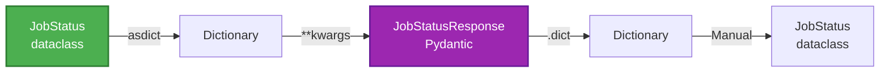

**Example Conversion**:
```python
from dataclasses import asdict

# JobStatus to JobStatusResponse
job_status = JobStatus(...)
response = JobStatusResponse(**asdict(job_status))

# JobStatusResponse to dict (for API)
json_response = response.dict()
```

---

## Integration Points

### 1. Web Routes Integration

The data models are extensively used in [web_routes_api](web_routes_api.md):

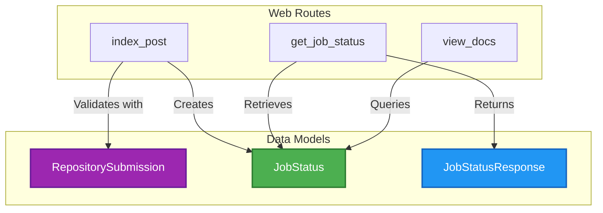

**Key Operations**:
- Form validation using `RepositorySubmission`
- Job creation and tracking with `JobStatus`
- API responses via `JobStatusResponse`

### 2. Background Worker Integration

The [background_processing](background_processing.md) module manages `JobStatus` lifecycle:

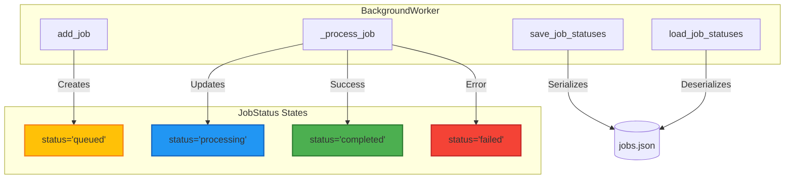

**Key Operations**:
- Job queue management
- Status updates during processing
- Persistence to/from JSON
- Progress tracking

### 3. Cache Manager Integration

The [cache_management](cache_management.md) module uses `CacheEntry`:

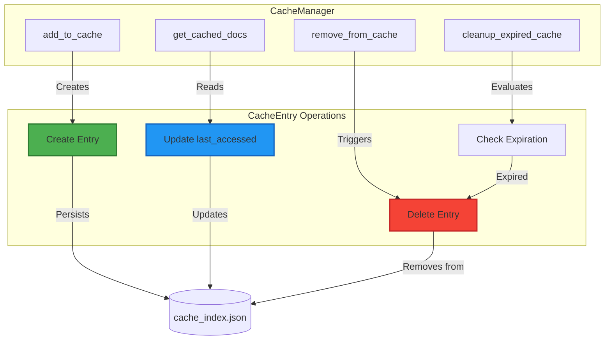

**Key Operations**:
- Cache entry creation
- Access time tracking
- Expiration management
- Index persistence

---

## Usage Patterns

### Pattern 1: Repository Submission Flow

```python
from codewiki.src.fe.models import RepositorySubmission, JobStatus
from datetime import datetime

# 1. Validate user input
try:
    submission = RepositorySubmission(repo_url="https://github.com/owner/repo")
    validated_url = str(submission.repo_url)
except ValidationError as e:
    # Handle validation error
    return {"error": str(e)}

# 2. Create job
job = JobStatus(
    job_id="owner--repo",
    repo_url=validated_url,
    status="queued",
    created_at=datetime.now(),
    progress="Waiting in queue..."
)

# 3. Add to processing queue
background_worker.add_job(job.job_id, job)
```

### Pattern 2: Job Status Query

```python
from codewiki.src.fe.models import JobStatusResponse
from dataclasses import asdict

# 1. Retrieve job status
job = background_worker.get_job_status(job_id)

if not job:
    raise HTTPException(status_code=404, detail="Job not found")

# 2. Convert to API response
response = JobStatusResponse(**asdict(job))

# 3. Return as JSON
return response  # FastAPI auto-serializes
```

### Pattern 3: Cache Management

```python
from codewiki.src.fe.models import CacheEntry
from datetime import datetime

# 1. Create cache entry
entry = CacheEntry(
    repo_url="https://github.com/owner/repo",
    repo_url_hash=cache_manager.get_repo_hash(repo_url),
    docs_path="/path/to/docs",
    created_at=datetime.now(),
    last_accessed=datetime.now()
)

# 2. Add to cache index
cache_manager.cache_index[entry.repo_url_hash] = entry
cache_manager.save_cache_index()

# 3. Update access time on retrieval
entry.last_accessed = datetime.now()
cache_manager.save_cache_index()
```

### Pattern 4: Job Persistence

```python
from datetime import datetime

# Serialize jobs to JSON
def save_job_statuses(jobs: Dict[str, JobStatus], file_path: Path):
    data = {}
    for job_id, job in jobs.items():
        data[job_id] = {
            'job_id': job.job_id,
            'repo_url': job.repo_url,
            'status': job.status,
            'created_at': job.created_at.isoformat(),
            'started_at': job.started_at.isoformat() if job.started_at else None,
            'completed_at': job.completed_at.isoformat() if job.completed_at else None,
            'error_message': job.error_message,
            'progress': job.progress,
            'docs_path': job.docs_path,
            'main_model': job.main_model,
            'commit_id': job.commit_id
        }
    
    file_manager.save_json(data, file_path)

# Deserialize jobs from JSON
def load_job_statuses(file_path: Path) -> Dict[str, JobStatus]:
    data = file_manager.load_json(file_path)
    jobs = {}
    
    for job_id, job_data in data.items():
        jobs[job_id] = JobStatus(
            job_id=job_data['job_id'],
            repo_url=job_data['repo_url'],
            status=job_data['status'],
            created_at=datetime.fromisoformat(job_data['created_at']),
            started_at=datetime.fromisoformat(job_data['started_at']) if job_data.get('started_at') else None,
            completed_at=datetime.fromisoformat(job_data['completed_at']) if job_data.get('completed_at') else None,
            error_message=job_data.get('error_message'),
            progress=job_data.get('progress', ''),
            docs_path=job_data.get('docs_path'),
            main_model=job_data.get('main_model'),
            commit_id=job_data.get('commit_id')
        )
    
    return jobs
```

---

## Type Safety

### Pydantic Type Validation

```python
from pydantic import ValidationError

# Valid submission
try:
    submission = RepositorySubmission(
        repo_url="https://github.com/owner/repo"
    )
    # ✓ Valid HttpUrl
except ValidationError as e:
    print(e)

# Invalid submissions
try:
    submission = RepositorySubmission(repo_url="not-a-url")
    # ✗ Raises ValidationError: invalid URL
except ValidationError as e:
    print(e.errors())

try:
    submission = RepositorySubmission(repo_url="http://example.com")
    # ✓ Valid URL but may fail GitHub validation in routes
except ValidationError as e:
    print(e)
```

### Dataclass Type Hints

```python
from typing import Optional
from datetime import datetime

# Type hints provide IDE support and runtime checking
job: JobStatus = JobStatus(
    job_id="test-job",
    repo_url="https://github.com/owner/repo",
    status="queued",
    created_at=datetime.now()
)

# Optional fields
job.started_at = datetime.now()  # Optional[datetime]
job.error_message = "Error occurred"  # Optional[str]

# Type checking catches errors
# job.status = 123  # Type checker warning: expected str
```

### Status Value Constraints

While not enforced at the model level, status values follow a strict contract:

```python
# Valid status values
VALID_STATUSES = ['queued', 'processing', 'completed', 'failed']

# Usage pattern
def update_job_status(job: JobStatus, new_status: str):
    if new_status not in VALID_STATUSES:
        raise ValueError(f"Invalid status: {new_status}")
    job.status = new_status
```

---

## Dependencies

### External Dependencies

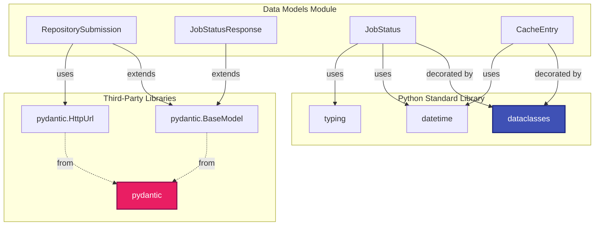

### Module Dependencies

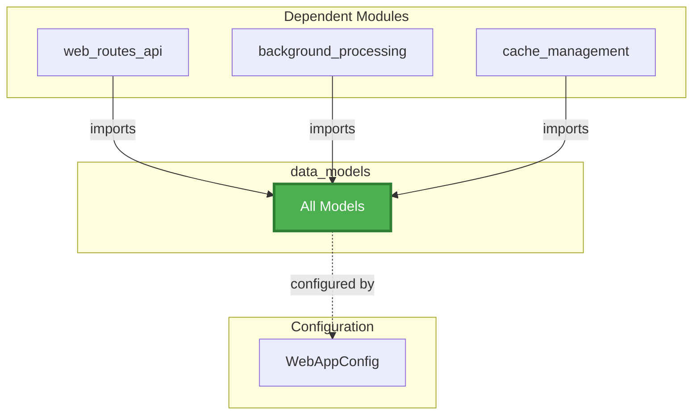

**Key Dependencies**:

1. **Pydantic** (v2.x): Validation and serialization for API models
2. **dataclasses**: Internal state management
3. **datetime**: Timestamp handling
4. **typing**: Type hints and Optional types

**Dependent Modules**:

1. **[web_routes_api](web_routes_api.md)**: Uses all models for request/response handling
2. **[background_processing](background_processing.md)**: Manages JobStatus lifecycle
3. **[cache_management](cache_management.md)**: Manages CacheEntry lifecycle
4. **[configuration_management](configuration_management.md)**: Provides configuration values

---

## Best Practices

### 1. Model Selection

**Use Pydantic Models When**:
- Validating external input (API requests, forms)
- Serializing responses to JSON
- Need automatic validation
- Working with API boundaries

**Use Dataclasses When**:
- Internal state management
- Performance-critical operations
- Need mutability
- Working with persistence layer

### 2. Validation Strategy

```python
# Always validate at boundaries
@app.post("/submit")
async def submit_repo(submission: RepositorySubmission):
    # Pydantic automatically validates
    validated_url = str(submission.repo_url)
    
    # Additional business logic validation
    if not GitHubRepoProcessor.is_valid_github_url(validated_url):
        raise HTTPException(400, "Invalid GitHub URL")
    
    # Proceed with validated data
    ...
```

### 3. State Management

```python
# Immutable creation, mutable updates
job = JobStatus(
    job_id="test",
    repo_url="https://github.com/owner/repo",
    status="queued",
    created_at=datetime.now()
)

# Update state as job progresses
job.status = "processing"
job.started_at = datetime.now()
job.progress = "Cloning repository..."

# Final state
job.status = "completed"
job.completed_at = datetime.now()
job.docs_path = "/path/to/docs"
```

### 4. Error Handling

```python
from pydantic import ValidationError

try:
    submission = RepositorySubmission(repo_url=user_input)
except ValidationError as e:
    # Provide user-friendly error messages
    errors = e.errors()
    return {"error": "Invalid repository URL", "details": errors}
```

### 5. Serialization Consistency

```python
# Always use isoformat for datetime serialization
data = {
    'created_at': job.created_at.isoformat(),
    'started_at': job.started_at.isoformat() if job.started_at else None
}

# Always use fromisoformat for deserialization
job.created_at = datetime.fromisoformat(data['created_at'])
job.started_at = datetime.fromisoformat(data['started_at']) if data.get('started_at') else None
```

---

## Summary

The **data_models** module provides the foundational data structures for the CodeWiki web application, ensuring type safety, validation, and consistency across all components. By combining Pydantic's validation capabilities with Python's dataclasses, it creates a robust data layer that bridges external APIs and internal state management.

**Key Strengths**:
- ✅ Strong type safety with Pydantic and type hints
- ✅ Automatic validation at API boundaries
- ✅ Clear separation between API contracts and internal state
- ✅ Comprehensive lifecycle tracking
- ✅ Efficient serialization/deserialization
- ✅ Well-integrated with all web application modules

**Related Documentation**:
- [web_routes_api](web_routes_api.md) - API endpoint implementation
- [background_processing](background_processing.md) - Job processing and lifecycle
- [cache_management](cache_management.md) - Cache entry management
- [configuration_management](configuration_management.md) - Configuration values
- [web_application](web_application.md) - Overall web application architecture
