# Dependency Analysis Module

## Overview

The Dependency Analysis module (`codewiki/src/be/dependency_analyzer`) is the core analytical engine of the CodeWiki system. It provides sophisticated capabilities for analyzing code dependencies, building dependency graphs, and understanding the relationships between different components within a codebase. This module serves as the foundation for generating comprehensive code documentation by mapping out how different parts of a software system interact with each other.

The module processes source code repositories to extract structural information, identify dependencies between components, and create navigable representations of the codebase architecture. It powers both the CLI interface for direct analysis and the web frontend for interactive exploration of code dependencies.

---

## Table of Contents

- [Architecture](#architecture)
- [Core Components](#core-components)
- [Dependency Graph Construction](#dependency-graph-construction)
- [Node Selection and Filtering](#node-selection-and-filtering)
- [Repository Analysis](#repository-analysis)
- [Integration with Other Modules](#integration-with-other-modules)
- [Data Flow](#data-flow)
- [Analysis Algorithms](#analysis-algorithms)
- [Performance Considerations](#performance-considerations)
- [Dependencies](#dependencies)

---

## Architecture

The Dependency Analysis module follows a layered architecture that separates data models, analysis logic, and graph construction algorithms.

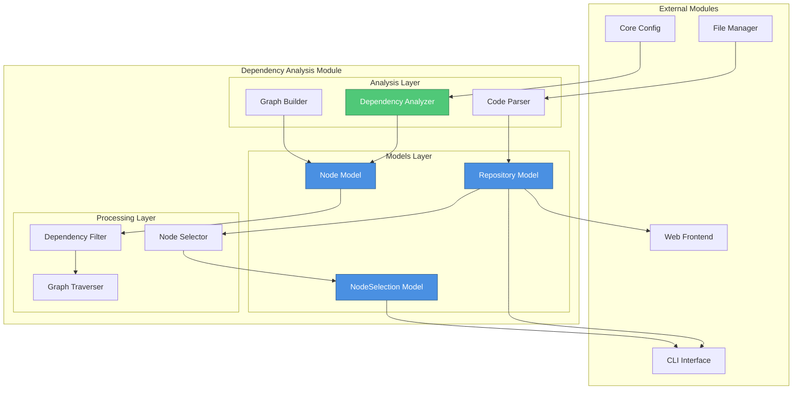

### Architectural Principles

1. **Separation of Concerns**: Data models are separated from analysis logic and processing algorithms
2. **Graph-Based Representation**: Dependencies are modeled as directed graphs for efficient traversal and analysis
3. **Scalability**: Designed to handle large codebases with thousands of components
4. **Extensibility**: Easy to add support for new programming languages and dependency types
5. **Immutability**: Core data structures are immutable to ensure thread-safety and predictable behavior

---

## Core Components

### Component Hierarchy

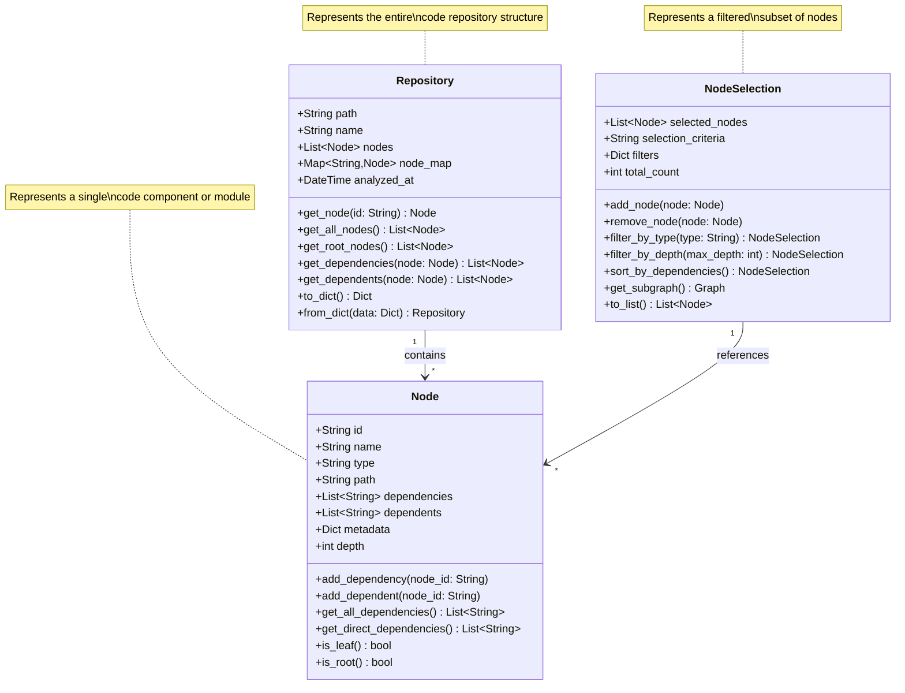

### Repository (`codewiki.src.be.dependency_analyzer.models.core.Repository`)

The Repository component represents the complete analyzed structure of a codebase, serving as the root container for all discovered nodes and their relationships.

**Key Responsibilities:**
- Storing the complete dependency graph of a codebase
- Providing efficient lookup of nodes by ID or path
- Managing bidirectional dependency relationships
- Tracking analysis metadata (timestamp, version, configuration)
- Serializing and deserializing repository structures
- Computing repository-level metrics and statistics

**Data Structure:**
- **Nodes Collection**: All discovered code components (classes, functions, modules)
- **Dependency Graph**: Directed graph representing relationships between nodes
- **Metadata**: Repository information (name, path, language, version)
- **Index Structures**: Optimized lookups by ID, path, type, and name
- **Analysis Context**: Configuration and parameters used during analysis

**Key Operations:**
- `get_node(id)`: Retrieve a specific node by its unique identifier
- `get_all_nodes()`: Return all nodes in the repository
- `get_root_nodes()`: Find nodes with no dependencies (entry points)
- `get_dependencies(node)`: Get all nodes that a given node depends on
- `get_dependents(node)`: Get all nodes that depend on a given node
- `compute_metrics()`: Calculate repository-level statistics

### Node (`codewiki.src.be.dependency_analyzer.models.core.Node`)

The Node component represents a single analyzable unit within the codebase, such as a module, class, function, or file.

**Key Responsibilities:**
- Representing individual code components
- Tracking dependencies and dependents
- Storing component metadata (type, location, complexity)
- Managing hierarchical relationships (parent-child)
- Computing node-level metrics
- Supporting various node types (module, class, function, file)

**Node Types:**
- **Module**: Python modules, JavaScript modules, etc.
- **Class**: Class definitions and their members
- **Function**: Function and method definitions
- **File**: Source code files
- **Package**: Package or namespace containers
- **Interface**: Interface definitions (for typed languages)

**Attributes:**
- **Identity**: Unique ID, name, qualified name
- **Location**: File path, line numbers, position
- **Type**: Node type classification
- **Dependencies**: List of node IDs this node depends on
- **Dependents**: List of node IDs that depend on this node
- **Metadata**: Additional information (docstrings, annotations, complexity)
- **Depth**: Distance from root nodes in the dependency graph

**Key Operations:**
- `add_dependency(node_id)`: Register a dependency relationship
- `add_dependent(node_id)`: Register a dependent relationship
- `get_all_dependencies()`: Recursively get all dependencies
- `get_direct_dependencies()`: Get only immediate dependencies
- `is_leaf()`: Check if node has no dependencies
- `is_root()`: Check if node has no dependents

### NodeSelection (`codewiki.src.be.dependency_analyzer.models.analysis.NodeSelection`)

The NodeSelection component represents a filtered or selected subset of nodes from a repository, used for focused analysis and visualization.

**Key Responsibilities:**
- Filtering nodes based on various criteria
- Creating subgraphs from the full dependency graph
- Supporting complex selection queries
- Maintaining selection metadata and context
- Enabling incremental selection refinement
- Optimizing visualization of large graphs

**Selection Criteria:**
- **By Type**: Filter nodes by their type (e.g., only classes)
- **By Depth**: Limit nodes by their depth in the dependency graph
- **By Path**: Select nodes matching path patterns
- **By Dependencies**: Select nodes based on dependency count
- **By Name Pattern**: Filter using regular expressions
- **Custom Filters**: User-defined filter functions

**Use Cases:**
- Visualizing a subset of the dependency graph
- Analyzing specific modules or packages
- Finding circular dependencies
- Identifying highly coupled components
- Generating focused documentation
- Performance optimization for large repositories

**Key Operations:**
- `filter_by_type(type)`: Filter nodes by type
- `filter_by_depth(max_depth)`: Limit by dependency depth
- `filter_by_pattern(pattern)`: Filter by name pattern
- `sort_by_dependencies()`: Order by dependency count
- `get_subgraph()`: Extract a subgraph from selection
- `union(other)`: Combine with another selection
- `intersection(other)`: Find common nodes with another selection

---

## Dependency Graph Construction

### Graph Building Process

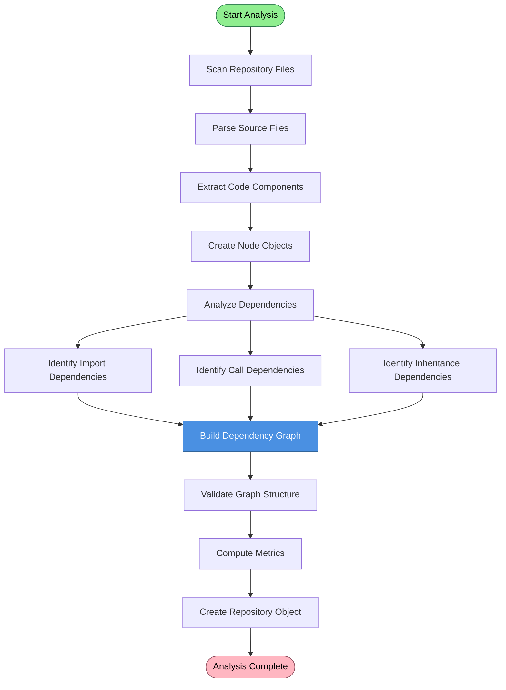

### Dependency Types

The module identifies and tracks multiple types of dependencies:

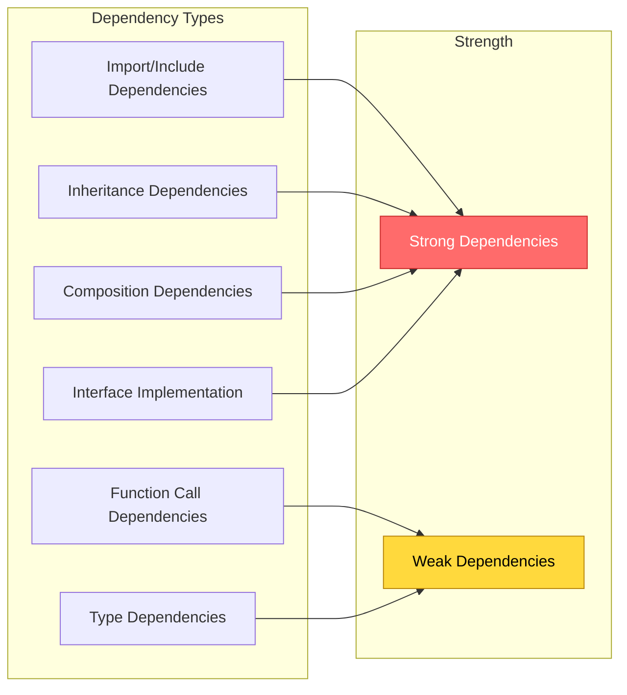

### Graph Validation

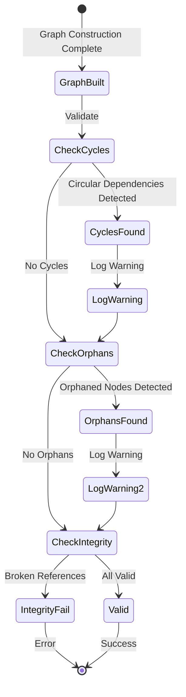

---

## Node Selection and Filtering

### Selection Workflow

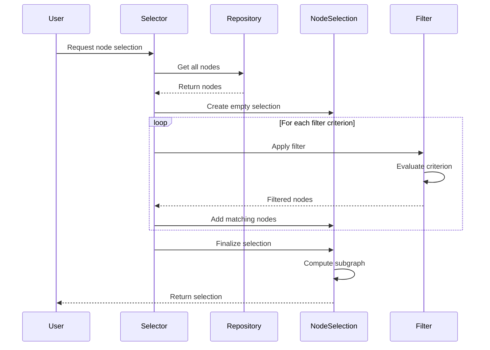

### Filter Composition

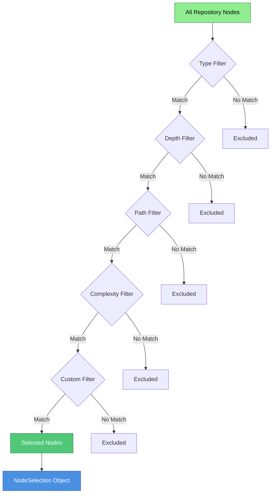

### Common Selection Patterns

#### 1. Module-Level Selection


#### 2. Circular Dependency Detection


#### 3. High-Coupling Analysis


---

## Repository Analysis

### Analysis Pipeline

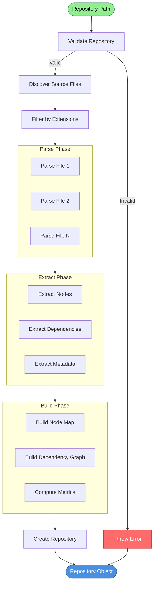

### Multi-Language Support

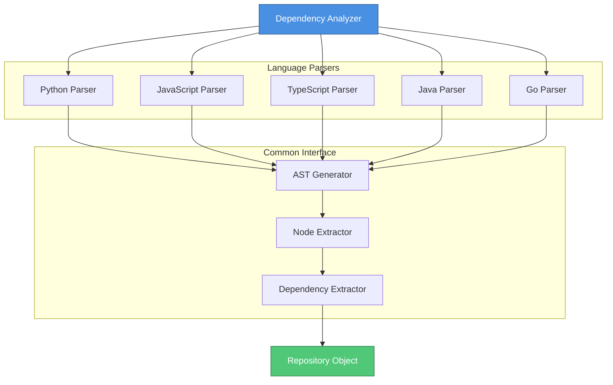

### Repository Metrics

The analysis engine computes various metrics for the repository:

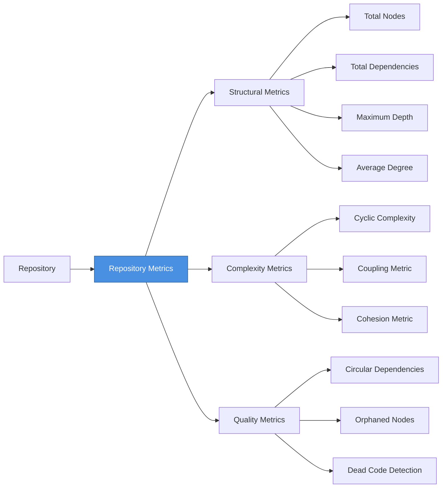

---

## Integration with Other Modules

### Module Interaction Map

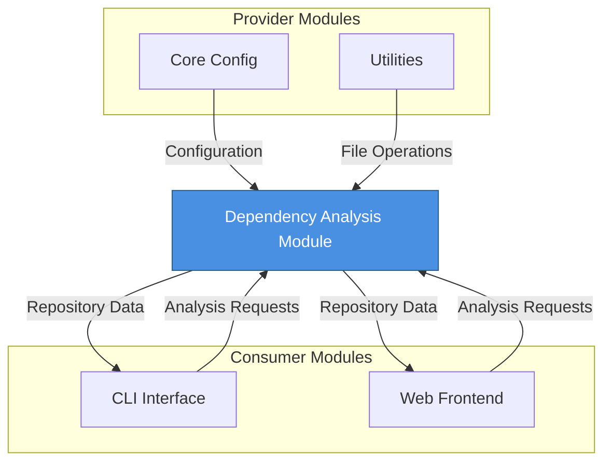

### Integration Points

#### With CLI Interface Module

The [cli_interface](cli_interface.md) module uses the dependency analysis engine for command-line operations:

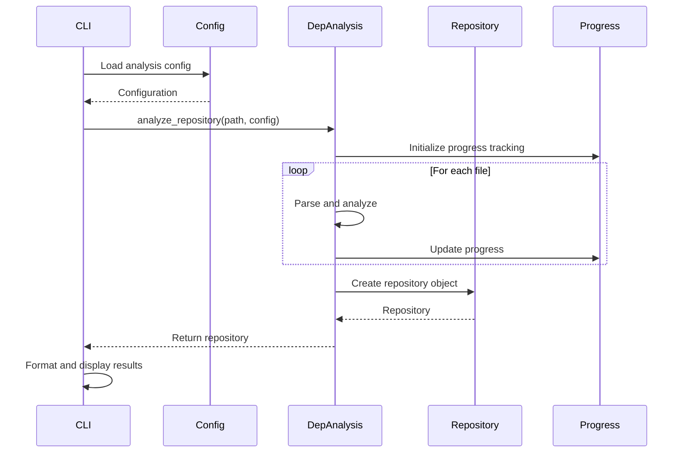

**Data Exchange:**
- **Input**: Repository path, analysis configuration, filter criteria
- **Output**: Repository object, NodeSelection objects, analysis metrics
- **Progress Updates**: Real-time progress information for ModuleProgressBar

#### With Web Frontend Module

The [web_frontend](web_frontend.md) module integrates dependency analysis for web-based visualization:

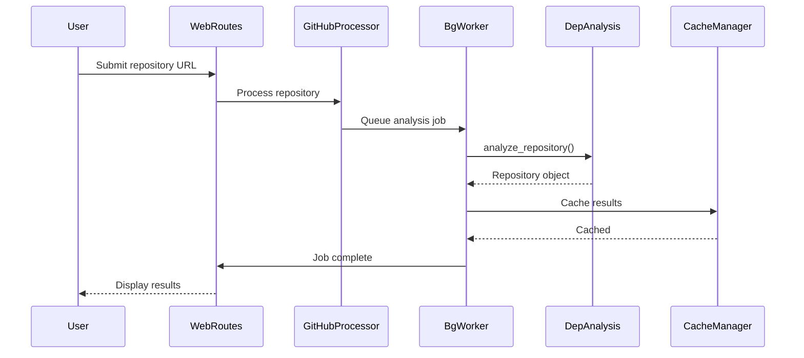

**Data Exchange:**
- **Input**: Repository URL or path, analysis parameters
- **Output**: Serialized Repository object, JSON graph data
- **Caching**: Repository objects cached via CacheManager
- **Background Processing**: Analysis runs asynchronously via BackgroundWorker

#### With Core Config Module

The [core_config](core_config.md) module provides configuration for analysis behavior:

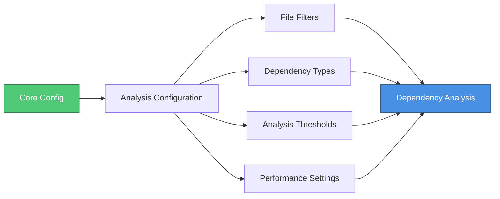

**Configuration Parameters:**
- File inclusion/exclusion patterns
- Supported dependency types
- Maximum analysis depth
- Circular dependency detection settings
- Performance optimization flags
- Language-specific parser settings

#### With Utilities Module

The [utilities](utilities.md) module provides file system operations:

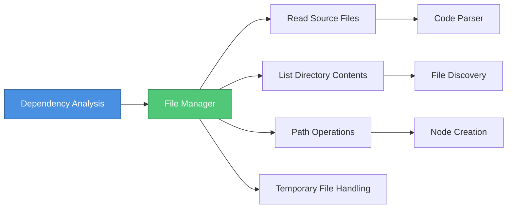

**Utility Functions Used:**
- File reading and parsing
- Directory traversal
- Path normalization and resolution
- File type detection
- Temporary file management for processing

---

## Data Flow

### End-to-End Analysis Flow

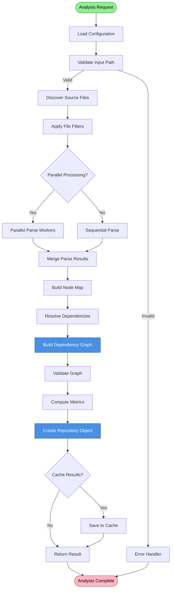

### Node Creation Flow

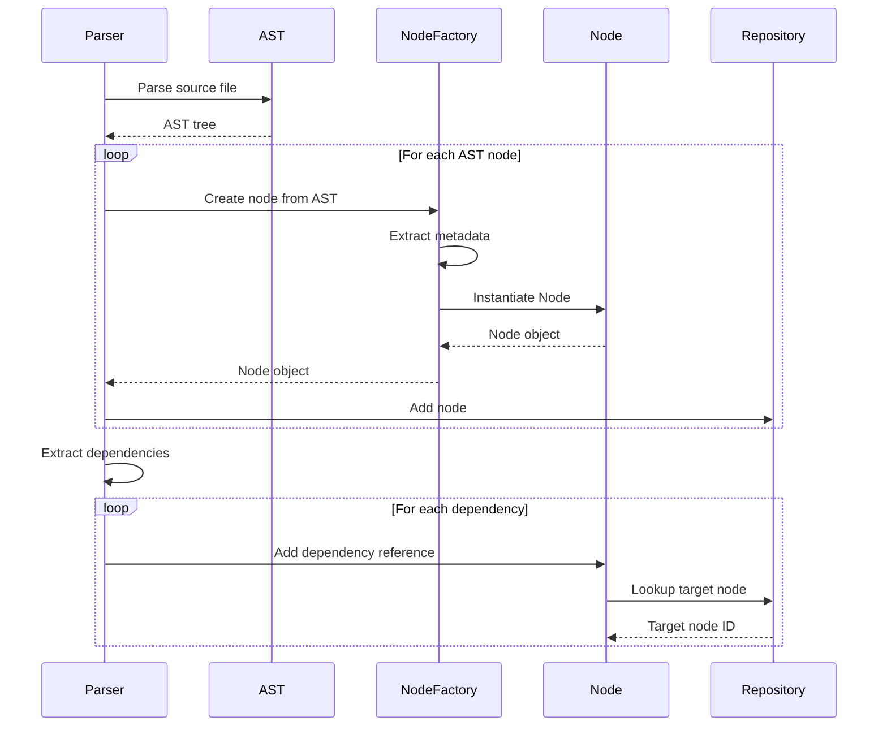

### Dependency Resolution Flow

```mermaid
flowchart TD
    Start[Start Resolution] --> GetUnresolved[Get Unresolved Dependencies]
    GetUnresolved --> HasUnresolved{Has Unresolved?}
    
    HasUnresolved -->|No| Complete[Resolution Complete]
    HasUnresolved -->|Yes| NextDep[Get Next Dependency]
    
    NextDep --> LookupNode[Lookup Node by Name]
    LookupNode --> Found{Node Found?}
    
    Found -->|Yes| CreateLink[Create Dependency Link]
    Found -->|No| CheckExternal{External Dependency?}
    
    CreateLink --> UpdateBidirectional[Update Bidirectional Links]
    UpdateBidirectional --> GetUnresolved
    
    CheckExternal -->|Yes| CreateExternal[Create External Node]
    CheckExternal -->|No| LogWarning[Log Unresolved Warning]
    
    CreateExternal --> CreateLink
    LogWarning --> GetUnresolved
    
    Complete --> End[End Resolution]
    
    style Start fill:#90EE90,stroke:#2E7D4E,color:#000
    style End fill:#FFB6C1,stroke:#8B4C5C,color:#000
    style CreateLink fill:#4A90E2,stroke:#2E5C8A,color:#fff
```

---

## Analysis Algorithms

### Dependency Graph Traversal

#### Depth-First Search (DFS)

Used for detecting circular dependencies and computing dependency chains:

```mermaid
flowchart TD
    Start([Start DFS]) --> InitStack[Initialize Stack with Root]
    InitStack --> InitVisited[Initialize Visited Set]
    
    InitVisited --> StackEmpty{Stack Empty?}
    StackEmpty -->|Yes| Complete[Traversal Complete]
    StackEmpty -->|No| PopNode[Pop Node from Stack]
    
    PopNode --> IsVisited{Already Visited?}
    IsVisited -->|Yes| StackEmpty
    IsVisited -->|No| MarkVisited[Mark as Visited]
    
    MarkVisited --> ProcessNode[Process Node]
    ProcessNode --> GetDeps[Get Dependencies]
    
    GetDeps --> HasDeps{Has Dependencies?}
    HasDeps -->|No| StackEmpty
    HasDeps -->|Yes| PushDeps[Push Dependencies to Stack]
    
    PushDeps --> CheckCycle{Dependency in Stack?}
    CheckCycle -->|Yes| CycleDetected[Record Circular Dependency]
    CheckCycle -->|No| StackEmpty
    
    CycleDetected --> StackEmpty
    Complete --> End([End DFS])
    
    style Start fill:#90EE90,stroke:#2E7D4E,color:#000
    style End fill:#FFB6C1,stroke:#8B4C5C,color:#000
    style CycleDetected fill:#FF6B6B,stroke:#C92A2A,color:#fff
```

#### Breadth-First Search (BFS)

Used for computing shortest dependency paths and level-based analysis:

```mermaid
flowchart TD
    Start([Start BFS]) --> InitQueue[Initialize Queue with Root]
    InitQueue --> InitVisited[Initialize Visited Set]
    InitVisited --> InitLevel[Set Level = 0]
    
    InitLevel --> QueueEmpty{Queue Empty?}
    QueueEmpty -->|Yes| Complete[Traversal Complete]
    QueueEmpty -->|No| DequeueNode[Dequeue Node]
    
    DequeueNode --> IsVisited{Already Visited?}
    IsVisited -->|Yes| QueueEmpty
    IsVisited -->|No| MarkVisited[Mark as Visited]
    
    MarkVisited --> SetDepth[Set Node Depth = Level]
    SetDepth --> ProcessNode[Process Node]
    ProcessNode --> GetDeps[Get Dependencies]
    
    GetDeps --> HasDeps{Has Dependencies?}
    HasDeps -->|No| QueueEmpty
    HasDeps -->|Yes| EnqueueDeps[Enqueue Dependencies]
    
    EnqueueDeps --> IncrementLevel[Increment Level for Next Layer]
    IncrementLevel --> QueueEmpty
    
    Complete --> End([End BFS])
    
    style Start fill:#90EE90,stroke:#2E7D4E,color:#000
    style End fill:#FFB6C1,stroke:#8B4C5C,color:#000
    style SetDepth fill:#4A90E2,stroke:#2E5C8A,color:#fff
```

### Circular Dependency Detection

```mermaid
flowchart TD
    Start([Start Detection]) --> InitSets[Initialize Sets]
    InitSets --> GetAllNodes[Get All Nodes]
    
    GetAllNodes --> NextNode{More Nodes?}
    NextNode -->|No| ReportCycles[Report All Cycles]
    NextNode -->|Yes| SelectNode[Select Next Node]
    
    SelectNode --> InProgress{In Progress Set?}
    InProgress -->|Yes| CycleFound[Cycle Detected]
    InProgress -->|No| AddToProgress[Add to In-Progress]
    
    CycleFound --> RecordCycle[Record Cycle Path]
    RecordCycle --> NextNode
    
    AddToProgress --> VisitDeps[Visit Dependencies]
    VisitDeps --> AllVisited{All Deps Visited?}
    
    AllVisited -->|Yes| MoveToComplete[Move to Completed Set]
    AllVisited -->|No| VisitDeps
    
    MoveToComplete --> NextNode
    ReportCycles --> End([End Detection])
    
    style Start fill:#90EE90,stroke:#2E7D4E,color:#000
    style End fill:#FFB6C1,stroke:#8B4C5C,color:#000
    style CycleFound fill:#FF6B6B,stroke:#C92A2A,color:#fff
```

### Topological Sorting

Used for determining build order and dependency resolution order:

```mermaid
flowchart TD
    Start([Start Topological Sort]) --> ComputeInDegree[Compute In-Degree for All Nodes]
    ComputeInDegree --> FindZeroInDegree[Find Nodes with In-Degree = 0]
    
    FindZeroInDegree --> InitQueue[Initialize Queue with Zero In-Degree Nodes]
    InitQueue --> InitResult[Initialize Result List]
    
    InitResult --> QueueEmpty{Queue Empty?}
    QueueEmpty -->|Yes| CheckComplete{All Nodes Processed?}
    QueueEmpty -->|No| DequeueNode[Dequeue Node]
    
    DequeueNode --> AddToResult[Add to Result List]
    AddToResult --> GetDependents[Get Dependent Nodes]
    
    GetDependents --> DecrementInDegree[Decrement In-Degree of Dependents]
    DecrementInDegree --> CheckZero{In-Degree = 0?}
    
    CheckZero -->|Yes| EnqueueNode[Enqueue Node]
    CheckZero -->|No| QueueEmpty
    EnqueueNode --> QueueEmpty
    
    CheckComplete -->|Yes| Success[Return Sorted List]
    CheckComplete -->|No| CycleExists[Cycle Exists - Cannot Sort]
    
    Success --> End([End Sort])
    CycleExists --> End
    
    style Start fill:#90EE90,stroke:#2E7D4E,color:#000
    style End fill:#FFB6C1,stroke:#8B4C5C,color:#000
    style Success fill:#50C878,stroke:#2E7D4E,color:#fff
    style CycleExists fill:#FF6B6B,stroke:#C92A2A,color:#fff
```

---

## Performance Considerations

### Optimization Strategies

```mermaid
graph TB
    Performance[Performance Optimization]
    
    subgraph "Parsing Optimization"
        Parallel[Parallel File Parsing]
        Incremental[Incremental Parsing]
        Cache[AST Caching]
    end
    
    subgraph "Graph Optimization"
        LazyLoad[Lazy Loading]
        IndexStructures[Index Structures]
        Pruning[Graph Pruning]
    end
    
    subgraph "Memory Optimization"
        Streaming[Streaming Processing]
        Compression[Data Compression]
        GC[Garbage Collection Hints]
    end
    
    Performance --> Parallel
    Performance --> Incremental
    Performance --> Cache
    Performance --> LazyLoad
    Performance --> IndexStructures
    Performance --> Pruning
    Performance --> Streaming
    Performance --> Compression
    Performance --> GC
    
    style Performance fill:#4A90E2,stroke:#2E5C8A,color:#fff
```

### Scalability Patterns

#### Large Repository Handling

```mermaid
flowchart TD
    LargeRepo[Large Repository] --> EstimateSize[Estimate Repository Size]
    EstimateSize --> SizeCheck{Size > Threshold?}
    
    SizeCheck -->|No| StandardAnalysis[Standard Analysis]
    SizeCheck -->|Yes| ChunkRepo[Chunk Repository]
    
    ChunkRepo --> ParallelChunks[Process Chunks in Parallel]
    ParallelChunks --> MergeChunks[Merge Chunk Results]
    MergeChunks --> IncrementalGraph[Build Graph Incrementally]
    
    IncrementalGraph --> StreamResults[Stream Results to Disk]
    StreamResults --> Complete[Analysis Complete]
    
    StandardAnalysis --> Complete
    
    style LargeRepo fill:#FFD93D,stroke:#B8860B,color:#000
    style Complete fill:#50C878,stroke:#2E7D4E,color:#fff
```

#### Caching Strategy

```mermaid
graph LR
    Request[Analysis Request] --> CheckCache{Cache Hit?}
    
    CheckCache -->|Yes| ValidateCache{Cache Valid?}
    CheckCache -->|No| PerformAnalysis[Perform Analysis]
    
    ValidateCache -->|Yes| ReturnCached[Return Cached Result]
    ValidateCache -->|No| InvalidateCache[Invalidate Cache]
    
    InvalidateCache --> PerformAnalysis
    PerformAnalysis --> UpdateCache[Update Cache]
    UpdateCache --> ReturnResult[Return Result]
    
    ReturnCached --> End([End])
    ReturnResult --> End
    
    style CheckCache fill:#FFD93D,stroke:#B8860B,color:#000
    style ReturnCached fill:#50C878,stroke:#2E7D4E,color:#fff
```

### Performance Metrics

| Operation | Time Complexity | Space Complexity | Notes |
|-----------|----------------|------------------|-------|
| Parse Single File | O(n) | O(n) | n = file size |
| Build Node Map | O(m) | O(m) | m = number of nodes |
| Resolve Dependencies | O(m × d) | O(m × d) | d = average dependencies per node |
| DFS Traversal | O(m + e) | O(m) | e = number of edges |
| BFS Traversal | O(m + e) | O(m) | e = number of edges |
| Cycle Detection | O(m + e) | O(m) | e = number of edges |
| Topological Sort | O(m + e) | O(m) | e = number of edges |
| Node Selection Filter | O(m) | O(k) | k = selected nodes |

---

## Dependencies

### Module Dependencies

```mermaid
graph TB
    DepAnalysis[Dependency Analysis Module]
    
    subgraph "Direct Dependencies"
        CoreConfig[Core Config Module]
        Utils[Utilities Module]
    end
    
    subgraph "Dependent Modules"
        CLI[CLI Interface Module]
        WebFE[Web Frontend Module]
    end
    
    subgraph "External Libraries"
        AST[AST Parser Libraries]
        Graph[Graph Libraries]
        Serialization[Serialization Libraries]
    end
    
    CoreConfig --> DepAnalysis
    Utils --> DepAnalysis
    
    DepAnalysis --> CLI
    DepAnalysis --> WebFE
    
    AST -.->|Language-Specific| DepAnalysis
    Graph -.->|Optional| DepAnalysis
    Serialization -.->|JSON/Pickle| DepAnalysis
    
    style DepAnalysis fill:#4A90E2,stroke:#2E5C8A,color:#fff
    style CoreConfig fill:#50C878,stroke:#2E7D4E,color:#fff
    style Utils fill:#50C878,stroke:#2E7D4E,color:#fff
    
    click CoreConfig href "core_config.md" "Core Config Module"
    click Utils href "utilities.md" "Utilities Module"
    click CLI href "cli_interface.md" "CLI Interface Module"
    click WebFE href "web_frontend.md" "Web Frontend Module"
```

### Dependency Details

| Module | Components Used | Purpose |
|--------|----------------|---------|
| [core_config](core_config.md) | `Config` | Analysis configuration and parameters |
| [utilities](utilities.md) | `FileManager` | File system operations and path handling |
| [cli_interface](cli_interface.md) | N/A (Consumer) | Command-line analysis interface |
| [web_frontend](web_frontend.md) | N/A (Consumer) | Web-based analysis and visualization |

### External Library Dependencies

#### Python AST Parser
- **Purpose**: Parsing Python source code
- **Usage**: Extract nodes and dependencies from Python files
- **Integration**: Built-in Python `ast` module

#### Language-Specific Parsers
- **JavaScript/TypeScript**: Babel, TypeScript Compiler API
- **Java**: JavaParser, Eclipse JDT
- **Go**: Go AST package
- **Purpose**: Multi-language support for dependency analysis

#### Graph Libraries (Optional)
- **NetworkX**: Advanced graph algorithms
- **Purpose**: Complex graph analysis and visualization
- **Usage**: Optional enhancement for advanced features

#### Serialization
- **JSON**: Repository serialization for web frontend
- **Pickle**: Fast serialization for caching
- **Purpose**: Data persistence and transfer

---

## Error Handling

### Error Handling Strategy

```mermaid
flowchart TD
    Operation[Analysis Operation] --> TryCatch{Try-Catch Block}
    
    TryCatch -->|Success| Continue[Continue Processing]
    TryCatch -->|Error| ClassifyError{Error Type}
    
    ClassifyError -->|Parse Error| HandleParse[Log Parse Error]
    ClassifyError -->|File Error| HandleFile[Log File Error]
    ClassifyError -->|Graph Error| HandleGraph[Log Graph Error]
    ClassifyError -->|Unknown| HandleUnknown[Log Unknown Error]
    
    HandleParse --> Recoverable{Recoverable?}
    HandleFile --> Recoverable
    HandleGraph --> Recoverable
    HandleUnknown --> Recoverable
    
    Recoverable -->|Yes| SkipItem[Skip Item, Continue]
    Recoverable -->|No| Abort[Abort Analysis]
    
    SkipItem --> Continue
    Continue --> Complete[Operation Complete]
    Abort --> Cleanup[Cleanup Resources]
    Cleanup --> Fail[Analysis Failed]
    
    style Operation fill:#90EE90,stroke:#2E7D4E,color:#000
    style Complete fill:#50C878,stroke:#2E7D4E,color:#fff
    style Fail fill:#FF6B6B,stroke:#C92A2A,color:#fff
```

### Common Error Scenarios

| Error Type | Cause | Handling Strategy | Recovery |
|------------|-------|-------------------|----------|
| Parse Error | Invalid syntax in source file | Log warning, skip file | Continue with remaining files |
| File Not Found | Missing source file | Log error, skip file | Continue with remaining files |
| Circular Dependency | Cycle in dependency graph | Log warning, record cycle | Continue analysis |
| Memory Error | Repository too large | Enable streaming mode | Retry with optimization |
| Invalid Node Reference | Broken dependency link | Log warning, create placeholder | Continue with partial graph |
| Timeout | Analysis taking too long | Abort operation | Return partial results |

---

## Best Practices

### Usage Guidelines

1. **Configuration**: Always validate configuration before starting analysis
2. **File Filtering**: Use appropriate file filters to exclude non-source files
3. **Progress Tracking**: Implement progress callbacks for long-running operations
4. **Error Handling**: Handle parse errors gracefully to avoid aborting entire analysis
5. **Caching**: Enable caching for frequently analyzed repositories
6. **Memory Management**: Use streaming mode for very large repositories
7. **Validation**: Validate repository structure after analysis

### Performance Tips

1. **Parallel Processing**: Enable parallel file parsing for large repositories
2. **Incremental Analysis**: Use incremental mode when re-analyzing modified repositories
3. **Selective Analysis**: Use NodeSelection to analyze specific parts of large codebases
4. **Index Optimization**: Build appropriate indexes for frequent query patterns
5. **Cache Warming**: Pre-populate cache for commonly analyzed repositories

### Integration Patterns

1. **CLI Integration**: Use progress callbacks to update ModuleProgressBar
2. **Web Integration**: Serialize Repository objects to JSON for web display
3. **Batch Processing**: Process multiple repositories using BackgroundWorker
4. **Real-time Analysis**: Use file watchers for incremental re-analysis
5. **Export Formats**: Support multiple export formats (JSON, GraphML, DOT)

---

## Future Enhancements

### Planned Features

```mermaid
mindmap
    root((Future Enhancements))
        Advanced Analysis
            Semantic Analysis
            Code Quality Metrics
            Security Vulnerability Detection
            Performance Hotspot Detection
        Language Support
            C/C++ Support
            Rust Support
            Ruby Support
            PHP Support
        Visualization
            Interactive Graph Visualization
            3D Dependency Graphs
            Timeline Analysis
            Heatmaps
        Performance
            Distributed Analysis
            GPU Acceleration
            Advanced Caching
            Real-time Incremental Updates
        Integration
            IDE Plugins
            CI/CD Integration
            Git Hook Integration
            Cloud Storage Support
```

### Roadmap

1. **Phase 1**: Enhanced language support (C/C++, Rust)
2. **Phase 2**: Advanced visualization capabilities
3. **Phase 3**: Distributed analysis for massive repositories
4. **Phase 4**: AI-powered code insights and recommendations
5. **Phase 5**: Real-time collaborative analysis

---

## Conclusion

The Dependency Analysis module is the analytical heart of the CodeWiki system, providing sophisticated capabilities for understanding code structure and relationships. Its graph-based approach, combined with efficient algorithms and flexible filtering, makes it suitable for analyzing codebases of any size.

The module's integration with the [cli_interface](cli_interface.md) and [web_frontend](web_frontend.md) modules enables both command-line and web-based workflows, while its use of [core_config](core_config.md) and [utilities](utilities.md) ensures consistent configuration and file handling across the system.

For detailed information about related modules, see:
- [CLI Interface Module](cli_interface.md) - Command-line interface for dependency analysis
- [Web Frontend Module](web_frontend.md) - Web-based visualization and interaction
- [Core Config Module](core_config.md) - Configuration management
- [Utilities Module](utilities.md) - File system utilities
