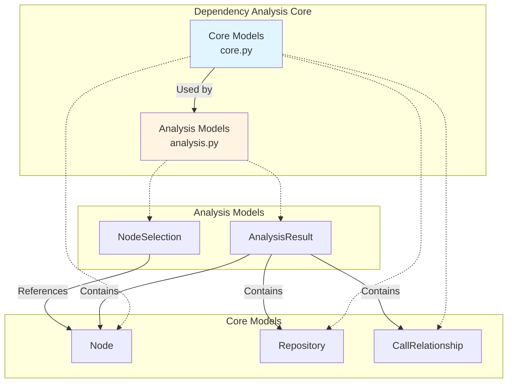
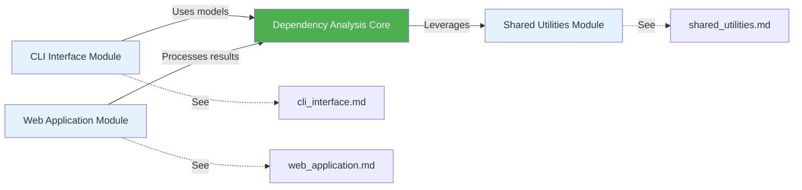
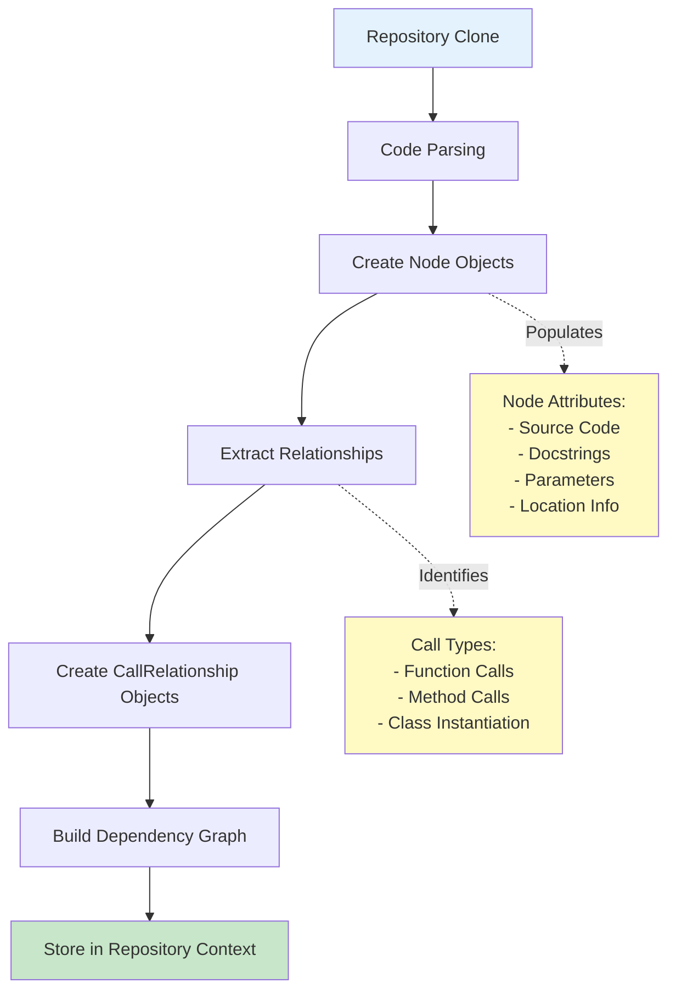
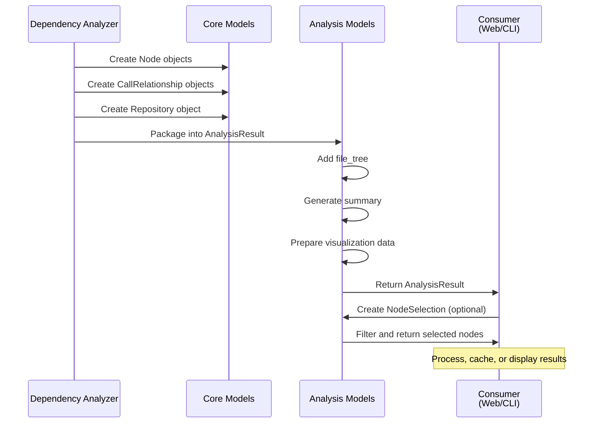
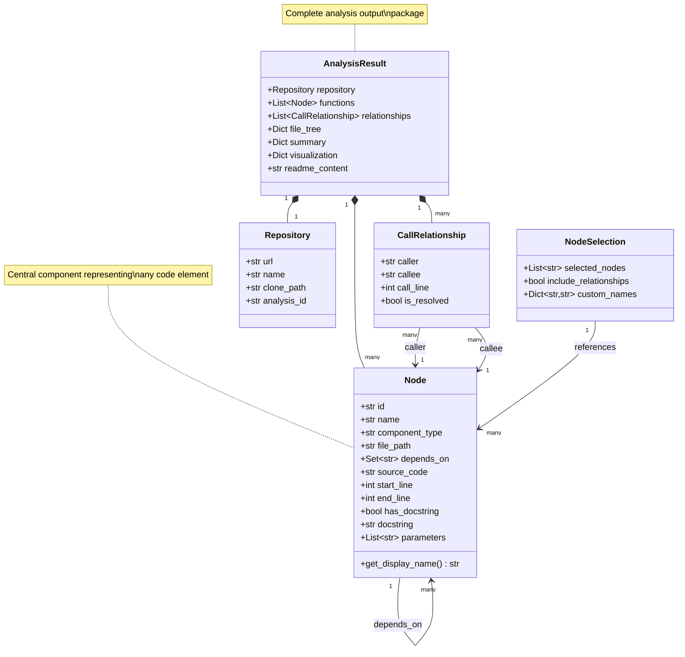

# Dependency Analysis Core Module

## Overview

The **dependency_analysis_core** module is the foundational backend component of the CodeWiki system responsible for analyzing code repositories, extracting dependency relationships, and building comprehensive code structure models. This module provides the core data models and structures that enable the system to understand, represent, and analyze code dependencies across entire repositories.

### Purpose

The primary purposes of this module are:

1. **Code Structure Representation**: Define data models for representing code components (functions, classes, methods) as nodes in a dependency graph
2. **Dependency Tracking**: Model relationships between code components, including call relationships and dependencies
3. **Repository Management**: Provide structures for managing repository metadata and analysis results
4. **Analysis Configuration**: Support selective analysis and export of code components through node selection mechanisms

### Key Capabilities

- **Node-based Code Modeling**: Represent any code component (function, class, method) as a structured node with metadata
- **Relationship Mapping**: Track caller-callee relationships and dependency chains
- **Source Code Integration**: Store and associate source code with analyzed components
- - **Flexible Selection**: Enable partial exports and custom analysis through node selection
- **Metadata Preservation**: Maintain docstrings, parameters, type information, and location data

## Architecture Overview

The dependency_analysis_core module is organized into two primary sub-modules:



### Module Structure

The module consists of two main files:

1. **[Core Models](#core-models-sub-module)** (`core.py`): Fundamental data structures for representing code components and repositories
2. **[Analysis Models](#analysis-models-sub-module)** (`analysis.py`): Higher-level structures for analysis results and node selection

## Integration with Other Modules

The dependency_analysis_core module serves as the data foundation for the entire CodeWiki system:



### Dependencies

- **Upstream Dependencies**: 
  - Uses `pydantic.BaseModel` for data validation and serialization
  - Leverages Python standard library types (`typing`, `datetime`)

- **Downstream Consumers**:
  - **[CLI Interface](cli_interface.md)**: Uses core models for configuration and progress tracking
  - **[Web Application](web_application.md)**: Processes analysis results for visualization and caching
  - **[Shared Utilities](shared_utilities.md)**: File management operations on analyzed repositories

## Core Models Sub-module

**File**: `venv_codewiki/lib/python3.12/site-packages/codewiki/src/be/dependency_analyzer/models/core.py`

The core models sub-module provides the fundamental building blocks for representing code structure and repository information.

### Components

#### 1. Node

The `Node` class is the central data structure representing any code component in the analyzed repository.

**Purpose**: Encapsulate all metadata and relationships for a single code component (function, class, method, etc.)

**Key Attributes**:

| Attribute | Type | Description |
|-----------|------|-------------|
| `id` | `str` | Unique identifier for the node |
| `name` | `str` | Component name |
| `component_type` | `str` | Type of component (function, class, method) |
| `file_path` | `str` | Absolute path to the source file |
| `relative_path` | `str` | Relative path within repository |
| `depends_on` | `Set[str]` | Set of node IDs this component depends on |
| `source_code` | `Optional[str]` | The actual source code of the component |
| `start_line` | `int` | Starting line number in source file |
| `end_line` | `int` | Ending line number in source file |
| `has_docstring` | `bool` | Whether component has documentation |
| `docstring` | `str` | The docstring content |
| `parameters` | `Optional[List[str]]` | Function/method parameters |
| `node_type` | `Optional[str]` | Additional type classification |
| `base_classes` | `Optional[List[str]]` | Parent classes (for class nodes) |
| `class_name` | `Optional[str]` | Containing class name (for methods) |
| `display_name` | `Optional[str]` | Custom display name |
| `component_id` | `Optional[str]` | Alternative component identifier |

**Key Methods**:
- `get_display_name()`: Returns the display name or falls back to the regular name

**Usage Context**: Nodes are created during repository analysis and used throughout the system for dependency visualization, documentation generation, and code navigation.

#### 2. CallRelationship

The `CallRelationship` class models the relationship between two code components where one calls the other.

**Purpose**: Track and represent function/method call relationships for dependency analysis

**Key Attributes**:

| Attribute | Type | Description |
|-----------|------|-------------|
| `caller` | `str` | ID of the calling component |
| `callee` | `str` | ID of the called component |
| `call_line` | `Optional[int]` | Line number where call occurs |
| `is_resolved` | `bool` | Whether the callee was successfully resolved |

**Usage Context**: CallRelationships form the edges in the dependency graph, enabling visualization of code flow and impact analysis.

#### 3. Repository

The `Repository` class contains metadata about the analyzed code repository.

**Purpose**: Store repository-level information and analysis context

**Key Attributes**:

| Attribute | Type | Description |
|-----------|------|-------------|
| `url` | `str` | Repository URL (e.g., GitHub URL) |
| `name` | `str` | Repository name |
| `clone_path` | `str` | Local path where repository is cloned |
| `analysis_id` | `str` | Unique identifier for this analysis session |

**Usage Context**: Repository information is used for tracking analysis sessions, managing local clones, and associating results with source repositories.

### Data Flow



## Analysis Models Sub-module

**File**: `venv_codewiki/lib/python3.12/site-packages/codewiki/src/be/dependency_analyzer/models/analysis.py`

The analysis models sub-module provides higher-level structures for packaging analysis results and configuring selective exports.

### Components

#### 1. AnalysisResult

The `AnalysisResult` class is a comprehensive container for all results from analyzing a repository.

**Purpose**: Package all analysis outputs into a single, serializable structure for storage, transmission, and processing

**Key Attributes**:

| Attribute | Type | Description |
|-----------|------|-------------|
| `repository` | `Repository` | Repository metadata |
| `functions` | `List[Node]` | All analyzed code components |
| `relationships` | `List[CallRelationship]` | All call relationships found |
| `file_tree` | `Dict[str, Any]` | Repository file structure |
| `summary` | `Dict[str, Any]` | Analysis statistics and summary |
| `visualization` | `Dict[str, Any]` | Visualization data (graphs, charts) |
| `readme_content` | `Optional[str]` | Repository README content |

**Usage Context**: 
- Returned by the dependency analyzer after completing repository analysis
- Consumed by the [web application](web_application.md) for caching and display
- Used by the [CLI interface](cli_interface.md) for generating reports

**Integration Points**:
- **Web Application**: `CacheManager` stores `AnalysisResult` objects for quick retrieval
- **CLI Interface**: Progress tracking displays analysis result statistics
- **Shared Utilities**: `FileManager` handles serialization of analysis results

#### 2. NodeSelection

The `NodeSelection` class enables selective export and analysis of specific code components.

**Purpose**: Configure partial exports by selecting specific nodes and customizing their representation

**Key Attributes**:

| Attribute | Type | Description |
|-----------|------|-------------|
| `selected_nodes` | `List[str]` | List of node IDs to include |
| `include_relationships` | `bool` | Whether to include relationships between selected nodes |
| `custom_names` | `Dict[str, str]` | Custom display names for selected nodes |

**Usage Context**:
- Enables users to export only relevant portions of large codebases
- Supports custom naming for better documentation clarity
- Allows relationship filtering for focused dependency analysis

**Use Cases**:
1. **Focused Documentation**: Export only public API components
2. **Module Isolation**: Analyze dependencies within a specific module
3. **Custom Reports**: Generate tailored documentation with renamed components

### Analysis Workflow



## Data Model Relationships

The following diagram illustrates how the core data models relate to each other:



## Common Usage Patterns

### Pattern 1: Creating a Node

```python
from codewiki.src.be.dependency_analyzer.models.core import Node

# Create a node for a function
function_node = Node(
    id="module.function_name",
    name="function_name",
    component_type="function",
    file_path="/path/to/file.py",
    relative_path="src/module/file.py",
    depends_on={"module.helper_function", "external.library.func"},
    source_code="def function_name(param1, param2):\n    ...",
    start_line=10,
    end_line=25,
    has_docstring=True,
    docstring="Function documentation",
    parameters=["param1", "param2"]
)
```

### Pattern 2: Building Analysis Results

```python
from codewiki.src.be.dependency_analyzer.models.analysis import AnalysisResult
from codewiki.src.be.dependency_analyzer.models.core import Repository, Node, CallRelationship

# Create repository metadata
repo = Repository(
    url="https://github.com/user/repo",
    name="repo",
    clone_path="/tmp/repo_clone",
    analysis_id="analysis_123"
)

# Collect nodes and relationships during analysis
nodes = [...]  # List of Node objects
relationships = [...]  # List of CallRelationship objects

# Package results
result = AnalysisResult(
    repository=repo,
    functions=nodes,
    relationships=relationships,
    file_tree={"src": {"module": ["file1.py", "file2.py"]}},
    summary={"total_functions": len(nodes), "total_relationships": len(relationships)},
    visualization={"graph_data": {...}}
)
```

### Pattern 3: Selective Node Export

```python
from codewiki.src.be.dependency_analyzer.models.analysis import NodeSelection

# Select specific nodes for export
selection = NodeSelection(
    selected_nodes=["module.public_api", "module.helper"],
    include_relationships=True,
    custom_names={
        "module.public_api": "Main API Function",
        "module.helper": "Helper Utility"
    }
)

# Use selection to filter analysis results
filtered_nodes = [n for n in analysis_result.functions if n.id in selection.selected_nodes]
```

## Design Principles

### 1. Immutability and Validation

All models use Pydantic's `BaseModel`, ensuring:
- **Type Safety**: Automatic type validation on instantiation
- **Serialization**: Easy conversion to/from JSON for storage and transmission
- **Immutability**: Data integrity through validated models

### 2. Separation of Concerns

The module separates:
- **Core Models**: Fundamental data structures (Node, Repository, CallRelationship)
- **Analysis Models**: Higher-level aggregations and configurations (AnalysisResult, NodeSelection)

This separation allows core models to remain stable while analysis models can evolve with new features.

### 3. Flexibility

- **Optional Fields**: Many fields are optional to accommodate different analysis depths
- **Generic Dictionaries**: `file_tree`, `summary`, and `visualization` use flexible dictionary structures
- **Set-based Dependencies**: Using `Set[str]` for `depends_on` ensures uniqueness and efficient lookups

### 4. Traceability

Every component maintains:
- **Location Information**: File paths and line numbers for source traceability
- **Unique Identifiers**: IDs for unambiguous component reference
- **Relationship Tracking**: Explicit caller-callee relationships

## Performance Considerations

### Memory Efficiency

- **Source Code Storage**: The `source_code` field is optional to reduce memory footprint when full source isn't needed
- **Set-based Dependencies**: Using sets for `depends_on` provides O(1) lookup and automatic deduplication

### Scalability

- **Lazy Loading**: Optional fields allow partial loading of node data
- **Batch Processing**: Lists of nodes and relationships support batch operations
- **Serialization**: Pydantic models enable efficient JSON serialization for caching

### Optimization Strategies

1. **Selective Analysis**: Use `NodeSelection` to analyze only relevant components
2. **Relationship Filtering**: Set `include_relationships=False` when relationships aren't needed
3. **Summary Caching**: Pre-computed summaries in `AnalysisResult` avoid repeated calculations

## Extension Points

The module is designed for extensibility:

### Adding New Node Types

```python
# Extend Node with new component types
node = Node(
    component_type="decorator",  # New type
    node_type="custom_decorator",  # Additional classification
    ...
)
```

### Custom Analysis Metadata

```python
# Add custom data to summary
result = AnalysisResult(
    summary={
        "total_functions": 100,
        "custom_metric": custom_value,  # Extensible
        "complexity_scores": {...}
    },
    ...
)
```

### Visualization Extensions

```python
# Add new visualization types
result = AnalysisResult(
    visualization={
        "dependency_graph": {...},
        "custom_chart": {...},  # New visualization
        "metrics_dashboard": {...}
    },
    ...
)
```

## Error Handling

### Validation Errors

Pydantic automatically validates data on model instantiation:

```python
try:
    node = Node(
        id="test",
        name="test_func",
        component_type="function",
        file_path="/path/to/file.py",
        relative_path="file.py"
    )
except ValidationError as e:
    # Handle validation errors
    print(e.errors())
```

### Relationship Resolution

The `is_resolved` field in `CallRelationship` tracks whether a callee was successfully identified:

```python
relationship = CallRelationship(
    caller="func_a",
    callee="unknown_func",
    is_resolved=False  # Indicates unresolved dependency
)
```

## Testing Considerations

### Unit Testing

Models can be easily tested due to Pydantic validation:

```python
def test_node_creation():
    node = Node(
        id="test.func",
        name="func",
        component_type="function",
        file_path="/test.py",
        relative_path="test.py"
    )
    assert node.get_display_name() == "func"
    assert node.depends_on == set()
```

### Integration Testing

Test complete analysis workflows:

```python
def test_analysis_result():
    result = AnalysisResult(
        repository=Repository(...),
        functions=[Node(...)],
        relationships=[CallRelationship(...)],
        file_tree={},
        summary={}
    )
    assert len(result.functions) > 0
    assert result.repository.analysis_id is not None
```

## Future Enhancements

Potential areas for module evolution:

1. **Enhanced Metadata**: Add support for type hints, decorators, and annotations
2. **Performance Metrics**: Include complexity scores, code quality metrics
3. **Version Tracking**: Support for analyzing multiple versions of a repository
4. **Incremental Analysis**: Update existing analysis results with changes
5. **Cross-Repository Dependencies**: Model dependencies between multiple repositories

## Related Documentation

- **[CLI Interface Module](cli_interface.md)**: Command-line interface using these models
- **[Web Application Module](web_application.md)**: Web interface for visualizing analysis results
- **[Shared Utilities Module](shared_utilities.md)**: File management and configuration utilities

## Summary

The dependency_analysis_core module provides the foundational data models for the CodeWiki system's code analysis capabilities. Through its well-designed Node, Repository, CallRelationship, AnalysisResult, and NodeSelection models, it enables:

- **Comprehensive Code Representation**: Capture all aspects of code components
- **Relationship Tracking**: Model complex dependency graphs
- **Flexible Analysis**: Support both full and selective analysis
- **System Integration**: Serve as the data backbone for CLI and web interfaces

The module's use of Pydantic ensures type safety, validation, and easy serialization, while its design principles of separation of concerns and extensibility make it a robust foundation for code analysis operations.
