# GitHub Integration Module

## Overview

The **github_integration** module provides comprehensive GitHub repository processing capabilities for the CodeWiki web application. It serves as the primary interface for validating, parsing, and cloning GitHub repositories, enabling the system to fetch source code for documentation generation. This module acts as a critical bridge between user-submitted repository URLs and the local file system where analysis and documentation generation occur.

The module is implemented through the `GitHubRepoProcessor` class, which offers static utility methods for URL validation, repository information extraction, and Git operations. It integrates tightly with the [background_processing](background_processing.md) module for asynchronous repository cloning and the [configuration_management](configuration_management.md) module for clone operation parameters.

---

## Architecture

### Component Structure

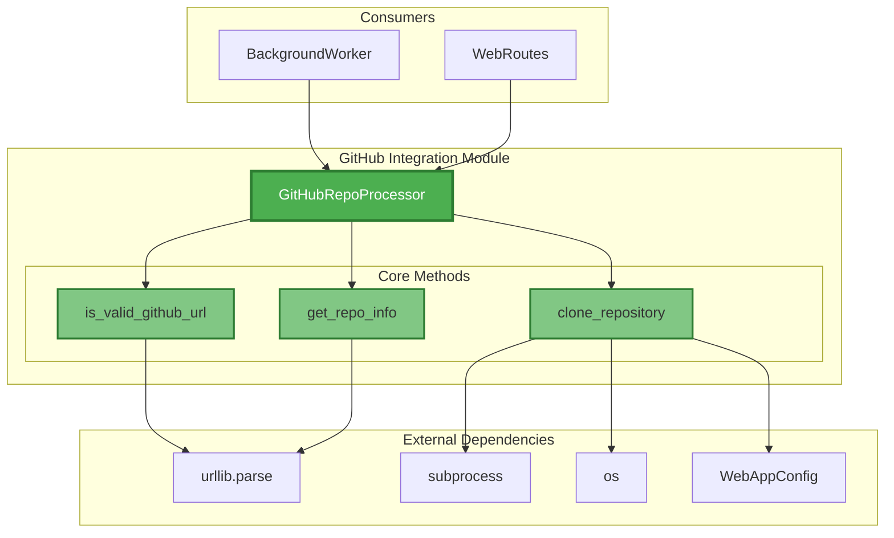

### Module Dependencies

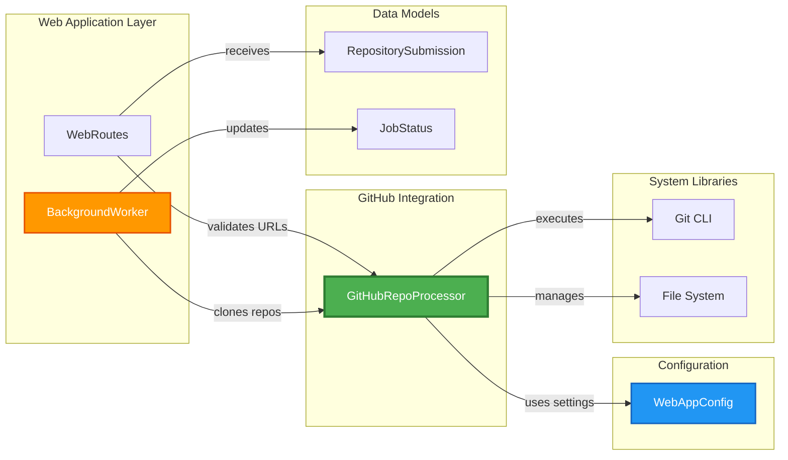

---

## Core Components

### GitHubRepoProcessor Class

The `GitHubRepoProcessor` is a utility class that provides static methods for GitHub repository operations. It does not maintain state and serves as a collection of pure functions for repository processing.

#### Key Responsibilities

1. **URL Validation**: Verify that submitted URLs are valid GitHub repository URLs
2. **Repository Parsing**: Extract owner, repository name, and other metadata from URLs
3. **Repository Cloning**: Execute Git clone operations with configurable depth and commit checkout
4. **Error Handling**: Provide robust error handling for network and Git operations

---

## Detailed Functionality

### 1. URL Validation

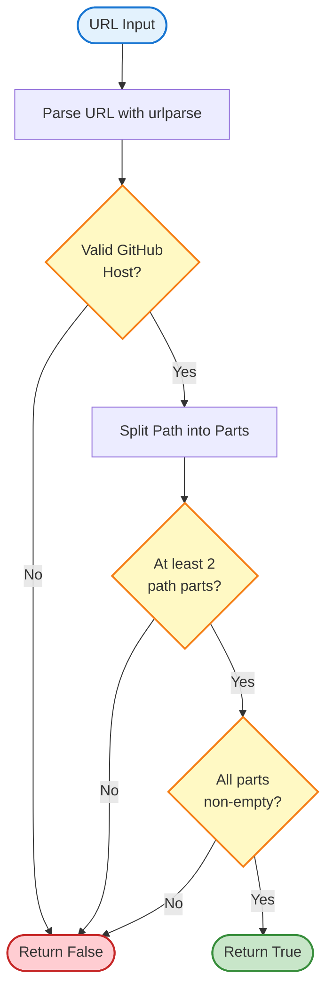

**Method**: `is_valid_github_url(url: str) -> bool`

**Purpose**: Validates whether a given URL is a properly formatted GitHub repository URL.

**Validation Criteria**:
- Host must be `github.com` or `www.github.com` (case-insensitive)
- Path must contain at least 2 segments (owner/repo)
- Both owner and repository name must be non-empty

**Example Valid URLs**:
- `https://github.com/owner/repository`
- `https://www.github.com/owner/repository`
- `https://github.com/owner/repository/tree/main`

**Example Invalid URLs**:
- `https://gitlab.com/owner/repo` (wrong host)
- `https://github.com/owner` (missing repo name)
- `https://github.com//repo` (empty owner)

---

### 2. Repository Information Extraction

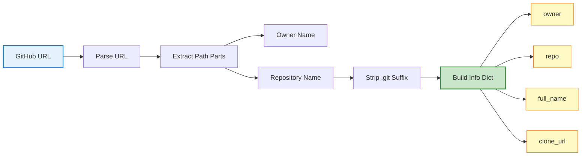

**Method**: `get_repo_info(url: str) -> Dict[str, str]`

**Purpose**: Extracts structured repository information from a GitHub URL.

**Returns**: Dictionary containing:
- `owner`: Repository owner/organization name
- `repo`: Repository name (without .git suffix)
- `full_name`: Combined owner/repo format
- `clone_url`: HTTPS clone URL for the repository

**Example**:
```python
url = "https://github.com/torvalds/linux.git"
info = GitHubRepoProcessor.get_repo_info(url)
# Returns:
# {
#     'owner': 'torvalds',
#     'repo': 'linux',
#     'full_name': 'torvalds/linux',
#     'clone_url': 'https://github.com/torvalds/linux.git'
# }
```

---

### 3. Repository Cloning

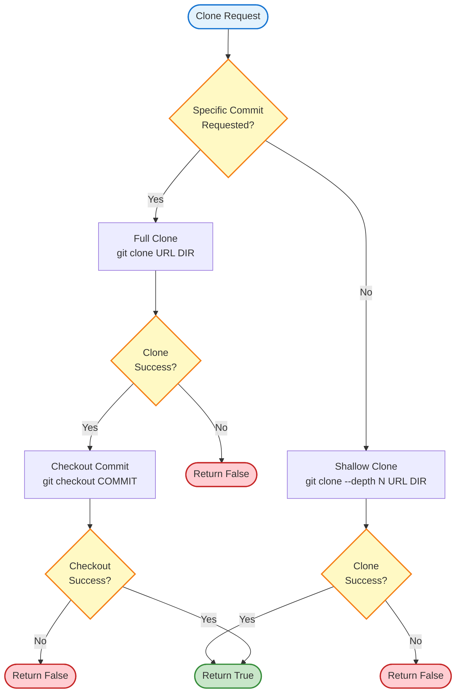

**Method**: `clone_repository(clone_url: str, target_dir: str, commit_id: str = None) -> bool`

**Purpose**: Clones a GitHub repository to a local directory with optional commit checkout.

**Parameters**:
- `clone_url`: HTTPS URL for cloning the repository
- `target_dir`: Local filesystem path for the cloned repository
- `commit_id`: Optional specific commit SHA to checkout

**Behavior**:

1. **Without Commit ID** (Default):
   - Performs shallow clone with depth from `WebAppConfig.CLONE_DEPTH` (default: 1)
   - Faster operation, minimal disk usage
   - Only fetches latest commit history

2. **With Commit ID**:
   - Performs full clone to access complete history
   - Checks out the specified commit after cloning
   - Required for historical analysis or specific versions

**Configuration Integration**:
- Uses `WebAppConfig.CLONE_TIMEOUT` (300 seconds) for operation timeout
- Uses `WebAppConfig.CLONE_DEPTH` (1) for shallow clone depth
- See [configuration_management](configuration_management.md) for details

**Error Handling**:
- Returns `False` on any failure (network, timeout, invalid commit)
- Prints error messages to stdout for debugging
- Handles subprocess timeouts gracefully

---

## Integration Points

### 1. Background Worker Integration

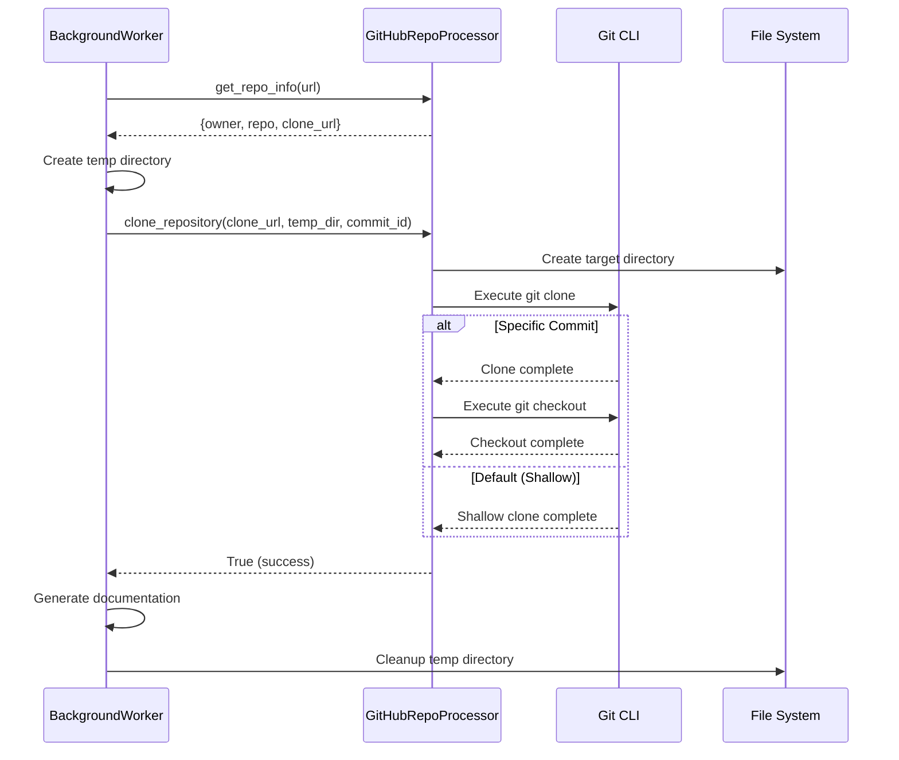

The [background_processing](background_processing.md) module uses `GitHubRepoProcessor` in its job processing workflow:

1. **Job Initialization**: Validates repository URL before queuing
2. **Repository Cloning**: Clones repository to temporary directory
3. **Documentation Generation**: Processes cloned repository
4. **Cleanup**: Removes temporary clone after processing

**Key Integration Code** (from BackgroundWorker):
```python
# Extract repository information
repo_info = GitHubRepoProcessor.get_repo_info(job.repo_url)
temp_repo_dir = os.path.join(self.temp_dir, job_id)

# Clone repository
if not GitHubRepoProcessor.clone_repository(
    repo_info['clone_url'], 
    temp_repo_dir, 
    job.commit_id
):
    raise Exception("Failed to clone repository")
```

---

### 2. Web Routes Integration

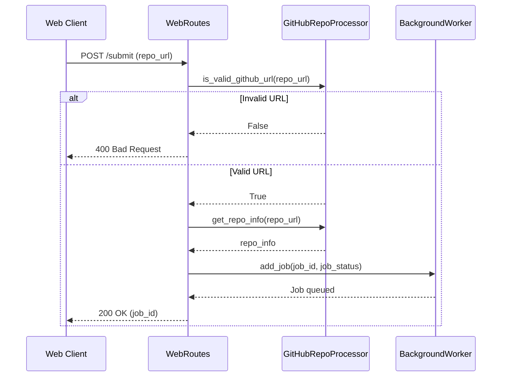

The [web_routes_api](web_routes_api.md) module uses `GitHubRepoProcessor` for request validation:

1. **URL Validation**: Validates submitted URLs before job creation
2. **Repository Parsing**: Extracts repository information for job identification
3. **Error Responses**: Returns appropriate HTTP errors for invalid URLs

---

### 3. Configuration Dependencies

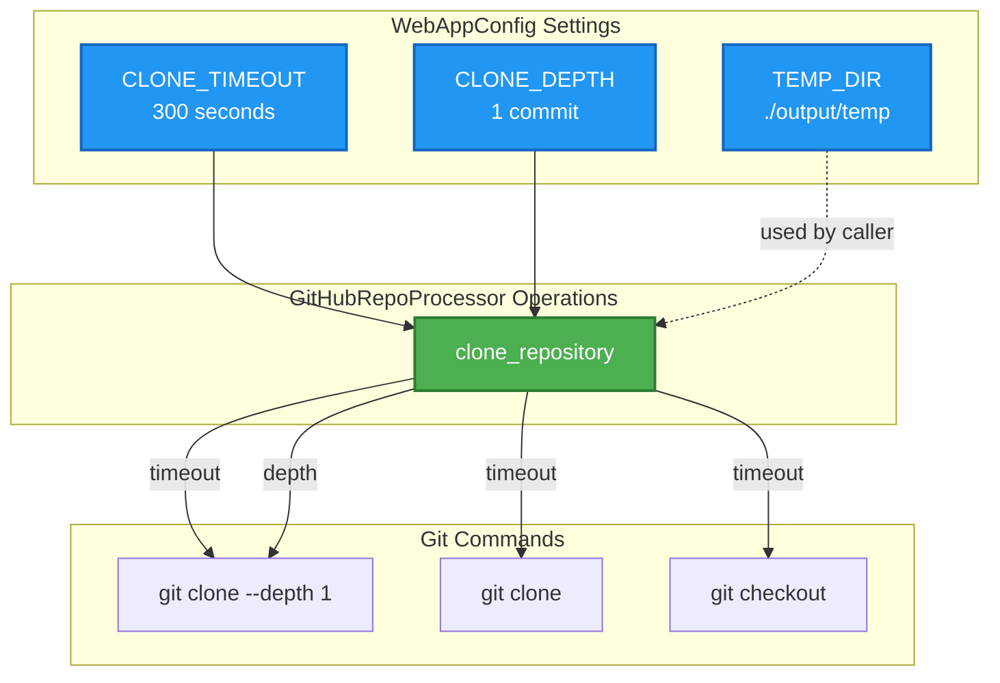

The module depends on [configuration_management](configuration_management.md) for:

- **CLONE_TIMEOUT**: Maximum time allowed for clone operations (300 seconds)
- **CLONE_DEPTH**: Number of commits to fetch in shallow clones (1 commit)
- **TEMP_DIR**: Base directory for temporary repository storage (via BackgroundWorker)

---

## Data Flow

### Complete Repository Processing Flow

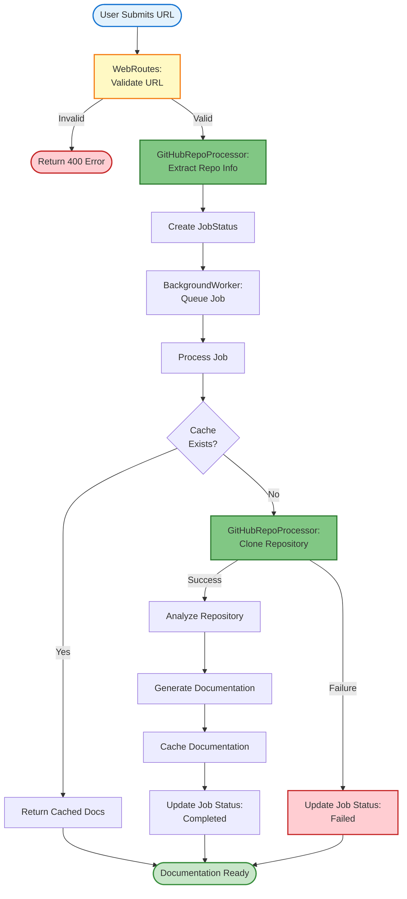

---

## Error Handling

### Error Scenarios and Handling

```mermaid
graph TB
    subgraph "Validation Errors"
        E1[Invalid Host]
        E2[Missing Path Parts]
        E3[Empty Owner/Repo]
    end
    
    subgraph "Clone Errors"
        E4[Network Timeout]
        E5[Invalid Repository]
        E6[Permission Denied]
        E7[Invalid Commit ID]
    end
    
    subgraph "System Errors"
        E8[Disk Space Full]
        E9[Directory Creation Failed]
        E10[Git Not Installed]
    end
    
    subgraph "Error Handling"
        H1[Return False]
        H2[Print Error Message]
        H3[Update Job Status]
    end
    
    E1 --> H1
    E2 --> H1
    E3 --> H1
    
    E4 --> H1
    E4 --> H2
    E5 --> H1
    E5 --> H2
    E6 --> H1
    E6 --> H2
    E7 --> H1
    E7 --> H2
    
    E8 --> H1
    E8 --> H2
    E9 --> H1
    E9 --> H2
    E10 --> H1
    E10 --> H2
    
    H1 --> H3
    H2 --> H3
    
    style E1 fill:#FFCDD2,stroke:#C62828,stroke-width:2px
    style E2 fill:#FFCDD2,stroke:#C62828,stroke-width:2px
    style E3 fill:#FFCDD2,stroke:#C62828,stroke-width:2px
    style E4 fill:#FFCDD2,stroke:#C62828,stroke-width:2px
    style E5 fill:#FFCDD2,stroke:#C62828,stroke-width:2px
    style E6 fill:#FFCDD2,stroke:#C62828,stroke-width:2px
    style E7 fill:#FFCDD2,stroke:#C62828,stroke-width:2px
    style E8 fill:#FFCDD2,stroke:#C62828,stroke-width:2px
    style E9 fill:#FFCDD2,stroke:#C62828,stroke-width:2px
    style E10 fill:#FFCDD2,stroke:#C62828,stroke-width:2px
    style H3 fill:#FFF9C4,stroke:#F57F17,stroke-width:2px
```

### Error Handling Strategy

1. **Validation Errors**:
   - Return `False` immediately
   - No side effects or state changes
   - Caller receives clear boolean result

2. **Clone Operation Errors**:
   - Capture subprocess stderr output
   - Print error messages for debugging
   - Return `False` to indicate failure
   - Caller (BackgroundWorker) updates job status

3. **Exception Handling**:
   - Broad exception catching in `clone_repository`
   - Prevents crashes from unexpected errors
   - Logs error details for troubleshooting

---

## Usage Examples

### Example 1: Basic URL Validation

```python
from codewiki.src.fe.github_processor import GitHubRepoProcessor

# Valid URL
url = "https://github.com/python/cpython"
if GitHubRepoProcessor.is_valid_github_url(url):
    print("Valid GitHub URL")
else:
    print("Invalid URL")

# Invalid URL
url = "https://gitlab.com/owner/repo"
if GitHubRepoProcessor.is_valid_github_url(url):
    print("Valid GitHub URL")
else:
    print("Invalid URL")  # This will be printed
```

### Example 2: Extract Repository Information

```python
from codewiki.src.fe.github_processor import GitHubRepoProcessor

url = "https://github.com/django/django.git"
repo_info = GitHubRepoProcessor.get_repo_info(url)

print(f"Owner: {repo_info['owner']}")           # django
print(f"Repository: {repo_info['repo']}")       # django
print(f"Full Name: {repo_info['full_name']}")   # django/django
print(f"Clone URL: {repo_info['clone_url']}")   # https://github.com/django/django.git
```

### Example 3: Clone Repository (Shallow)

```python
from codewiki.src.fe.github_processor import GitHubRepoProcessor

clone_url = "https://github.com/flask/flask.git"
target_dir = "./temp/flask"

# Shallow clone (latest commit only)
success = GitHubRepoProcessor.clone_repository(clone_url, target_dir)

if success:
    print("Repository cloned successfully")
    # Process the repository...
else:
    print("Failed to clone repository")
```

### Example 4: Clone Specific Commit

```python
from codewiki.src.fe.github_processor import GitHubRepoProcessor

clone_url = "https://github.com/requests/requests.git"
target_dir = "./temp/requests"
commit_id = "a1b2c3d4e5f6"  # Specific commit SHA

# Full clone with commit checkout
success = GitHubRepoProcessor.clone_repository(
    clone_url, 
    target_dir, 
    commit_id
)

if success:
    print(f"Repository cloned and checked out to {commit_id}")
else:
    print("Failed to clone or checkout commit")
```

### Example 5: Complete Workflow

```python
from codewiki.src.fe.github_processor import GitHubRepoProcessor
import os

def process_github_repo(url: str, temp_dir: str) -> bool:
    """Complete workflow for processing a GitHub repository."""
    
    # Step 1: Validate URL
    if not GitHubRepoProcessor.is_valid_github_url(url):
        print(f"Invalid GitHub URL: {url}")
        return False
    
    # Step 2: Extract repository information
    repo_info = GitHubRepoProcessor.get_repo_info(url)
    print(f"Processing {repo_info['full_name']}...")
    
    # Step 3: Prepare target directory
    target_dir = os.path.join(temp_dir, repo_info['full_name'].replace('/', '--'))
    
    # Step 4: Clone repository
    if not GitHubRepoProcessor.clone_repository(repo_info['clone_url'], target_dir):
        print(f"Failed to clone {repo_info['full_name']}")
        return False
    
    print(f"Successfully cloned to {target_dir}")
    
    # Step 5: Process repository (documentation generation, etc.)
    # ... your processing logic here ...
    
    return True

# Usage
process_github_repo("https://github.com/pallets/click", "./temp")
```

---

## Performance Considerations

### 1. Clone Operation Optimization

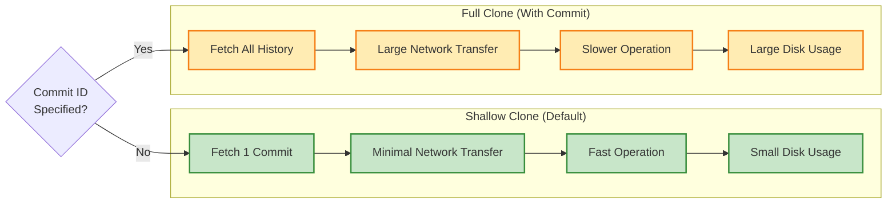

**Optimization Strategies**:

1. **Shallow Clones by Default**:
   - Only fetches latest commit (depth=1)
   - Reduces network bandwidth by 90%+ for large repositories
   - Faster clone times (seconds vs. minutes)

2. **Conditional Full Clones**:
   - Only performs full clone when specific commit is needed
   - Balances functionality with performance

3. **Timeout Configuration**:
   - 300-second timeout prevents indefinite hangs
   - Allows large repositories while protecting system resources

### 2. Resource Management

**Disk Space**:
- Shallow clones: ~10-50 MB per repository
- Full clones: Can be several GB for large projects
- Temporary directories cleaned up after processing

**Network Bandwidth**:
- Shallow clone: Minimal (latest commit only)
- Full clone: Proportional to repository history size

**CPU Usage**:
- Git operations are CPU-intensive during decompression
- Subprocess execution isolates Git from Python process

---

## Security Considerations

### 1. URL Validation Security

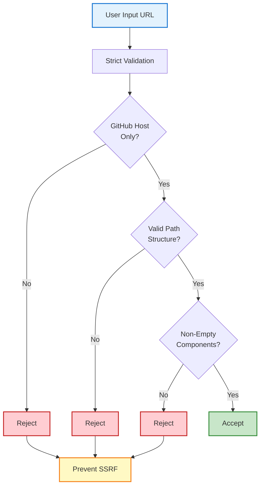

**Security Measures**:

1. **Host Whitelist**:
   - Only accepts `github.com` and `www.github.com`
   - Prevents Server-Side Request Forgery (SSRF) attacks
   - Blocks attempts to clone from internal networks or malicious hosts

2. **Path Validation**:
   - Requires valid owner/repo structure
   - Prevents directory traversal attempts
   - Validates non-empty path components

3. **HTTPS Only**:
   - Clone URLs always use HTTPS protocol
   - Prevents man-in-the-middle attacks
   - Ensures encrypted data transfer

### 2. Command Injection Prevention

**Safe Subprocess Execution**:
```python
# Safe: Uses list arguments (no shell interpretation)
subprocess.run([
    'git', 'clone', '--depth', str(WebAppConfig.CLONE_DEPTH), 
    clone_url, target_dir
], capture_output=True, text=True, timeout=WebAppConfig.CLONE_TIMEOUT)
```

**Protection Mechanisms**:
- Uses list-based subprocess arguments (not shell strings)
- No shell interpretation of user input
- Prevents command injection via malicious URLs
- Timeout prevents resource exhaustion attacks

### 3. Resource Limits

**Timeout Protection**:
- 300-second timeout on all Git operations
- Prevents denial-of-service via slow clones
- Protects against network-based attacks

**Disk Space**:
- Temporary directories isolated per job
- Cleanup after processing prevents disk exhaustion
- See [background_processing](background_processing.md) for cleanup details

---

## Testing Considerations

### Test Coverage Areas

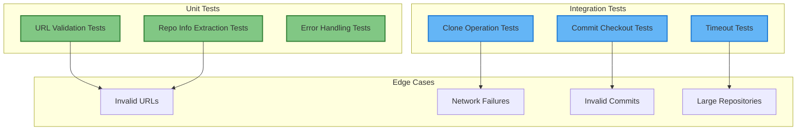

### Recommended Test Cases

1. **URL Validation Tests**:
   - Valid GitHub URLs (various formats)
   - Invalid hosts (GitLab, Bitbucket, etc.)
   - Malformed URLs (missing parts, special characters)
   - Edge cases (trailing slashes, .git suffix)

2. **Repository Info Tests**:
   - Standard owner/repo format
   - URLs with .git suffix
   - URLs with additional path segments
   - Special characters in owner/repo names

3. **Clone Operation Tests**:
   - Successful shallow clone
   - Successful full clone with commit
   - Network timeout scenarios
   - Invalid repository URLs
   - Invalid commit IDs
   - Permission denied scenarios

4. **Error Handling Tests**:
   - Git not installed
   - Disk space full
   - Network unavailable
   - Invalid target directory

---

## Future Enhancements

### Potential Improvements

1. **Authentication Support**:
   - Support for private repositories
   - GitHub token integration
   - OAuth authentication flow

2. **Advanced Clone Options**:
   - Branch-specific cloning
   - Submodule support
   - Sparse checkout for large repositories

3. **Progress Reporting**:
   - Real-time clone progress updates
   - Bandwidth usage monitoring
   - Estimated time remaining

4. **Caching Optimizations**:
   - Incremental updates (git pull) for cached repositories
   - Shared repository cache across jobs
   - Deduplication of common dependencies

5. **Multi-Platform Support**:
   - Support for GitLab, Bitbucket
   - Generic Git URL support
   - Self-hosted Git servers

6. **Enhanced Error Reporting**:
   - Structured error codes
   - Detailed error messages
   - Retry strategies for transient failures

---

## Related Modules

- **[background_processing](background_processing.md)**: Uses GitHubRepoProcessor for asynchronous repository cloning
- **[web_routes_api](web_routes_api.md)**: Validates URLs before job submission
- **[configuration_management](configuration_management.md)**: Provides clone timeout and depth settings
- **[data_models](data_models.md)**: Defines RepositorySubmission and JobStatus structures
- **[cache_management](cache_management.md)**: Caches cloned repository documentation

---

## Summary

The **github_integration** module is a critical component of the CodeWiki web application, providing robust and secure GitHub repository processing capabilities. Its design emphasizes:

- **Simplicity**: Static utility methods with clear responsibilities
- **Security**: Strict URL validation and safe subprocess execution
- **Performance**: Optimized shallow clones with configurable depth
- **Reliability**: Comprehensive error handling and timeout protection
- **Integration**: Seamless integration with background processing and web routes

The module serves as the foundation for repository acquisition, enabling the system to fetch source code for analysis and documentation generation while maintaining security and performance standards.

