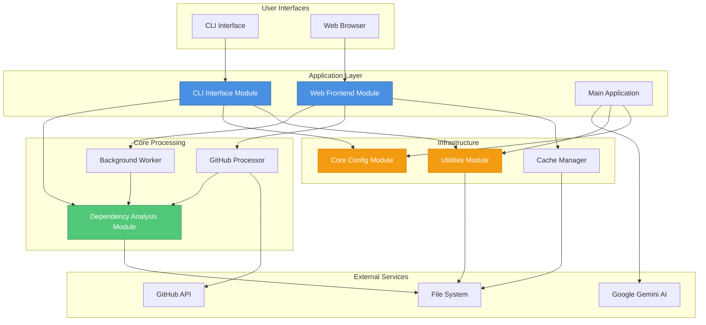
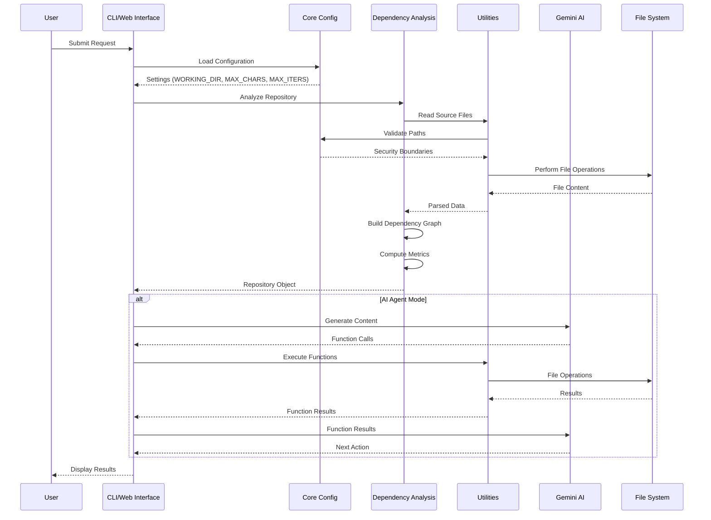
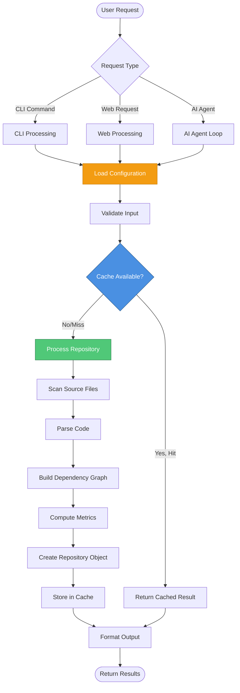
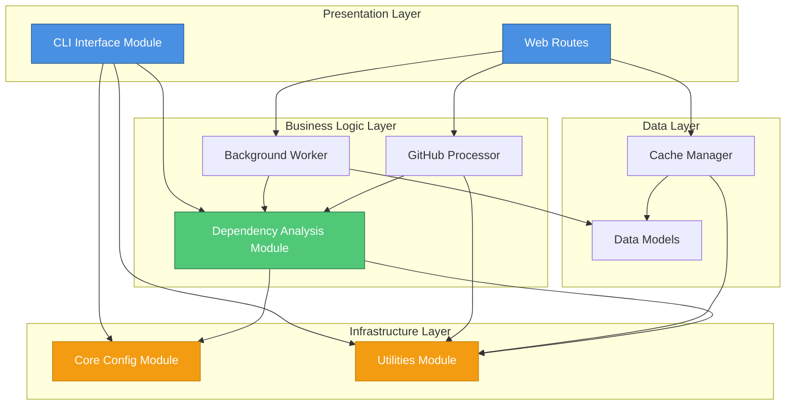
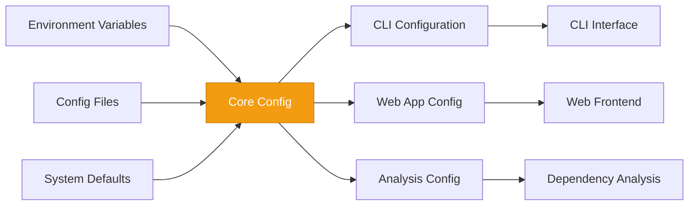
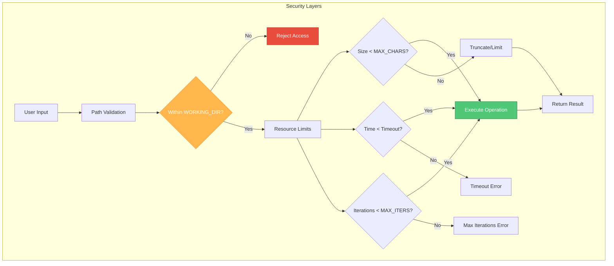

# AI Agent Repository Overview

## Purpose

The **ai-agent** repository implements an AI-powered coding assistant system that enables autonomous code analysis, modification, and execution within a secure, sandboxed environment. The system leverages Google's Gemini AI model to provide intelligent code assistance through both command-line and web-based interfaces, with comprehensive dependency analysis capabilities for understanding code structure and relationships.

The repository serves as a complete framework for building AI coding agents that can:
- Analyze code repositories and generate dependency graphs
- Read, write, and execute code files within defined boundaries
- Provide interactive code exploration through web and CLI interfaces
- Process GitHub repositories for automated documentation and analysis
- Manage background jobs for long-running analysis tasks
- Cache analysis results for improved performance

---

## End-to-End Architecture

### High-Level System Architecture



### Component Interaction Flow



### Data Flow Architecture



### Module Dependency Graph



---

## Core Modules Documentation

The ai-agent repository is organized into five core modules, each serving a specific purpose in the system architecture:

### 1. [CLI Interface Module](cli_interface.md)
**Location:** `codewiki/cli`

Provides the command-line interface for interacting with the CodeWiki system, enabling users to analyze repositories, manage configuration, and track progress through terminal commands.

**Key Components:**
- `Configuration` - CLI configuration management
- `ModuleProgressBar` - Visual progress tracking for terminal

**Primary Use Cases:**
- Command-line repository analysis
- Configuration management via CLI
- Progress monitoring for long-running operations
- Integration with CI/CD pipelines

---

### 2. [Dependency Analysis Module](dependency_analysis.md)
**Location:** `codewiki/src/be/dependency_analyzer`

The core analytical engine that processes source code repositories to extract structural information, build dependency graphs, and compute code metrics.

**Key Components:**
- `Repository` - Complete repository structure representation
- `Node` - Individual code component (class, function, module)
- `NodeSelection` - Filtered subset of nodes for focused analysis

**Primary Use Cases:**
- Code dependency graph generation
- Circular dependency detection
- Code structure analysis
- Dependency metrics computation
- Multi-language code parsing

---

### 3. [Web Frontend Module](web_frontend.md)
**Location:** `codewiki/src/fe`

Provides the web-based user interface and API layer, enabling browser-based interaction with the code analysis system through RESTful endpoints and asynchronous job processing.

**Key Components:**
- `WebRoutes` - HTTP routing and API endpoints
- `BackgroundWorker` - Asynchronous job processing
- `CacheManager` - Result caching and optimization
- `GitHubRepoProcessor` - GitHub integration
- `WebAppConfig` - Web application configuration
- `JobStatus` - Job tracking and progress
- `CacheEntry` - Cache entry management
- `RepositorySubmission` - Repository submission handling

**Primary Use Cases:**
- Web-based code exploration
- GitHub repository analysis
- Asynchronous job processing
- Result caching and retrieval
- API-based integrations

---

### 4. [Core Config Module](core_config.md)
**Location:** `codewiki/src/config.py`

Central configuration hub that defines runtime parameters, security boundaries, and operational constraints for the entire system.

**Key Components:**
- `Config` - Configuration management class

**Configuration Parameters:**
- `MAX_CHARS` - Maximum file read size (default: 10,000 characters)
- `WORKING_DIR` - Sandboxed working directory (default: "./calculator")
- `MAX_ITERS` - Maximum AI agent iterations (default: 20)

**Primary Use Cases:**
- Security boundary enforcement
- Resource limit management
- Environment-specific configuration
- System-wide parameter control

---

### 5. [Utilities Module](utilities.md)
**Location:** `codewiki/src/utils.py`

Provides secure, sandboxed file system operations that enable the AI agent to interact with code files while maintaining strict security boundaries.

**Key Components:**
- `FileManager` - File system operations manager

**Core Functions:**
- `get_files_info` - Directory listing with file metadata
- `get_file_content` - Secure file reading with size limits
- `write_file` - File writing with directory creation
- `run_python_file` - Python script execution with timeout

**Primary Use Cases:**
- Secure file system access
- Code file reading and writing
- Python script execution
- Directory exploration
- Path validation and sandboxing

---

## System Integration

### Configuration Flow



### Security Architecture



---

## Getting Started

### Quick Start Guide

1. **Installation**
   ```bash
   git clone <repository-url>
   cd ai-agent
   pip install -r requirements.txt
   ```

2. **Configuration**
   ```python
   # Edit codewiki/src/config.py
   MAX_CHARS = 10000
   WORKING_DIR = "./your-project"
   MAX_ITERS = 20
   ```

3. **CLI Usage**
   ```bash
   # Analyze a repository
   python -m codewiki.cli analyze ./path/to/repo
   
   # View configuration
   python -m codewiki.cli config list
   ```

4. **Web Interface**
   ```bash
   # Start web server
   python -m codewiki.src.fe.app
   
   # Access at http://localhost:5000
   ```

### Module Navigation

- **For CLI users**: Start with [CLI Interface Module](cli_interface.md)
- **For web developers**: Start with [Web Frontend Module](web_frontend.md)
- **For code analysis**: Start with [Dependency Analysis Module](dependency_analysis.md)
- **For configuration**: Start with [Core Config Module](core_config.md)
- **For file operations**: Start with [Utilities Module](utilities.md)

---

## Key Features

### 🔍 Code Analysis
- Multi-language dependency analysis
- Circular dependency detection
- Code metrics computation
- Dependency graph visualization

### 🌐 Web Interface
- RESTful API endpoints
- Asynchronous job processing
- GitHub repository integration
- Intelligent result caching

### 🖥️ CLI Interface
- Command-line repository analysis
- Configuration management
- Progress tracking
- Batch processing support

### 🔒 Security
- Sandboxed file operations
- Path traversal prevention
- Resource consumption limits
- Execution timeouts

### ⚡ Performance
- Multi-tier caching
- Parallel processing
- Incremental analysis
- Background job queuing

---

## Architecture Highlights

### Modular Design
Each module has clear responsibilities and well-defined interfaces, enabling independent development and testing.

### Security-First Approach
All file operations are validated against security boundaries, preventing unauthorized access and resource exhaustion.

### Scalable Architecture
Stateless API design and background job processing enable horizontal scaling for production deployments.

### AI Integration
Seamless integration with Google Gemini AI for intelligent code assistance and automated decision-making.

### Extensible Framework
Plugin-friendly architecture allows easy addition of new languages, analysis types, and integration points.

---

## Documentation Structure

Each core module includes comprehensive documentation covering:
- **Architecture**: Component design and interaction patterns
- **Core Components**: Detailed component specifications
- **Integration Points**: How modules interact with each other
- **Data Flow**: Request/response patterns and data transformations
- **Usage Examples**: Practical code examples and workflows
- **Best Practices**: Guidelines for effective usage
- **Security Considerations**: Security features and recommendations

---

## Contributing

For detailed information about each module's implementation, please refer to the individual module documentation linked above. Each document provides in-depth coverage of architecture, components, and usage patterns specific to that module.