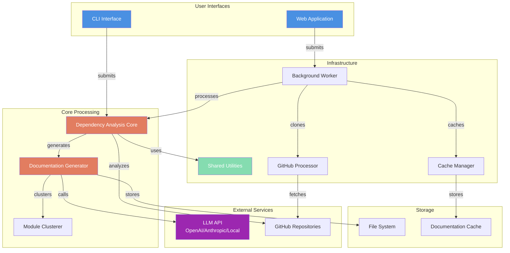
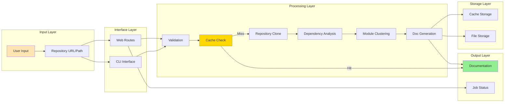
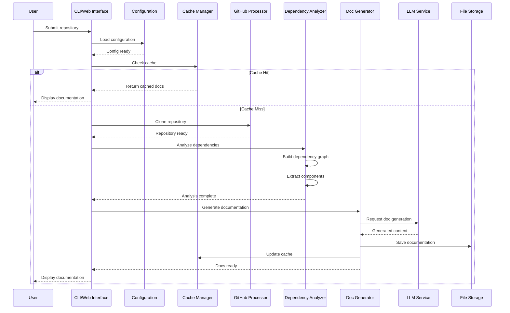
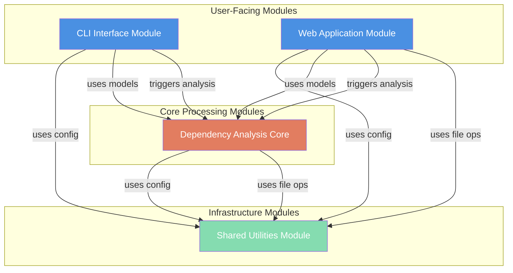
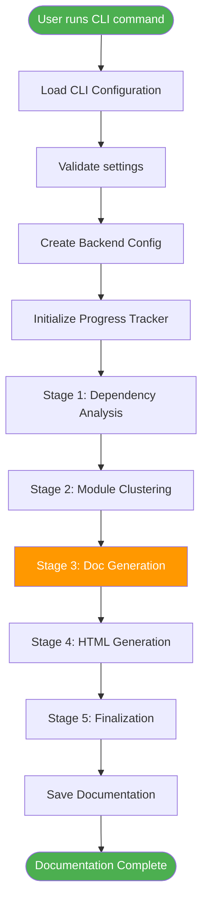
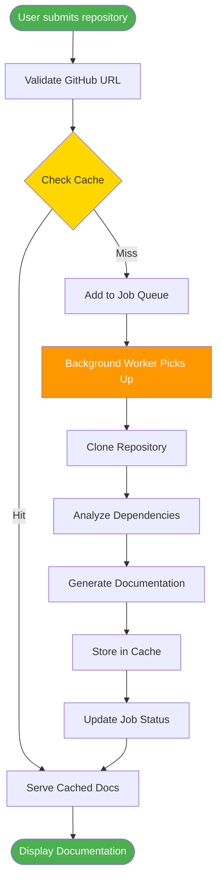

# AI-Agent Repository Overview

## Purpose

The **ai-agent** repository (also known as **CodeWiki**) is an intelligent documentation generation system that automatically analyzes code repositories and produces comprehensive, structured documentation using Large Language Models (LLMs). The system provides both command-line and web-based interfaces for transforming complex codebases into navigable, well-organized documentation with minimal manual effort.

### Core Capabilities

- **Automated Code Analysis**: Analyzes repository structure, dependencies, and relationships between code components
- **Intelligent Documentation Generation**: Leverages LLMs to generate human-readable documentation from source code
- **Multi-Interface Support**: Provides both CLI and web application interfaces for different use cases
- **Smart Caching**: Implements intelligent caching to avoid redundant documentation generation
- **GitHub Integration**: Seamlessly processes repositories from GitHub with commit-specific support
- **Asynchronous Processing**: Background job processing for non-blocking documentation generation

---

## End-to-End Architecture

### High-Level System Architecture



### Data Flow Architecture



### Component Interaction Sequence



---

## Core Modules

The ai-agent repository is organized into four primary modules, each serving a distinct purpose in the documentation generation pipeline:

### 1. [CLI Interface Module](cli_interface.md)

**Purpose**: Provides command-line interface for documentation generation with configuration management and progress tracking.

**Key Components**:
- `Configuration`: Persistent user settings management
- `ProgressTracker`: Multi-stage progress tracking with ETA
- `ModuleProgressBar`: Per-module progress visualization

**Primary Responsibilities**:
- User configuration storage (`~/.codewiki/config.json`)
- Command-line argument parsing and validation
- Real-time progress feedback during generation
- Integration with backend configuration system

**Usage Context**: Ideal for developers who prefer terminal-based workflows, CI/CD integration, and scripted documentation generation.

---

### 2. [Dependency Analysis Core Module](dependency_analysis_core.md)

**Purpose**: Analyzes code repositories to extract structure, dependencies, and relationships between components.

**Key Components**:
- `Node`: Represents code components (functions, classes, methods)
- `CallRelationship`: Models caller-callee relationships
- `Repository`: Repository metadata container
- `AnalysisResult`: Complete analysis output package
- `NodeSelection`: Selective export configuration

**Primary Responsibilities**:
- Code structure representation as dependency graphs
- Relationship tracking between components
- Source code and metadata extraction
- Analysis result packaging and serialization

**Usage Context**: Core data foundation used by all other modules for representing analyzed code structure.

---

### 3. [Web Application Module](web_application.md)

**Purpose**: Provides web-based interface for repository submission, job tracking, and documentation viewing.

**Key Components**:
- `WebRoutes`: FastAPI route handlers
- `BackgroundWorker`: Asynchronous job processing
- `CacheManager`: Documentation caching system
- `GitHubRepoProcessor`: GitHub integration
- `WebAppConfig`: Web application configuration

**Sub-modules**:
- [Configuration Management](configuration_management.md): Web app settings
- [Web Routes & API](web_routes_api.md): HTTP endpoints
- [Background Processing](background_processing.md): Job queue management
- [Cache Management](cache_management.md): Intelligent caching
- [GitHub Integration](github_integration.md): Repository operations
- [Data Models](data_models.md): Request/response models

**Primary Responsibilities**:
- Web-based repository submission
- Background job processing and tracking
- Cache management and retrieval
- GitHub repository cloning and processing
- Documentation serving and viewing

**Usage Context**: Ideal for teams, web-based workflows, and users who prefer graphical interfaces.

---

### 4. [Shared Utilities Module](shared_utilities.md)

**Purpose**: Provides foundational infrastructure for configuration and file operations shared across all modules.

**Key Components**:
- `Config`: Unified configuration management
- `FileManager`: Standardized file I/O operations

**Primary Responsibilities**:
- Context-aware configuration (CLI vs. Web)
- LLM API configuration management
- Directory structure management
- JSON and text file operations
- Environment variable handling

**Usage Context**: Foundation module used by all other modules for configuration and file operations.

---

## Module Dependency Graph



---

## System Workflows

### CLI Documentation Generation Workflow



### Web Application Workflow



---

## Key Features

### 1. Dual Interface Support
- **CLI**: Terminal-based workflow with progress tracking
- **Web**: Browser-based interface with job tracking

### 2. Intelligent Caching
- SHA-256 hash-based cache indexing
- Configurable expiration (default: 365 days)
- Automatic cache validation and cleanup

### 3. Asynchronous Processing
- Non-blocking background job execution
- Queue-based job management
- Real-time status updates

### 4. LLM Integration
- Support for multiple LLM providers (OpenAI, Anthropic, local)
- Configurable models for different tasks
- Fallback model support

### 5. GitHub Integration
- URL validation and normalization
- Commit-specific documentation
- Shallow cloning for efficiency

### 6. Comprehensive Analysis
- Dependency graph construction
- Module clustering
- Relationship tracking
- Metadata extraction

---

## Configuration Management

### CLI Configuration
- Stored in `~/.codewiki/config.json`
- Persistent user preferences
- API key management via keyring

### Web Application Configuration
- Environment variable based
- Runtime configuration injection
- Separate cache and temp directories

### Shared Configuration
- Unified `Config` class
- Context-aware settings
- LLM endpoint configuration

---

## Technology Stack

### Core Technologies
- **Python 3.12+**: Primary programming language
- **FastAPI**: Web framework for REST API
- **Pydantic**: Data validation and serialization
- **Click**: CLI framework

### External Services
- **LLM APIs**: OpenAI, Anthropic, or local LLM endpoints
- **GitHub**: Repository hosting and access

### Storage
- **File System**: Documentation and cache storage
- **JSON**: Configuration and data serialization

---

## Getting Started

### CLI Usage
```bash
# Initialize configuration
codewiki init

# Generate documentation
codewiki generate /path/to/repo --verbose

# Update configuration
codewiki config set main_model gpt-4-turbo
```

### Web Application Usage
```bash
# Start web server
python -m codewiki.web

# Access at http://localhost:8000
# Submit repository URL via web form
```

---

## Module Reference Summary

| Module | Primary Purpose | Key Components | Documentation |
|--------|----------------|----------------|---------------|
| **CLI Interface** | Command-line interface | Configuration, ProgressTracker | [cli_interface.md](cli_interface.md) |
| **Dependency Analysis Core** | Code analysis and modeling | Node, Repository, AnalysisResult | [dependency_analysis_core.md](dependency_analysis_core.md) |
| **Web Application** | Web-based interface | WebRoutes, BackgroundWorker, CacheManager | [web_application.md](web_application.md) |
| **Shared Utilities** | Common infrastructure | Config, FileManager | [shared_utilities.md](shared_utilities.md) |

---

## System Characteristics

### Strengths
✅ **Automated Documentation**: Minimal manual effort required  
✅ **Multi-Interface**: CLI and web options for different workflows  
✅ **Intelligent Caching**: Avoids redundant processing  
✅ **Asynchronous Processing**: Non-blocking operations  
✅ **Flexible LLM Support**: Multiple provider options  
✅ **Comprehensive Analysis**: Deep code understanding  

### Use Cases
- **Open Source Projects**: Generate documentation for public repositories
- **Enterprise Codebases**: Document internal code for team knowledge sharing
- **Code Reviews**: Understand unfamiliar codebases quickly
- **Onboarding**: Help new developers understand project structure
- **Documentation Maintenance**: Keep docs in sync with code changes

---

## Conclusion

The **ai-agent** (CodeWiki) repository provides a sophisticated, production-ready system for automated code documentation generation. Its modular architecture, dual-interface support, and intelligent processing make it suitable for both individual developers and enterprise teams seeking to maintain high-quality, up-to-date documentation with minimal manual effort.

For detailed information about specific modules, please refer to the individual module documentation linked throughout this overview.