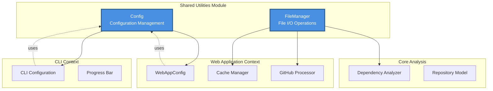
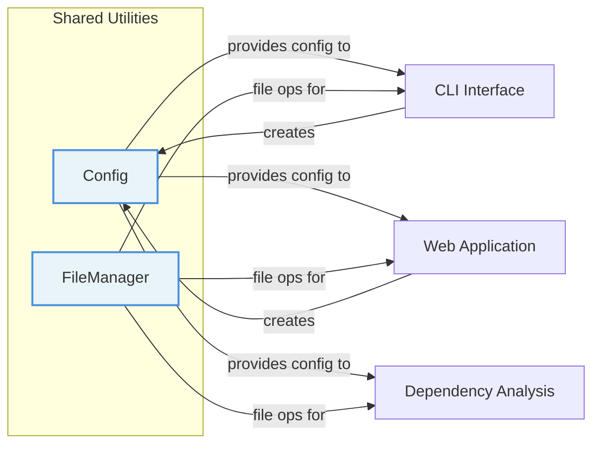
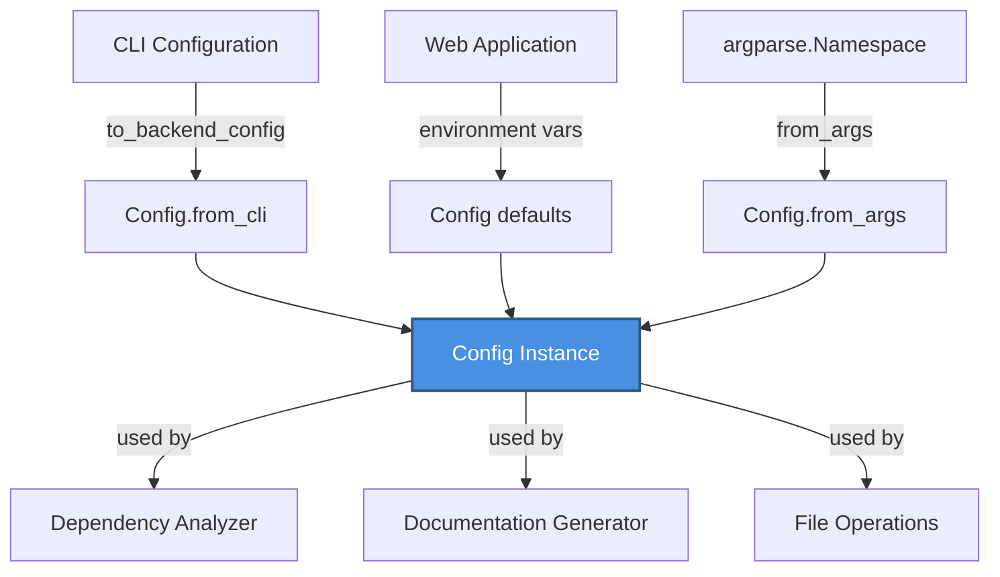
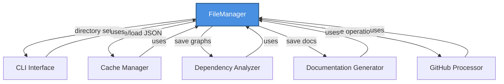
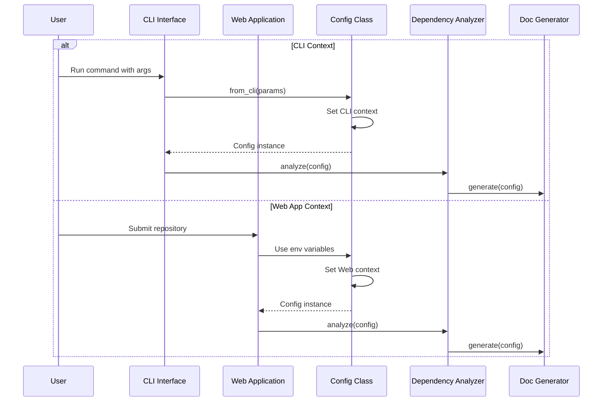
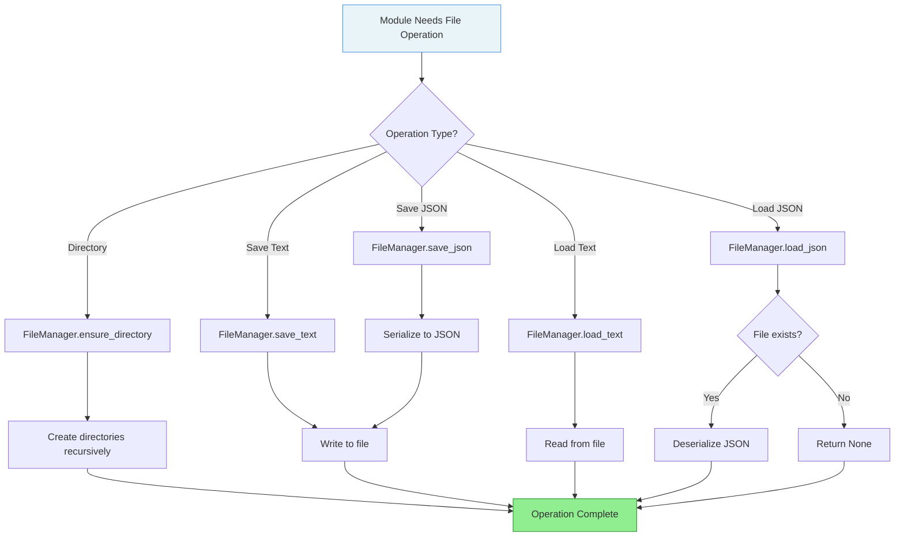

# Shared Utilities Module

## Overview

The **shared_utilities** module provides foundational infrastructure components that are shared across the entire CodeWiki system. It serves as the backbone for configuration management and file operations, ensuring consistent behavior across both CLI and web application contexts.

This module acts as a central dependency for other modules, providing:
- **Unified Configuration Management**: A flexible configuration system that adapts to different execution contexts (CLI vs. Web App)
- **File System Operations**: Standardized file I/O utilities for JSON and text file handling
- **Environment Management**: Context-aware settings that bridge CLI and web application environments

## Purpose

The shared_utilities module addresses several critical system-wide needs:

1. **Configuration Abstraction**: Provides a single source of truth for system configuration while supporting multiple execution contexts
2. **File Management Standardization**: Ensures consistent file operations across all modules
3. **Environment Flexibility**: Enables seamless operation in both CLI and web application modes
4. **Dependency Injection**: Supplies core utilities to higher-level modules without creating circular dependencies

## Architecture Overview

The module consists of two primary components that work together to provide essential services:



### Component Relationships



## Core Components

### 1. Config Class

**Location**: `venv_codewiki/lib/python3.12/site-packages/codewiki/src/config.py`

The `Config` class is a dataclass that encapsulates all configuration parameters needed for CodeWiki operations. It provides a unified interface for configuration across different execution contexts.

#### Key Responsibilities:
- **Path Management**: Manages repository paths, output directories, and documentation locations
- **LLM Configuration**: Stores API endpoints, keys, and model selections
- **Context Adaptation**: Provides factory methods for CLI and web application contexts
- **Directory Structure**: Defines and manages the output directory hierarchy

#### Configuration Parameters:

| Parameter | Type | Description |
|-----------|------|-------------|
| `repo_path` | str | Path to the repository being analyzed |
| `output_dir` | str | Base output directory for all generated files |
| `dependency_graph_dir` | str | Directory for dependency graph artifacts |
| `docs_dir` | str | Directory for generated documentation |
| `max_depth` | int | Maximum depth for module tree analysis |
| `llm_base_url` | str | Base URL for LLM API endpoint |
| `llm_api_key` | str | API key for LLM authentication |
| `main_model` | str | Primary model for documentation generation |
| `cluster_model` | str | Model used for module clustering |
| `fallback_model` | str | Fallback model when primary fails |

#### Factory Methods:

**`from_args(args: argparse.Namespace) -> Config`**
- Creates configuration from command-line arguments
- Sanitizes repository names for filesystem compatibility
- Uses default environment variables for LLM settings
- Used primarily in legacy CLI workflows

**`from_cli(repo_path, output_dir, llm_base_url, llm_api_key, main_model, cluster_model, fallback_model) -> Config`**
- Creates configuration for modern CLI context
- Provides explicit control over all parameters
- Integrates with CLI configuration management system
- Bridges CLI Configuration to Backend Config

#### Context Detection:

The module provides global functions for context management:

```python
set_cli_context(enabled: bool = True)  # Set CLI vs Web App context
is_cli_context() -> bool               # Check current context
```

This enables different modules to adapt their behavior based on the execution environment.

#### Integration Points:



### 2. FileManager Class

**Location**: `venv_codewiki/lib/python3.12/site-packages/codewiki/src/utils.py`

The `FileManager` class provides a centralized, static utility for all file system operations. It ensures consistent file handling across the entire system.

#### Key Responsibilities:
- **Directory Management**: Creates and ensures directory existence
- **JSON Operations**: Handles JSON serialization and deserialization
- **Text File Operations**: Manages text file reading and writing
- **Error Handling**: Provides safe file operations with proper error handling

#### Methods:

**`ensure_directory(path: str) -> None`**
- Creates directory and all parent directories if they don't exist
- Uses `os.makedirs` with `exist_ok=True` for idempotent operation
- Essential for setting up output directory structures

**`save_json(data: Any, filepath: str) -> None`**
- Serializes Python objects to JSON format
- Writes to specified file path with indentation for readability
- Used for saving module trees, dependency graphs, and cache data

**`load_json(filepath: str) -> Optional[Dict[str, Any]]`**
- Deserializes JSON files to Python dictionaries
- Returns `None` if file doesn't exist (graceful handling)
- Used for loading cached data and configuration files

**`save_text(content: str, filepath: str) -> None`**
- Writes text content to files
- Used for saving generated documentation (Markdown files)

**`load_text(filepath: str) -> str`**
- Reads text content from files
- Used for loading templates and existing documentation

#### Usage Pattern:

```python
from codewiki.src.utils import file_manager

# Ensure output directory exists
file_manager.ensure_directory("./output/docs")

# Save module tree
file_manager.save_json(module_tree, "./output/module_tree.json")

# Load cached data
cache_data = file_manager.load_json("./output/cache/repo_cache.json")

# Save documentation
file_manager.save_text(markdown_content, "./output/docs/module.md")
```

#### Integration with Other Modules:



## Configuration Flow

The following diagram illustrates how configuration flows through the system in different contexts:



## File Operations Flow



## Constants and Defaults

The module defines several system-wide constants:

| Constant | Value | Description |
|----------|-------|-------------|
| `OUTPUT_BASE_DIR` | 'output' | Base directory for all outputs |
| `DEPENDENCY_GRAPHS_DIR` | 'dependency_graphs' | Subdirectory for graph artifacts |
| `DOCS_DIR` | 'docs' | Subdirectory for documentation |
| `FIRST_MODULE_TREE_FILENAME` | 'first_module_tree.json' | Initial module tree file |
| `MODULE_TREE_FILENAME` | 'module_tree.json' | Final module tree file |
| `OVERVIEW_FILENAME` | 'overview.md' | Overview documentation file |
| `MAX_DEPTH` | 2 | Maximum module tree depth |
| `MAX_TOKEN_PER_MODULE` | 36,369 | Token limit per module |
| `MAX_TOKEN_PER_LEAF_MODULE` | 16,000 | Token limit for leaf modules |

### Environment Variables

The module reads the following environment variables (with defaults):

- `MAIN_MODEL`: Primary LLM model (default: 'claude-sonnet-4')
- `FALLBACK_MODEL_1`: Fallback LLM model (default: 'glm-4p5')
- `CLUSTER_MODEL`: Clustering model (default: same as MAIN_MODEL)
- `LLM_BASE_URL`: LLM API endpoint (default: 'http://0.0.0.0:4000/')
- `LLM_API_KEY`: LLM API key (default: 'sk-1234')

## Cross-Module Dependencies

The shared_utilities module is a foundational dependency for multiple modules:

### Upstream Dependencies (modules that use shared_utilities):

1. **[CLI Interface](cli_interface.md)**
   - Uses `Config.from_cli()` to create runtime configuration
   - Integrates CLI Configuration with Backend Config
   - Uses `FileManager` for output directory setup

2. **[Web Application](web_application.md)**
   - Uses `Config` with environment variables
   - `WebAppConfig` extends configuration for web-specific settings
   - Uses `FileManager` for cache and temporary file management

3. **[Dependency Analysis Core](dependency_analysis_core.md)**
   - Receives `Config` instance for analysis parameters
   - Uses `FileManager` to save dependency graphs and module trees
   - Relies on path configuration for output locations

### Downstream Dependencies (modules that shared_utilities uses):

- **None**: This is a foundational module with no internal dependencies on other CodeWiki modules
- External dependencies: `os`, `json`, `argparse`, `dataclasses`, `dotenv`

## Usage Examples

### Creating Configuration for CLI

```python
from codewiki.src.config import Config, set_cli_context

# Set CLI context
set_cli_context(True)

# Create configuration
config = Config.from_cli(
    repo_path="/path/to/repo",
    output_dir="./docs",
    llm_base_url="http://localhost:4000",
    llm_api_key="sk-key",
    main_model="claude-sonnet-4",
    cluster_model="claude-sonnet-4"
)

# Use configuration
print(f"Docs will be saved to: {config.docs_dir}")
```

### Creating Configuration for Web App

```python
import os
from codewiki.src.config import Config

# Set environment variables
os.environ['MAIN_MODEL'] = 'gpt-4'
os.environ['LLM_BASE_URL'] = 'https://api.openai.com/v1'
os.environ['LLM_API_KEY'] = 'sk-...'

# Create configuration from args
import argparse
args = argparse.Namespace(repo_path="/path/to/repo")
config = Config.from_args(args)
```

### Using FileManager

```python
from codewiki.src.utils import file_manager

# Setup directory structure
file_manager.ensure_directory("./output/docs")
file_manager.ensure_directory("./output/cache")

# Save module tree
module_tree = {
    "name": "my_module",
    "children": []
}
file_manager.save_json(module_tree, "./output/module_tree.json")

# Load cached data
cached_data = file_manager.load_json("./output/cache/data.json")
if cached_data is None:
    print("No cached data found")

# Save documentation
documentation = "# Module Documentation\n\nContent here..."
file_manager.save_text(documentation, "./output/docs/module.md")
```

## Design Patterns

### 1. Singleton Pattern (FileManager)

The `FileManager` class uses static methods, effectively implementing a stateless singleton pattern. This ensures:
- Consistent file operations across the entire system
- No need for instance management
- Thread-safe operations (as methods are stateless)

### 2. Factory Pattern (Config)

The `Config` class provides multiple factory methods (`from_args`, `from_cli`) that create appropriately configured instances based on context:
- Encapsulates complex initialization logic
- Provides clear entry points for different use cases
- Enables easy testing with mock configurations

### 3. Context Manager Pattern

The global context functions (`set_cli_context`, `is_cli_context`) implement a simple context management pattern:
- Allows modules to adapt behavior based on execution environment
- Centralizes context state management
- Enables environment-specific optimizations

## Best Practices

### Configuration Management

1. **Always use factory methods**: Don't instantiate `Config` directly; use `from_cli()` or `from_args()`
2. **Set context early**: Call `set_cli_context()` at application startup
3. **Use environment variables for secrets**: Never hardcode API keys in configuration
4. **Validate paths**: Ensure repository paths exist before creating configuration

### File Operations

1. **Always ensure directories first**: Call `ensure_directory()` before saving files
2. **Handle None returns**: Check for `None` when using `load_json()`
3. **Use absolute paths**: Convert relative paths to absolute for consistency
4. **Sanitize filenames**: Clean user input before using in file paths

### Error Handling

```python
from codewiki.src.utils import file_manager

# Good: Handle missing files gracefully
data = file_manager.load_json("config.json")
if data is None:
    data = {"default": "values"}

# Good: Ensure directory before saving
file_manager.ensure_directory("./output")
file_manager.save_json(data, "./output/data.json")
```

## Testing Considerations

### Mocking FileManager

```python
from unittest.mock import patch

def test_save_operation():
    with patch('codewiki.src.utils.FileManager.save_json') as mock_save:
        # Test code that uses file_manager
        file_manager.save_json({"test": "data"}, "test.json")
        mock_save.assert_called_once()
```

### Testing Configuration

```python
def test_config_creation():
    config = Config.from_cli(
        repo_path="/test/repo",
        output_dir="/test/output",
        llm_base_url="http://test",
        llm_api_key="test-key",
        main_model="test-model",
        cluster_model="test-cluster"
    )
    
    assert config.repo_path == "/test/repo"
    assert config.main_model == "test-model"
```

## Performance Considerations

### File I/O Optimization

- **Batch operations**: Group multiple file operations when possible
- **Lazy loading**: Use `load_json()` only when data is needed
- **Directory caching**: `ensure_directory()` is idempotent and fast for existing directories

### Configuration Caching

- Configuration objects are lightweight and can be created as needed
- For long-running processes, create once and reuse
- No need to cache configuration in most cases

## Security Considerations

1. **API Key Management**:
   - Never log or print API keys
   - Use environment variables or secure key storage
   - Rotate keys regularly

2. **Path Traversal Prevention**:
   - Sanitize repository names before creating paths
   - Validate user-provided paths
   - Use absolute paths to prevent directory traversal

3. **File Permissions**:
   - Ensure output directories have appropriate permissions
   - Don't expose sensitive configuration files

## Future Enhancements

Potential improvements to the shared_utilities module:

1. **Configuration Validation**: Add schema validation for configuration parameters
2. **Async File Operations**: Support async I/O for better performance in web contexts
3. **Configuration Profiles**: Support multiple named configuration profiles
4. **File Locking**: Add file locking for concurrent access scenarios
5. **Compression Support**: Add support for compressed JSON files
6. **Configuration Encryption**: Encrypt sensitive configuration data at rest

## Summary

The shared_utilities module provides essential infrastructure for the CodeWiki system:

- **Config**: Flexible, context-aware configuration management
- **FileManager**: Standardized, reliable file I/O operations

These components enable:
- Seamless operation across CLI and web application contexts
- Consistent file handling throughout the system
- Centralized configuration management
- Clean separation of concerns

By serving as a foundational dependency, this module ensures that all higher-level modules have access to reliable, well-tested utilities for configuration and file operations.
