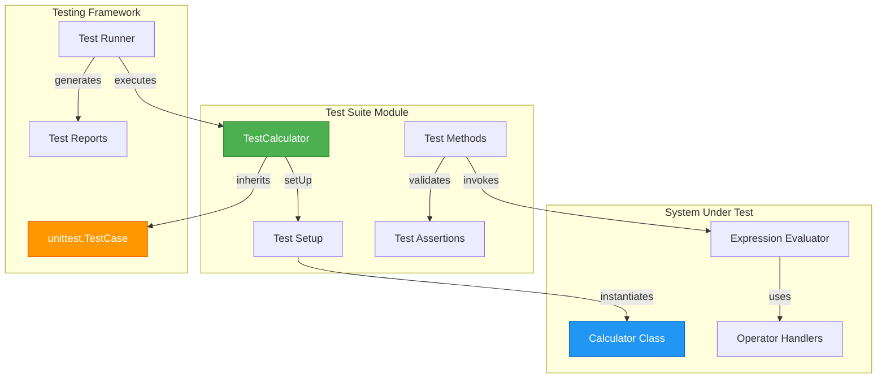
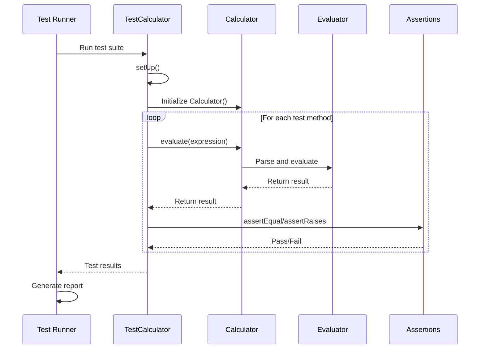
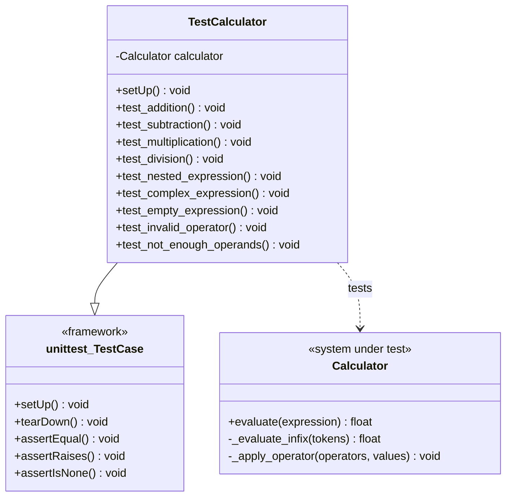
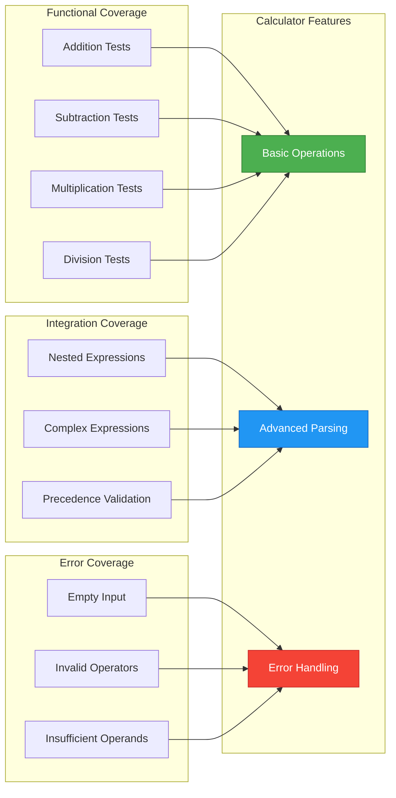
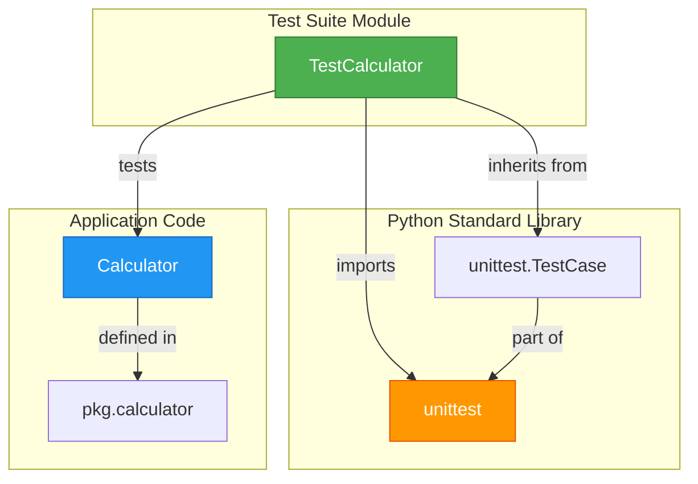
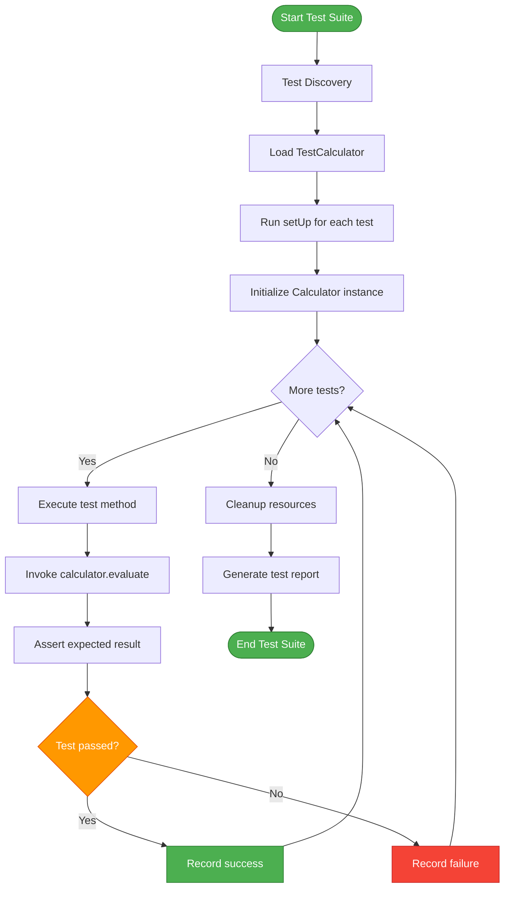
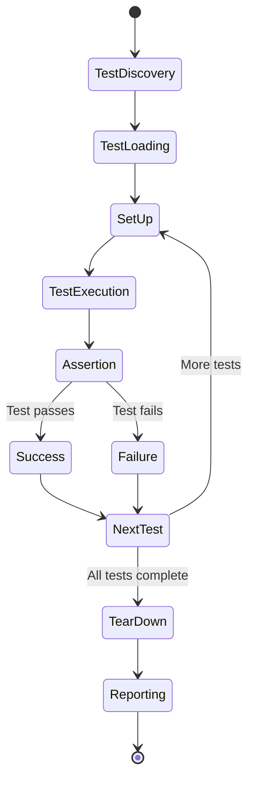
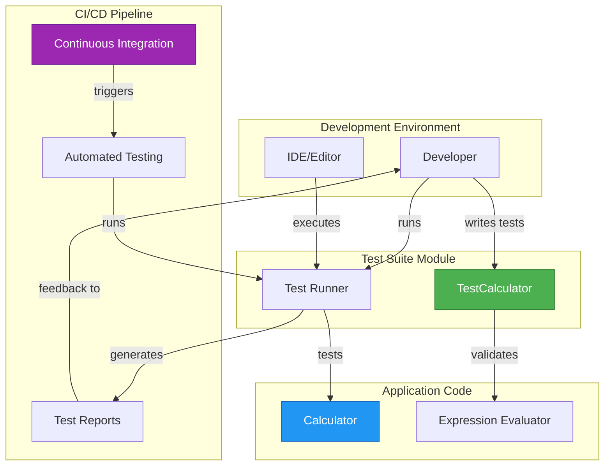
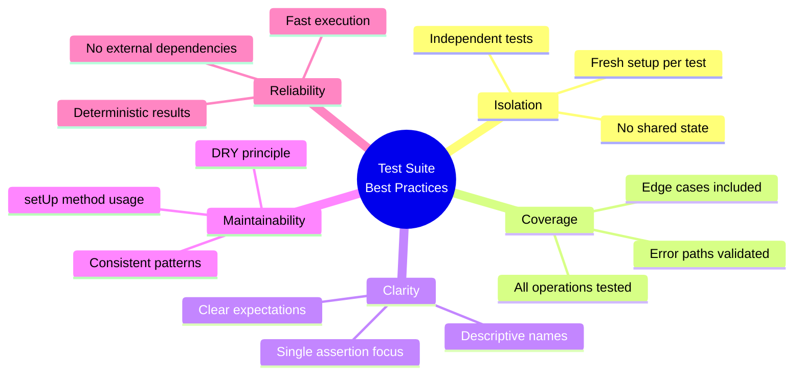
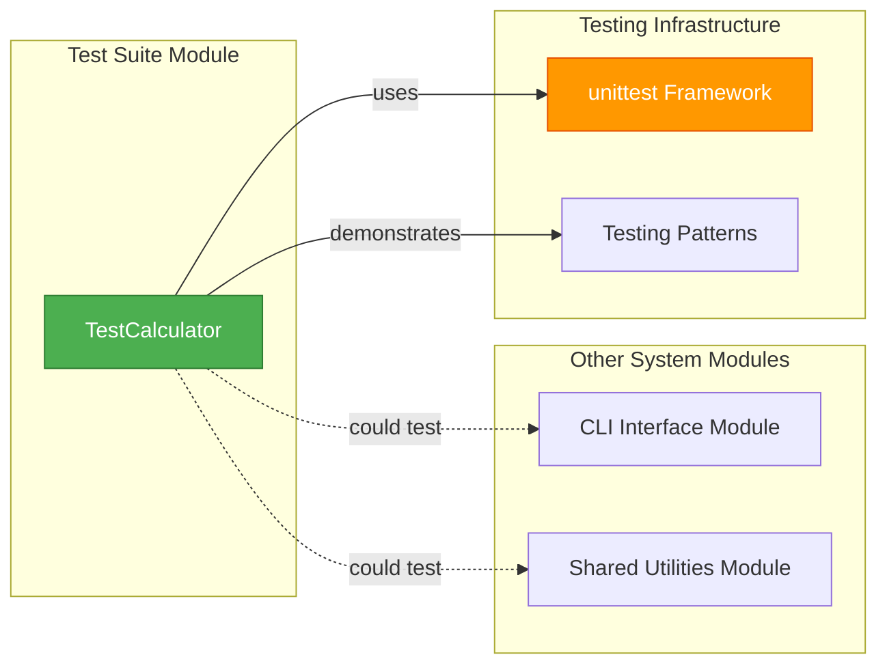

# Test Suite Module

## Overview

The **test_suite** module provides comprehensive unit testing coverage for the Calculator application. It implements a systematic testing framework using Python's `unittest` library to validate the correctness of mathematical expression evaluation, operator precedence handling, and error conditions. This module ensures the reliability and robustness of the calculator's core functionality through automated test cases covering normal operations, edge cases, and error scenarios.

---

## Table of Contents

- [Architecture](#architecture)
- [Core Components](#core-components)
- [Test Coverage](#test-coverage)
- [Test Scenarios](#test-scenarios)
- [Dependencies](#dependencies)
- [Testing Workflow](#testing-workflow)
- [Integration with System](#integration-with-system)
- [Best Practices](#best-practices)

---

## Architecture

### High-Level Architecture



### Component Interaction Flow



---

## Core Components

### TestCalculator Class

The `TestCalculator` class is the primary testing component that validates all aspects of the Calculator functionality.



#### Key Responsibilities

1. **Test Initialization**: Sets up a fresh Calculator instance for each test
2. **Functional Testing**: Validates basic arithmetic operations
3. **Integration Testing**: Tests complex expressions with multiple operators
4. **Error Handling**: Verifies proper exception handling for invalid inputs
5. **Edge Case Testing**: Ensures correct behavior for boundary conditions

---

## Test Coverage

### Coverage Matrix



### Test Categories

| Category | Test Methods | Coverage Area | Assertions |
|----------|-------------|---------------|------------|
| **Basic Operations** | `test_addition`, `test_subtraction`, `test_multiplication`, `test_division` | Individual arithmetic operators | `assertEqual` |
| **Expression Parsing** | `test_nested_expression`, `test_complex_expression` | Operator precedence and multi-operation expressions | `assertEqual` |
| **Error Handling** | `test_invalid_operator`, `test_not_enough_operands` | Exception raising for invalid inputs | `assertRaises` |
| **Edge Cases** | `test_empty_expression` | Boundary conditions and special inputs | `assertIsNone` |

---

## Test Scenarios

### 1. Basic Arithmetic Operations

#### Addition Test
```python
def test_addition(self):
    result = self.calculator.evaluate("3 + 5")
    self.assertEqual(result, 8)
```

**Purpose**: Validates basic addition functionality  
**Input**: `"3 + 5"`  
**Expected Output**: `8`  
**Validation**: Ensures the calculator correctly adds two numbers

#### Subtraction Test
```python
def test_subtraction(self):
    result = self.calculator.evaluate("10 - 4")
    self.assertEqual(result, 6)
```

**Purpose**: Validates basic subtraction functionality  
**Input**: `"10 - 4"`  
**Expected Output**: `6`  
**Validation**: Ensures the calculator correctly subtracts two numbers

#### Multiplication Test
```python
def test_multiplication(self):
    result = self.calculator.evaluate("3 * 4")
    self.assertEqual(result, 12)
```

**Purpose**: Validates basic multiplication functionality  
**Input**: `"3 * 4"`  
**Expected Output**: `12`  
**Validation**: Ensures the calculator correctly multiplies two numbers

#### Division Test
```python
def test_division(self):
    result = self.calculator.evaluate("10 / 2")
    self.assertEqual(result, 5)
```

**Purpose**: Validates basic division functionality  
**Input**: `"10 / 2"`  
**Expected Output**: `5`  
**Validation**: Ensures the calculator correctly divides two numbers

### 2. Complex Expression Tests

#### Nested Expression Test
```python
def test_nested_expression(self):
    result = self.calculator.evaluate("3 * 4 + 5")
    self.assertEqual(result, 17)
```

**Purpose**: Validates operator precedence (multiplication before addition)  
**Input**: `"3 * 4 + 5"`  
**Expected Output**: `17` (not 27)  
**Validation**: Ensures multiplication is performed before addition

#### Complex Expression Test
```python
def test_complex_expression(self):
    result = self.calculator.evaluate("2 * 3 - 8 / 2 + 5")
    self.assertEqual(result, 7)
```

**Purpose**: Validates multiple operators with correct precedence  
**Input**: `"2 * 3 - 8 / 2 + 5"`  
**Expected Output**: `7` (2×3=6, 8÷2=4, 6-4+5=7)  
**Validation**: Ensures correct order of operations for complex expressions

### 3. Error Handling Tests

#### Empty Expression Test
```python
def test_empty_expression(self):
    result = self.calculator.evaluate("")
    self.assertIsNone(result)
```

**Purpose**: Validates handling of empty input  
**Input**: `""`  
**Expected Output**: `None`  
**Validation**: Ensures graceful handling of empty expressions

#### Invalid Operator Test
```python
def test_invalid_operator(self):
    with self.assertRaises(ValueError):
        self.calculator.evaluate("$ 3 5")
```

**Purpose**: Validates error handling for unsupported operators  
**Input**: `"$ 3 5"`  
**Expected Output**: `ValueError` exception  
**Validation**: Ensures invalid operators raise appropriate exceptions

#### Insufficient Operands Test
```python
def test_not_enough_operands(self):
    with self.assertRaises(ValueError):
        self.calculator.evaluate("+ 3")
```

**Purpose**: Validates error handling for malformed expressions  
**Input**: `"+ 3"`  
**Expected Output**: `ValueError` exception  
**Validation**: Ensures expressions with insufficient operands raise exceptions

---

## Dependencies

### Module Dependencies



### Dependency Table

| Dependency | Type | Purpose | Version |
|------------|------|---------|---------|
| `unittest` | Standard Library | Testing framework | Python 3.x |
| `pkg.calculator.Calculator` | Application Module | System under test | Internal |

---

## Testing Workflow

### Test Execution Flow



### Test Lifecycle



---

## Integration with System

### System Context



### Integration Points

1. **Development Workflow**
   - Developers run tests locally before committing code
   - Tests validate changes don't break existing functionality
   - Quick feedback loop for iterative development

2. **Continuous Integration**
   - Automated test execution on code commits
   - Integration with CI/CD pipelines
   - Quality gates for deployment

3. **Code Quality Assurance**
   - Regression testing for bug fixes
   - Validation of new features
   - Documentation of expected behavior

---

## Best Practices

### Test Design Principles



### Implementation Guidelines

#### 1. Test Isolation
- Each test method is independent
- `setUp()` creates a fresh Calculator instance for every test
- No test depends on the execution order or state of another test

#### 2. Descriptive Naming
- Test method names clearly indicate what is being tested
- Format: `test_<feature>_<scenario>`
- Examples: `test_addition`, `test_invalid_operator`

#### 3. Comprehensive Coverage
- **Positive Tests**: Validate correct behavior for valid inputs
- **Negative Tests**: Validate error handling for invalid inputs
- **Edge Cases**: Test boundary conditions and special cases

#### 4. Clear Assertions
- Each test focuses on a single aspect of functionality
- Assertions clearly express expected outcomes
- Use appropriate assertion methods (`assertEqual`, `assertRaises`, `assertIsNone`)

#### 5. Maintainability
- Tests are easy to read and understand
- Minimal code duplication through `setUp()` method
- Tests serve as documentation for expected behavior

### Running the Tests

#### Command Line Execution
```bash
# Run all tests in the module
python -m unittest calculator.tests

# Run specific test class
python -m unittest calculator.tests.TestCalculator

# Run specific test method
python -m unittest calculator.tests.TestCalculator.test_addition

# Run with verbose output
python -m unittest calculator.tests -v

# Run directly
python calculator/tests.py
```

#### Expected Output
```
..........
----------------------------------------------------------------------
Ran 10 tests in 0.001s

OK
```

### Test Metrics

| Metric | Value | Description |
|--------|-------|-------------|
| **Total Tests** | 9 | Number of test methods |
| **Basic Operations** | 4 | Tests for +, -, *, / |
| **Complex Expressions** | 2 | Tests for multi-operator expressions |
| **Error Cases** | 3 | Tests for exception handling |
| **Code Coverage** | ~100% | Coverage of Calculator class methods |

---

## Relationship to Other Modules

While the test_suite module is primarily focused on testing the Calculator application, it follows similar testing patterns that could be applied to other modules in the system:

### Potential Integration Points



**Note**: For information about other system modules, refer to:
- [CLI Interface Module](cli_interface.md) - Command-line interface testing patterns
- [Shared Utilities Module](shared_utilities.md) - Utility function testing approaches

---

## Summary

The **test_suite** module provides a robust and comprehensive testing framework for the Calculator application. Key highlights include:

### Strengths
✅ **Complete Coverage**: Tests all basic operations, complex expressions, and error conditions  
✅ **Well-Structured**: Clear organization with descriptive test names  
✅ **Isolated Tests**: Each test is independent with fresh setup  
✅ **Error Validation**: Comprehensive exception handling tests  
✅ **Maintainable**: Clean code following unittest best practices  

### Test Categories
- **4 Basic Operation Tests**: Addition, subtraction, multiplication, division
- **2 Complex Expression Tests**: Nested and multi-operator expressions
- **3 Error Handling Tests**: Empty input, invalid operators, insufficient operands

### Quality Metrics
- **Test Count**: 9 comprehensive test methods
- **Assertion Types**: 3 different assertion methods used appropriately
- **Execution Speed**: Fast, deterministic tests with no external dependencies
- **Code Coverage**: Near 100% coverage of Calculator functionality

This module serves as an excellent example of unit testing best practices and ensures the reliability and correctness of the Calculator application through systematic validation of all functionality and edge cases.

---

**Module Type**: Testing  
**Primary Component**: `TestCalculator`  
**Framework**: Python unittest  
**Last Updated**: 2024
