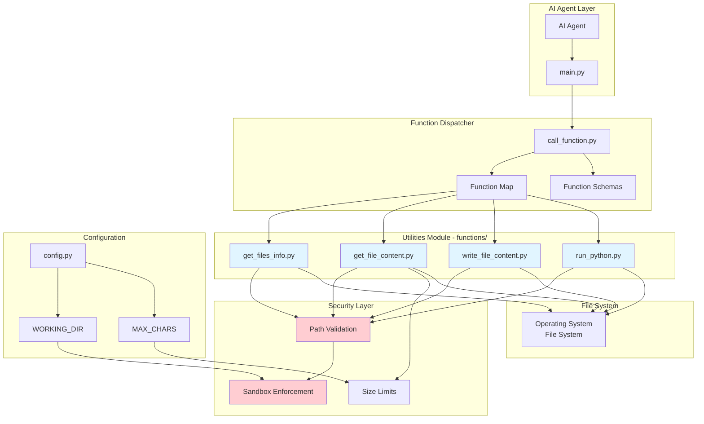
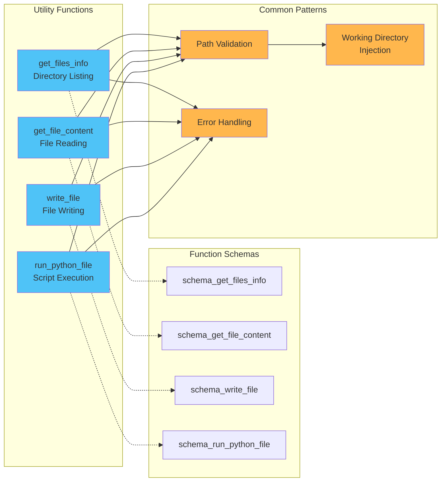
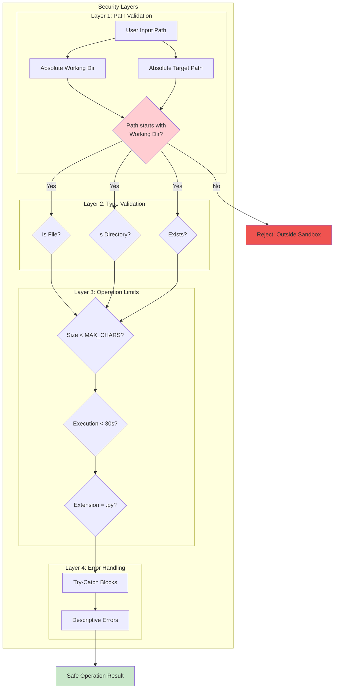
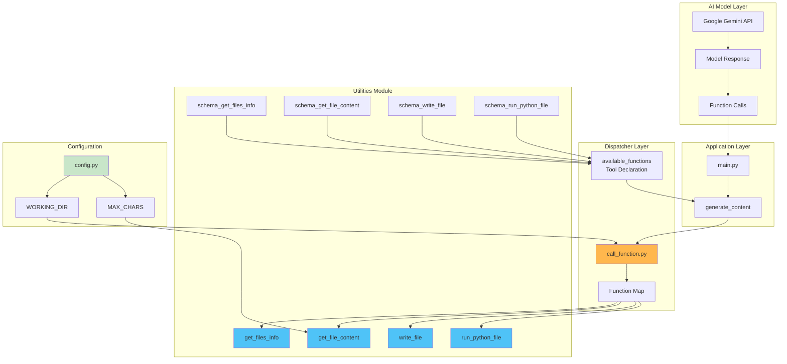
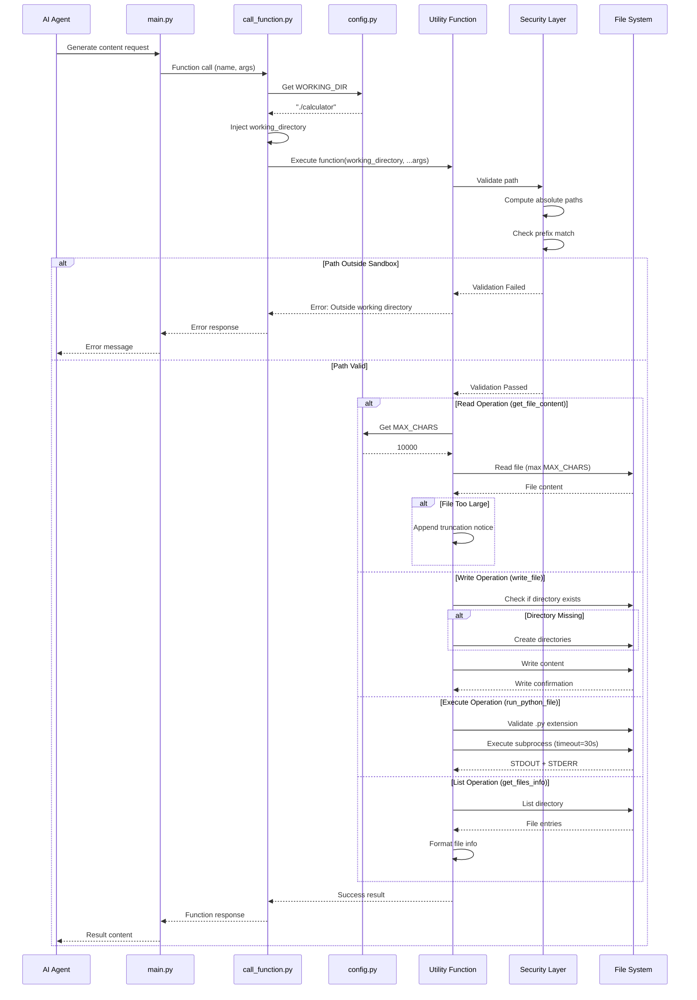

# Utilities Module

## Overview

The **utilities** module provides the core file system operation capabilities for the AI Agent system. It implements a secure, sandboxed set of file manipulation functions that enable the AI agent to interact with the file system in a controlled manner. This module serves as the operational layer between the AI agent's decision-making logic and the actual file system, ensuring all operations are performed safely within defined boundaries.

The module consists of four primary utility functions that handle file reading, writing, directory listing, and Python script execution—all essential operations for an AI coding assistant to analyze, modify, and test code.

---

## Table of Contents

- [Architecture](#architecture)
- [Core Components](#core-components)
- [Security Model](#security-model)
- [Function Specifications](#function-specifications)
- [Integration Points](#integration-points)
- [Data Flow](#data-flow)
- [Error Handling](#error-handling)
- [Usage Examples](#usage-examples)
- [Best Practices](#best-practices)
- [Related Modules](#related-modules)

---

## Architecture

The utilities module implements a function-based architecture with strict security boundaries and standardized error handling. Each utility function operates independently while sharing common security validation patterns.



### Design Principles

1. **Security First**: All operations validate paths against the working directory sandbox
2. **Fail-Safe**: Comprehensive error handling with descriptive error messages
3. **Declarative Schemas**: Each function includes a schema for AI model integration
4. **Separation of Concerns**: Function logic separated from schema definitions
5. **Consistent Interface**: All functions follow the same parameter and return patterns

---

## Core Components

The utilities module consists of four core file operation functions, each with its corresponding schema definition for AI model integration.



### Component Overview

| Component | File | Purpose | Key Features |
|-----------|------|---------|--------------|
| **get_files_info** | `get_files_info.py` | List directory contents | File sizes, directory detection |
| **get_file_content** | `get_file_content.py` | Read file contents | Size limits, truncation handling |
| **write_file** | `write_file_content.py` | Write/create files | Auto-directory creation, overwrite protection |
| **run_python_file** | `run_python.py` | Execute Python scripts | Timeout protection, output capture |

---

## Security Model

The utilities module implements a multi-layered security model to ensure safe file system operations.



### Security Features

#### 1. Sandbox Enforcement

All functions implement identical path validation logic:

```python
abs_working_dir = os.path.abspath(working_directory)
abs_file_path = os.path.abspath(os.path.join(working_directory, file_path))
if not abs_file_path.startswith(abs_working_dir):
    return f'Error: Cannot access "{file_path}" as it is outside the permitted working directory'
```

**Protection Against**:
- Path traversal attacks (`../../etc/passwd`)
- Absolute path injection (`/etc/passwd`)
- Symbolic link exploitation
- Directory escape attempts

#### 2. Resource Limits

**File Size Limits** (`get_file_content`):
- Reads maximum `MAX_CHARS` characters (default: 10,000)
- Appends truncation notice if file is larger
- Prevents memory exhaustion

**Execution Timeout** (`run_python_file`):
- 30-second timeout on subprocess execution
- Prevents infinite loops and hanging processes
- Ensures responsive system behavior

#### 3. Type Validation

**File Type Checks**:
- Validates file vs. directory status
- Ensures Python files have `.py` extension
- Checks file existence before operations

#### 4. Error Isolation

**Comprehensive Exception Handling**:
- All file operations wrapped in try-catch blocks
- Descriptive error messages for debugging
- No system information leakage in errors

---

## Function Specifications

### 1. get_files_info

**Purpose**: Lists files and directories within a specified directory, providing size and type information.

**Function Signature**:
```python
def get_files_info(working_directory, directory=".") -> str
```

**Parameters**:
- `working_directory` (str): Absolute or relative path to the sandbox root (injected by dispatcher)
- `directory` (str, optional): Target directory relative to working_directory (default: ".")

**Returns**:
- Success: Multi-line string with file information in format:
  ```
  - filename: file_size=X bytes, is_dir=True/False
  ```
- Error: String starting with "Error:" describing the issue

**Schema Definition**:
```python
schema_get_files_info = types.FunctionDeclaration(
    name="get_files_info",
    description="Lists files in the specified directory along with their sizes, constrained to the working directory.",
    parameters=types.Schema(
        type=types.Type.OBJECT,
        properties={
            "directory": types.Schema(
                type=types.Type.STRING,
                description="The directory to list files from, relative to the working directory.",
            ),
        },
    ),
)
```

**Security Validations**:
1. Path must be within working directory
2. Target must be a directory
3. Directory must exist

**Example Output**:
```
- main.py: file_size=1234 bytes, is_dir=False
- tests.py: file_size=567 bytes, is_dir=False
- pkg: file_size=4096 bytes, is_dir=True
- README.md: file_size=890 bytes, is_dir=False
```

---

### 2. get_file_content

**Purpose**: Reads and returns the content of a specified file, with size limitations.

**Function Signature**:
```python
def get_file_content(working_directory, file_path) -> str
```

**Parameters**:
- `working_directory` (str): Absolute or relative path to the sandbox root (injected by dispatcher)
- `file_path` (str): Path to the file relative to working_directory

**Returns**:
- Success: File content (up to `MAX_CHARS` characters)
- Truncated: File content + truncation notice
- Error: String starting with "Error:" describing the issue

**Schema Definition**:
```python
schema_get_file_content = types.FunctionDeclaration(
    name="get_file_content",
    description=f"Reads and returns the first {MAX_CHARS} characters of the content from a specified file.",
    parameters=types.Schema(
        type=types.Type.OBJECT,
        properties={
            "file_path": types.Schema(
                type=types.Type.STRING,
                description="The path to the file whose content should be read, relative to the working directory.",
            ),
        },
        required=["file_path"],
    ),
)
```

**Security Validations**:
1. Path must be within working directory
2. Target must be a regular file
3. File must exist
4. Content limited to `MAX_CHARS`

**Truncation Behavior**:
```python
if os.path.getsize(abs_file_path) > MAX_CHARS:
    content += f'[...File "{file_path}" truncated at {MAX_CHARS} characters]'
```

**Example Output**:
```python
# For a small file
def hello():
    print("Hello, World!")

# For a large file
def hello():
    print("Hello, World!")
... (9,900 more characters) ...
[...File "large_file.py" truncated at 10000 characters]
```

---

### 3. write_file

**Purpose**: Writes content to a file, creating it if it doesn't exist, including parent directories.

**Function Signature**:
```python
def write_file(working_directory, file_path, content) -> str
```

**Parameters**:
- `working_directory` (str): Absolute or relative path to the sandbox root (injected by dispatcher)
- `file_path` (str): Path to the file relative to working_directory
- `content` (str): Content to write to the file

**Returns**:
- Success: Confirmation message with character count
- Error: String starting with "Error:" describing the issue

**Schema Definition**:
```python
schema_write_file = types.FunctionDeclaration(
    name="write_file",
    description="Writes content to a file within the working directory. Creates the file if it doesn't exist.",
    parameters=types.Schema(
        type=types.Type.OBJECT,
        properties={
            "file_path": types.Schema(
                type=types.Type.STRING,
                description="Path to the file to write, relative to the working directory.",
            ),
            "content": types.Schema(
                type=types.Type.STRING,
                description="Content to write to the file",
            ),
        },
        required=["file_path", "content"],
    ),
)
```

**Security Validations**:
1. Path must be within working directory
2. Target must not be an existing directory
3. Auto-creates parent directories if needed

**Directory Creation**:
```python
if not os.path.exists(abs_file_path):
    os.makedirs(os.path.dirname(abs_file_path), exist_ok=True)
```

**Example Output**:
```
Successfully wrote to "src/utils.py" (1234 characters written)
```

---

### 4. run_python_file

**Purpose**: Executes a Python script within the working directory and captures its output.

**Function Signature**:
```python
def run_python_file(working_directory, file_path, args=None) -> str
```

**Parameters**:
- `working_directory` (str): Absolute or relative path to the sandbox root (injected by dispatcher)
- `file_path` (str): Path to the Python file relative to working_directory
- `args` (list[str], optional): Command-line arguments to pass to the script

**Returns**:
- Success: Combined STDOUT and STDERR output
- Error: String starting with "Error:" describing the issue

**Schema Definition**:
```python
schema_run_python_file = types.FunctionDeclaration(
    name="run_python_file",
    description="Executes a Python file within the working directory and returns the output from the interpreter.",
    parameters=types.Schema(
        type=types.Type.OBJECT,
        properties={
            "file_path": types.Schema(
                type=types.Type.STRING,
                description="Path to the Python file to execute, relative to the working directory.",
            ),
            "args": types.Schema(
                type=types.Type.ARRAY,
                items=types.Schema(
                    type=types.Type.STRING,
                    description="Optional arguments to pass to the Python file.",
                ),
                description="Optional arguments to pass to the Python file.",
            ),
        },
        required=["file_path"],
    ),
)
```

**Security Validations**:
1. Path must be within working directory
2. File must exist
3. File must have `.py` extension
4. Execution timeout of 30 seconds

**Execution Details**:
```python
commands = ["python", abs_file_path]
if args:
    commands.extend(args)
result = subprocess.run(
    commands,
    capture_output=True,
    text=True,
    timeout=30,
    cwd=abs_working_dir,
)
```

**Example Output**:
```
STDOUT:
Test passed: add(2, 3) = 5
Test passed: subtract(5, 3) = 2

STDERR:
Warning: Deprecated function used

Process exited with code 0
```

---

## Integration Points

The utilities module integrates with multiple system components through a centralized dispatcher pattern.



### Integration with call_function.py

The dispatcher module (`call_function.py`) serves as the bridge between the AI model and utility functions:

```python
# Function map for dynamic dispatch
function_map = {
    "get_files_info": get_files_info,
    "get_file_content": get_file_content,
    "run_python_file": run_python_file,
    "write_file": write_file,
}

# Schema aggregation for AI model
available_functions = types.Tool(
    function_declarations=[
        schema_get_files_info,
        schema_get_file_content,
        schema_run_python_file,
        schema_write_file,
    ]
)

# Working directory injection
args = dict(function_call_part.args)
args["working_directory"] = WORKING_DIR
function_result = function_map[function_name](**args)
```

### Integration with Configuration

The utilities module depends on the [core_config](core_config.md) module for:

1. **WORKING_DIR**: Sandbox boundary enforcement
2. **MAX_CHARS**: File reading size limits

---

## Data Flow

The data flow through the utilities module follows a request-response pattern with security validation at each step.



### Data Flow Patterns

1. **Request Flow**: AI Agent → Main → Dispatcher → Utility Function
2. **Configuration Injection**: Dispatcher injects `WORKING_DIR` into all function calls
3. **Security Validation**: Every function validates paths before file system access
4. **Response Flow**: Utility Function → Dispatcher → Main → AI Agent
5. **Error Propagation**: Errors return as strings, not exceptions

---

## Error Handling

The utilities module implements comprehensive error handling with consistent patterns across all functions.

```mermaid
graph TB
    subgraph "Error Categories"
        SEC_ERR[Security Errors]
        VAL_ERR[Validation Errors]
        FS_ERR[File System Errors]
        EXEC_ERR[Execution Errors]
    end
    
    subgraph "Security Errors"
        OUTSIDE[Outside Working Directory]
        TRAVERSAL[Path Traversal Attempt]
    end
    
    subgraph "Validation Errors"
        NOT_FILE[Not a File]
        NOT_DIR[Not a Directory]
        NOT_EXIST[Does Not Exist]
        WRONG_EXT[Wrong Extension]
    end
    
    subgraph "File System Errors"
        READ_ERR[Read Permission Error]
        WRITE_ERR[Write Permission Error]
        DIR_CREATE_ERR[Directory Creation Error]
    end
    
    subgraph "Execution Errors"
        TIMEOUT_ERR[Timeout Exceeded]
        RUNTIME_ERR[Runtime Exception]
        SUBPROCESS_ERR[Subprocess Error]
    end
    
    SEC_ERR --> OUTSIDE
    SEC_ERR --> TRAVERSAL
    
    VAL_ERR --> NOT_FILE
    VAL_ERR --> NOT_DIR
    VAL_ERR --> NOT_EXIST
    VAL_ERR --> WRONG_EXT
    
    FS_ERR --> READ_ERR
    FS_ERR --> WRITE_ERR
    FS_ERR --> DIR_CREATE_ERR
    
    EXEC_ERR --> TIMEOUT_ERR
    EXEC_ERR --> RUNTIME_ERR
    EXEC_ERR --> SUBPROCESS_ERR
    
    OUTSIDE --> ERROR_MSG[Descriptive Error Message]
    TRAVERSAL --> ERROR_MSG
    NOT_FILE --> ERROR_MSG
    NOT_DIR --> ERROR_MSG
    NOT_EXIST --> ERROR_MSG
    WRONG_EXT --> ERROR_MSG
    READ_ERR --> ERROR_MSG
    WRITE_ERR --> ERROR_MSG
    DIR_CREATE_ERR --> ERROR_MSG
    TIMEOUT_ERR --> ERROR_MSG
    RUNTIME_ERR --> ERROR_MSG
    SUBPROCESS_ERR --> ERROR_MSG
    
    ERROR_MSG --> RETURN[Return Error String]
    
    style SEC_ERR fill:#ffcdd2
    style VAL_ERR fill:#fff9c4
    style FS_ERR fill:#f8bbd0
    style EXEC_ERR fill:#d1c4e9
    style ERROR_MSG fill:#c8e6c9
```



### Error Message Patterns

All error messages follow consistent formatting:

```python
# Security errors
f'Error: Cannot access "{file_path}" as it is outside the permitted working directory'

# Validation errors
f'Error: File not found or is not a regular file: "{file_path}"'
f'Error: "{directory}" is not a directory'
f'Error: "{file_path}" is not a Python file.'

# File system errors
f'Error reading file "{file_path}": {e}'
f'Error: writing to file: {e}'
f'Error: creating directory: {e}'

# Execution errors
f'Error: executing Python file: {e}'
```

### Error Handling Strategy

1. **No Exceptions Raised**: All errors return as strings
2. **Descriptive Messages**: Include file paths and error context
3. **Security-Conscious**: Don't leak system information
4. **AI-Friendly**: Clear, parseable error formats
5. **Consistent Prefixes**: All errors start with "Error:"

---

## Usage Examples

### Example 1: Exploring a Project

```python
# AI Agent workflow to understand a project structure

# Step 1: List root directory
result = get_files_info(
    working_directory="./calculator",
    directory="."
)
# Output:
# - main.py: file_size=1234 bytes, is_dir=False
# - tests.py: file_size=567 bytes, is_dir=False
# - pkg: file_size=4096 bytes, is_dir=True
# - README.md: file_size=890 bytes, is_dir=False

# Step 2: Read main file
content = get_file_content(
    working_directory="./calculator",
    file_path="main.py"
)
# Output: (file contents)

# Step 3: Explore subdirectory
result = get_files_info(
    working_directory="./calculator",
    directory="pkg"
)
# Output:
# - __init__.py: file_size=0 bytes, is_dir=False
# - utils.py: file_size=456 bytes, is_dir=False
```

### Example 2: Fixing a Bug

```python
# AI Agent workflow to fix a bug

# Step 1: Read the buggy file
content = get_file_content(
    working_directory="./calculator",
    file_path="main.py"
)

# Step 2: Run tests to confirm bug
output = run_python_file(
    working_directory="./calculator",
    file_path="tests.py"
)
# Output:
# STDOUT:
# Test failed: add(2, 3) expected 5, got 6
# STDERR:
# Process exited with code 1

# Step 3: Write fixed version
result = write_file(
    working_directory="./calculator",
    file_path="main.py",
    content="""def add(a, b):
    return a + b  # Fixed: was a + b + 1

def subtract(a, b):
    return a - b
"""
)
# Output: Successfully wrote to "main.py" (89 characters written)

# Step 4: Verify fix
output = run_python_file(
    working_directory="./calculator",
    file_path="tests.py"
)
# Output:
# STDOUT:
# All tests passed!
# Process exited with code 0
```

### Example 3: Creating New Files

```python
# AI Agent workflow to create a new module

# Step 1: Create new file in subdirectory
result = write_file(
    working_directory="./calculator",
    file_path="pkg/advanced.py",
    content="""def multiply(a, b):
    return a * b

def divide(a, b):
    if b == 0:
        raise ValueError("Cannot divide by zero")
    return a / b
"""
)
# Output: Successfully wrote to "pkg/advanced.py" (123 characters written)

# Step 2: Create test file
result = write_file(
    working_directory="./calculator",
    file_path="pkg/test_advanced.py",
    content="""from advanced import multiply, divide

assert multiply(3, 4) == 12
assert divide(10, 2) == 5
print("All tests passed!")
"""
)

# Step 3: Run tests
output = run_python_file(
    working_directory="./calculator",
    file_path="pkg/test_advanced.py"
)
```

### Example 4: Security Validation

```python
# Attempting to access files outside working directory

# Attempt 1: Path traversal
result = get_file_content(
    working_directory="./calculator",
    file_path="../../etc/passwd"
)
# Output: Error: Cannot read "../../etc/passwd" as it is outside the permitted working directory

# Attempt 2: Absolute path
result = get_file_content(
    working_directory="./calculator",
    file_path="/etc/passwd"
)
# Output: Error: Cannot read "/etc/passwd" as it is outside the permitted working directory

# Attempt 3: Valid relative path
result = get_file_content(
    working_directory="./calculator",
    file_path="main.py"
)
# Output: (file contents - success)
```

### Example 5: Running Scripts with Arguments

```python
# Running a Python script with command-line arguments

result = run_python_file(
    working_directory="./calculator",
    file_path="main.py",
    args=["--verbose", "test"]
)
# Executes: python ./calculator/main.py --verbose test
# Output: (script output with arguments processed)
```

---

## Best Practices

### For Function Implementation

1. **Always Validate Paths First**
   ```python
   abs_working_dir = os.path.abspath(working_directory)
   abs_file_path = os.path.abspath(os.path.join(working_directory, file_path))
   if not abs_file_path.startswith(abs_working_dir):
       return f'Error: Cannot access "{file_path}" as it is outside the permitted working directory'
   ```

2. **Use Try-Catch for File Operations**
   ```python
   try:
       with open(abs_file_path, "r") as f:
           content = f.read(MAX_CHARS)
       return content
   except Exception as e:
       return f'Error reading file "{file_path}": {e}'
   ```

3. **Provide Descriptive Error Messages**
   - Include the file path in error messages
   - Explain what went wrong
   - Don't expose system internals

4. **Return Strings, Not Exceptions**
   - All functions return strings
   - Errors are strings starting with "Error:"
   - Success messages are descriptive

### For AI Agent Usage

1. **Always List Before Reading**
   - Use `get_files_info` to explore directory structure
   - Understand file sizes before reading
   - Identify directories vs. files

2. **Check File Sizes**
   - Large files will be truncated
   - Consider file size when reading
   - Request specific sections if needed

3. **Test After Modifications**
   - Use `run_python_file` to verify changes
   - Check for syntax errors
   - Validate functionality

4. **Handle Errors Gracefully**
   - Parse error messages
   - Adjust approach based on errors
   - Don't retry failed operations without changes

### For System Integration

1. **Configure Appropriately**
   - Set `WORKING_DIR` to project root
   - Adjust `MAX_CHARS` based on file types
   - See [core_config](core_config.md) for details

2. **Monitor Function Usage**
   - Track which functions are called most
   - Identify patterns in file access
   - Optimize based on usage

3. **Validate Configuration**
   - Ensure `WORKING_DIR` exists
   - Verify permissions on working directory
   - Test with sample files

4. **Handle Timeouts**
   - 30-second limit on Python execution
   - Consider breaking long operations
   - Implement progress indicators

### Security Best Practices

1. **Never Trust User Input**
   - Always validate paths
   - Use absolute path resolution
   - Check prefix matching

2. **Limit Resource Consumption**
   - Respect `MAX_CHARS` limits
   - Enforce execution timeouts
   - Monitor file system usage

3. **Isolate Execution**
   - Run scripts in working directory context
   - Capture all output
   - Prevent resource leaks

4. **Log Security Events**
   - Track path validation failures
   - Monitor timeout occurrences
   - Alert on suspicious patterns

---

## Related Modules

The utilities module integrates with and depends on several other system modules:

### Core Dependencies

- **[core_config](core_config.md)**: Provides `WORKING_DIR` and `MAX_CHARS` configuration
  - Used for sandbox enforcement
  - Controls file reading limits
  - Defines operational boundaries

### Integration Points

- **call_function.py**: Function dispatcher that routes AI agent requests to utility functions
  - Injects `working_directory` parameter
  - Aggregates function schemas
  - Handles function call responses

- **main.py**: Main application loop that orchestrates AI agent interactions
  - Calls utilities through dispatcher
  - Processes function results
  - Manages iteration flow

### Related Documentation

For a complete understanding of the system, also review:

- **[core_config](core_config.md)**: Configuration parameters and security settings
- **CLI Interface**: Command-line interface for system interaction (if applicable)
- **Dependency Analysis**: Code analysis and dependency tracking (if applicable)
- **Web Frontend**: Web-based interface for the AI agent (if applicable)

---

## Conclusion

The utilities module provides the essential file system operations that enable the AI Agent to interact with code projects safely and effectively. Through its security-first design, comprehensive error handling, and consistent interface patterns, it ensures that all file operations are performed within defined boundaries while providing the AI agent with the capabilities it needs to analyze, modify, and test code.

The module's integration with the configuration system and function dispatcher creates a robust, extensible foundation for AI-powered code assistance, balancing functionality with security and reliability.
