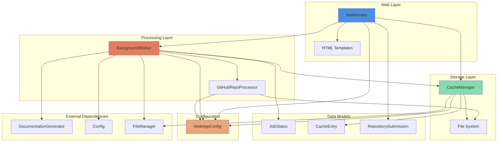
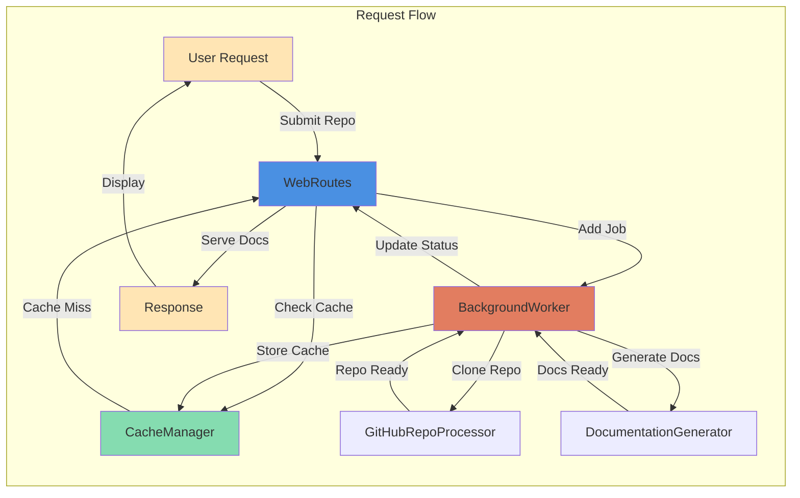
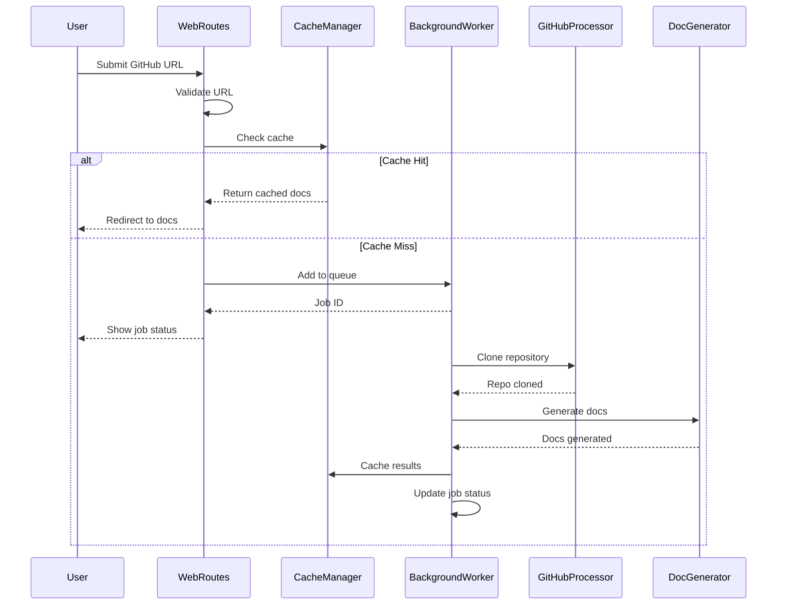
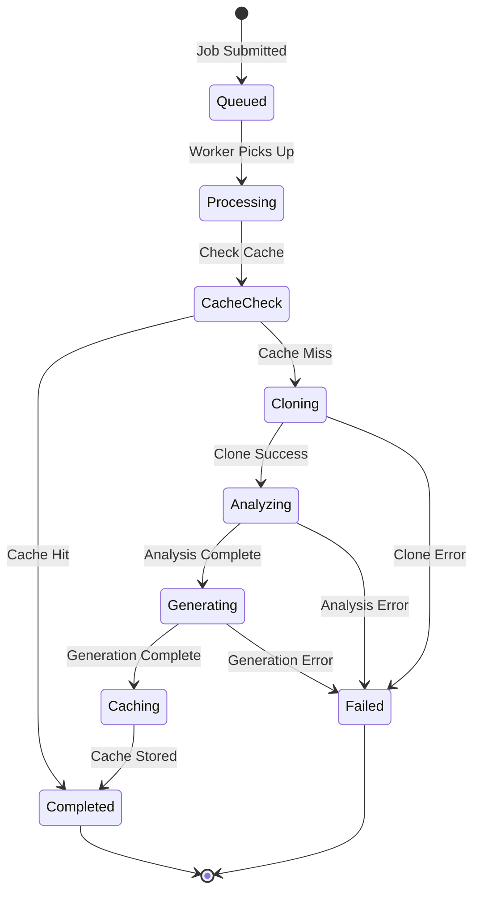
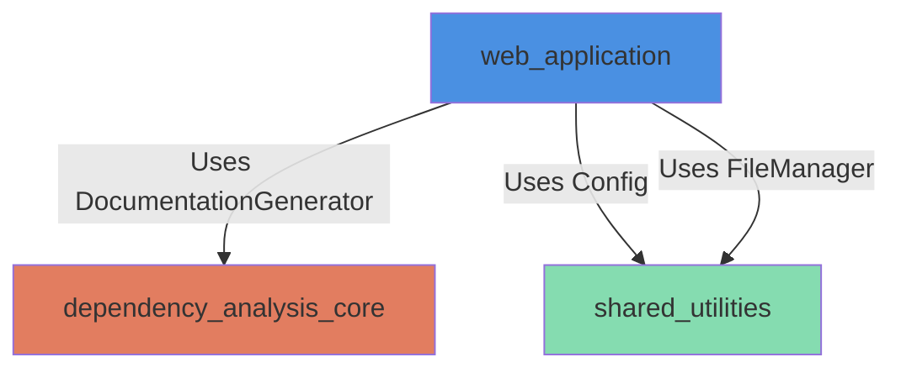

# Web Application Module

## Overview

The **web_application** module provides a comprehensive web-based interface for the CodeWiki documentation generation system. It implements a FastAPI-based web application that allows users to submit GitHub repositories for documentation generation, track processing jobs, and view generated documentation through an intuitive web interface.

This module serves as the frontend layer of the CodeWiki system, orchestrating repository processing, caching, background job management, and documentation delivery.

## Purpose

The web_application module enables:

- **Web-based Repository Submission**: Users can submit GitHub repositories via a web form
- **Asynchronous Job Processing**: Background worker processes documentation generation jobs
- **Intelligent Caching**: Stores and retrieves previously generated documentation
- **Real-time Job Tracking**: Monitor the status and progress of documentation generation
- **Documentation Viewing**: Serve and display generated documentation with navigation
- **GitHub Integration**: Clone and process repositories from GitHub with commit-specific support

## Architecture Overview

The web_application module follows a layered architecture with clear separation of concerns:



## Module Structure

The web_application module is organized into the following sub-modules:

### 1. **Configuration Management** ([configuration_management.md](configuration_management.md))
- **WebAppConfig**: Centralized configuration for web application settings
- Manages directories, cache settings, server settings, and Git operations
- Provides utility methods for path management and directory initialization

### 2. **Web Routes & API** ([web_routes_api.md](web_routes_api.md))
- **WebRoutes**: FastAPI route handlers for all web endpoints
- Repository submission and validation
- Job status tracking and retrieval
- Documentation viewing and serving
- URL normalization and job ID management

### 3. **Background Processing** ([background_processing.md](background_processing.md))
- **BackgroundWorker**: Asynchronous job processing engine
- Queue management for documentation generation tasks
- Job lifecycle management (queued → processing → completed/failed)
- Integration with DocumentationGenerator from dependency_analysis_core
- Persistent job status tracking

### 4. **Cache Management** ([cache_management.md](cache_management.md))
- **CacheManager**: Documentation caching system
- Hash-based cache indexing
- Cache expiration and cleanup
- Persistent cache index storage

### 5. **GitHub Integration** ([github_integration.md](github_integration.md))
- **GitHubRepoProcessor**: GitHub repository operations
- URL validation and parsing
- Repository cloning with commit-specific checkout
- Repository metadata extraction

### 6. **Data Models** ([data_models.md](data_models.md))
- **JobStatus**: Job tracking and status information
- **CacheEntry**: Cache metadata and indexing
- **RepositorySubmission**: Form submission validation
- **JobStatusResponse**: API response models

## Component Relationships



## Data Flow

### Repository Submission Flow



### Job Processing Flow



## Key Features

### 1. Asynchronous Job Processing
- Non-blocking background worker thread
- Queue-based job management with configurable size
- Real-time job status updates
- Automatic cleanup of old jobs

### 2. Intelligent Caching
- SHA-256 hash-based cache indexing
- Configurable cache expiration (default: 365 days)
- Automatic cache validation and cleanup
- Persistent cache index across restarts

### 3. GitHub Repository Support
- URL validation and normalization
- Support for various GitHub URL formats
- Commit-specific documentation generation
- Shallow cloning for efficiency (when no commit specified)

### 4. Job Status Tracking
- Comprehensive job lifecycle tracking
- Progress updates during processing
- Error message capture and reporting
- Persistent job status storage

### 5. Documentation Serving
- Dynamic documentation rendering
- Module tree navigation
- Metadata display
- Markdown to HTML conversion

## Integration with Other Modules

### Dependencies on Other Modules



- **dependency_analysis_core**: Uses `DocumentationGenerator` for generating documentation from cloned repositories
- **shared_utilities**: Uses `Config` for configuration management and `FileManager` for file operations

### External Dependencies

- **FastAPI**: Web framework for API and route handling
- **Pydantic**: Data validation and serialization
- **Git**: Repository cloning and version control operations
- **Threading**: Background job processing
- **Queue**: Job queue management

## Configuration

The module uses `WebAppConfig` for centralized configuration:

| Setting | Default | Description |
|---------|---------|-------------|
| `CACHE_DIR` | `./output/cache` | Cache storage directory |
| `TEMP_DIR` | `./output/temp` | Temporary repository storage |
| `OUTPUT_DIR` | `./output` | Base output directory |
| `QUEUE_SIZE` | `100` | Maximum queue size |
| `CACHE_EXPIRY_DAYS` | `365` | Cache expiration period |
| `JOB_CLEANUP_HOURS` | `24000` | Job cleanup threshold |
| `RETRY_COOLDOWN_MINUTES` | `3` | Retry cooldown period |
| `DEFAULT_HOST` | `127.0.0.1` | Default server host |
| `DEFAULT_PORT` | `8000` | Default server port |
| `CLONE_TIMEOUT` | `300` | Git clone timeout (seconds) |
| `CLONE_DEPTH` | `1` | Shallow clone depth |

## API Endpoints

### Web Interface Endpoints

| Endpoint | Method | Description |
|----------|--------|-------------|
| `/` | GET | Main page with submission form |
| `/` | POST | Submit repository for processing |
| `/view-docs/{job_id}` | GET | Redirect to documentation viewer |
| `/static-docs/{job_id}/{filename}` | GET | Serve documentation files |

### API Endpoints

| Endpoint | Method | Description |
|----------|--------|-------------|
| `/api/job/{job_id}` | GET | Get job status (JSON) |

## Error Handling

The module implements comprehensive error handling:

- **Validation Errors**: Invalid GitHub URLs, malformed submissions
- **Clone Errors**: Repository access issues, network failures
- **Processing Errors**: Documentation generation failures
- **Cache Errors**: Cache read/write failures
- **Queue Errors**: Queue full, job not found

All errors are captured, logged, and presented to users with meaningful messages.

## Performance Considerations

### Optimization Strategies

1. **Caching**: Prevents redundant documentation generation
2. **Shallow Cloning**: Reduces clone time and disk usage (when no commit specified)
3. **Background Processing**: Non-blocking job execution
4. **Queue Management**: Prevents system overload
5. **Automatic Cleanup**: Manages disk space and memory

### Scalability

- Queue-based architecture supports horizontal scaling
- Stateless job processing enables distributed workers
- Cache sharing possible with shared storage backend
- Job status persistence enables recovery from failures

## Security Considerations

- **URL Validation**: Prevents malicious repository URLs
- **Timeout Protection**: Prevents hanging operations
- **Path Sanitization**: Prevents directory traversal attacks
- **Resource Limits**: Queue size and timeout limits prevent DoS

## Usage Example

### Starting the Web Application

```python
from codewiki.src.fe.config import WebAppConfig
from codewiki.src.fe.cache_manager import CacheManager
from codewiki.src.fe.background_worker import BackgroundWorker
from codewiki.src.fe.routes import WebRoutes

# Initialize configuration
WebAppConfig.ensure_directories()

# Initialize components
cache_manager = CacheManager()
background_worker = BackgroundWorker(cache_manager)
web_routes = WebRoutes(background_worker, cache_manager)

# Start background worker
background_worker.start()

# Routes are now ready to be registered with FastAPI
```

### Submitting a Repository

```python
# Via web interface: POST to /
# Form data:
# - repo_url: https://github.com/owner/repo
# - commit_id: abc123 (optional)

# Via API:
import requests

response = requests.post(
    "http://localhost:8000/",
    data={
        "repo_url": "https://github.com/owner/repo",
        "commit_id": "abc123"  # optional
    }
)
```

### Checking Job Status

```python
import requests

response = requests.get("http://localhost:8000/api/job/owner--repo")
status = response.json()

print(f"Status: {status['status']}")
print(f"Progress: {status['progress']}")
```

## Future Enhancements

Potential improvements for the web_application module:

1. **Multi-worker Support**: Distributed job processing
2. **WebSocket Updates**: Real-time job status updates
3. **User Authentication**: User accounts and private repositories
4. **Advanced Caching**: Redis/Memcached integration
5. **Rate Limiting**: API rate limiting and throttling
6. **Metrics & Monitoring**: Prometheus/Grafana integration
7. **Docker Support**: Containerized deployment
8. **CDN Integration**: Static documentation serving via CDN

## Related Documentation

- [Configuration Management](configuration_management.md) - WebAppConfig details
- [Web Routes & API](web_routes_api.md) - Route handlers and endpoints
- [Background Processing](background_processing.md) - Job processing engine
- [Cache Management](cache_management.md) - Caching system
- [GitHub Integration](github_integration.md) - Repository operations
- [Data Models](data_models.md) - Data structures and models
- [dependency_analysis_core](dependency_analysis_core.md) - Documentation generation
- [shared_utilities](shared_utilities.md) - Common utilities

## Conclusion

The web_application module provides a robust, scalable, and user-friendly interface for the CodeWiki documentation generation system. Its modular architecture, comprehensive error handling, and intelligent caching make it suitable for both development and production environments.
