# Web Frontend Module

## Overview

The Web Frontend module (`codewiki/src/fe`) provides the web-based user interface and API layer for the CodeWiki system. It serves as the primary web application entry point, enabling users to interact with the code analysis system through a browser-based interface. This module orchestrates asynchronous job processing, caching mechanisms, GitHub repository integration, and HTTP routing to deliver a responsive and scalable web experience.

The module acts as the presentation and orchestration layer, bridging user interactions with the backend dependency analysis engine. It manages the complete lifecycle of repository analysis requests—from submission and validation, through background processing, to result caching and delivery. By providing both synchronous API endpoints and asynchronous job processing, it ensures optimal performance even when analyzing large codebases.

---

## Table of Contents

- [Architecture](#architecture)
- [Core Components](#core-components)
- [Background Job Processing](#background-job-processing)
- [Caching Strategy](#caching-strategy)
- [GitHub Integration](#github-integration)
- [Web Routes and API](#web-routes-and-api)
- [Data Models](#data-models)
- [Integration with Other Modules](#integration-with-other-modules)
- [Request Flow](#request-flow)
- [Performance and Scalability](#performance-and-scalability)
- [Dependencies](#dependencies)

---

## Architecture

The Web Frontend module follows a modern web application architecture with clear separation between routing, business logic, background processing, and data management layers.

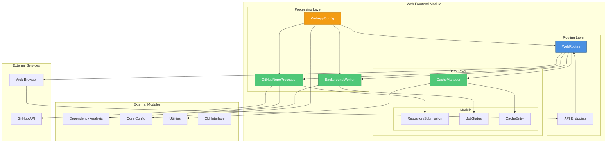

### Architectural Principles

1. **Asynchronous Processing**: Long-running analysis tasks are handled in background workers to maintain UI responsiveness
2. **Caching First**: Intelligent caching reduces redundant processing and improves response times
3. **Stateless API**: RESTful design principles enable horizontal scaling
4. **Configuration-Driven**: Behavior is controlled through centralized configuration
5. **Separation of Concerns**: Clear boundaries between routing, processing, and data management
6. **Resilience**: Graceful error handling and retry mechanisms for external service calls

---

## Core Components

### Component Hierarchy

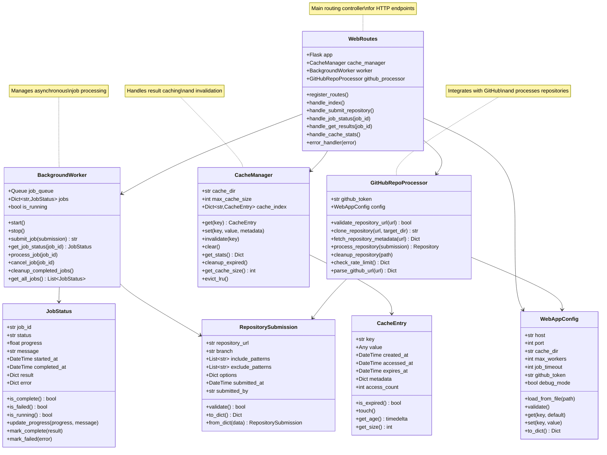

### WebRoutes (`codewiki.src.fe.routes.WebRoutes`)

The **WebRoutes** component serves as the main HTTP routing controller, defining all API endpoints and handling request/response cycles. It orchestrates interactions between the cache manager, background worker, and GitHub processor to fulfill user requests.

**Key Responsibilities:**
- Define and register all HTTP routes and endpoints
- Handle incoming HTTP requests and validate input
- Coordinate between cache, background jobs, and GitHub processing
- Format and return HTTP responses
- Implement error handling and logging
- Serve static assets and templates

**Primary Routes:**
- `GET /` - Serve the main web interface
- `POST /api/submit` - Submit a repository for analysis
- `GET /api/job/<job_id>` - Get job status and progress
- `GET /api/results/<job_id>` - Retrieve analysis results
- `GET /api/cache/stats` - Get cache statistics
- `DELETE /api/cache/<key>` - Invalidate cache entry

**Integration Points:**
- Uses `CacheManager` to check for cached results before processing
- Submits jobs to `BackgroundWorker` for asynchronous processing
- Delegates GitHub operations to `GitHubRepoProcessor`
- Loads configuration from `WebAppConfig`

### BackgroundWorker (`codewiki.src.fe.background_worker.BackgroundWorker`)

The **BackgroundWorker** component manages asynchronous job processing, enabling the web application to handle long-running repository analysis tasks without blocking HTTP requests.

**Key Responsibilities:**
- Maintain a job queue for pending analysis tasks
- Execute jobs in background threads or processes
- Track job status and progress throughout execution
- Provide job status updates to API consumers
- Handle job cancellation and timeout scenarios
- Clean up completed jobs and resources

**Job Lifecycle:**
1. **Submission** - Job is added to queue with unique ID
2. **Queued** - Job waits for available worker
3. **Running** - Worker processes the repository analysis
4. **Complete** - Results are stored and made available
5. **Failed** - Error information is captured and reported

**Features:**
- Concurrent job processing with configurable worker pool
- Progress tracking with percentage and status messages
- Automatic retry logic for transient failures
- Job timeout and cancellation support
- Resource cleanup after job completion

**Integration Points:**
- Receives `RepositorySubmission` objects from `WebRoutes`
- Invokes [Dependency Analysis](dependency_analysis.md) module for code analysis
- Updates `JobStatus` objects throughout processing
- Stores results in `CacheManager` upon completion

### CacheManager (`codewiki.src.fe.cache_manager.CacheManager`)

The **CacheManager** component implements an intelligent caching layer that stores analysis results to avoid redundant processing of previously analyzed repositories.

**Key Responsibilities:**
- Store and retrieve analysis results efficiently
- Implement cache eviction policies (LRU, TTL)
- Track cache statistics and usage metrics
- Manage cache size and storage limits
- Handle cache invalidation and cleanup
- Persist cache index across application restarts

**Caching Strategy:**
- **Key Generation**: Based on repository URL, branch, and analysis options
- **Eviction Policy**: Least Recently Used (LRU) with time-to-live (TTL)
- **Storage**: File-based storage with metadata index
- **Compression**: Optional compression for large results

**Cache Operations:**
- `get(key)` - Retrieve cached entry if valid
- `set(key, value, metadata)` - Store new cache entry
- `invalidate(key)` - Remove specific cache entry
- `clear()` - Remove all cache entries
- `cleanup_expired()` - Remove expired entries
- `get_stats()` - Return cache hit/miss statistics

**Integration Points:**
- Used by `WebRoutes` to check for cached results
- Stores results from `BackgroundWorker` upon job completion
- Uses [Utilities](utilities.md) `FileManager` for file operations
- Configured via `WebAppConfig`

### GitHubRepoProcessor (`codewiki.src.fe.github_processor.GitHubRepoProcessor`)

The **GitHubRepoProcessor** component handles all interactions with GitHub, including repository validation, cloning, and metadata extraction.

**Key Responsibilities:**
- Validate GitHub repository URLs
- Clone repositories to local filesystem
- Fetch repository metadata (stars, forks, description)
- Handle GitHub API authentication and rate limiting
- Parse GitHub URLs to extract owner and repository name
- Clean up cloned repositories after processing

**GitHub Operations:**
- **URL Validation**: Verify repository exists and is accessible
- **Cloning**: Use git commands or GitHub API to clone repository
- **Metadata Fetching**: Retrieve repository information via GitHub API
- **Rate Limit Handling**: Monitor and respect GitHub API rate limits
- **Authentication**: Support personal access tokens for private repos

**Features:**
- Support for public and private repositories
- Branch and tag selection
- Shallow cloning for performance
- Automatic cleanup of temporary files
- Rate limit monitoring and backoff

**Integration Points:**
- Receives `RepositorySubmission` from `WebRoutes`
- Provides cloned repository to [Dependency Analysis](dependency_analysis.md) module
- Uses `WebAppConfig` for GitHub token and settings
- Returns `Repository` objects for analysis

### WebAppConfig (`codewiki.src.fe.config.WebAppConfig`)

The **WebAppConfig** component manages all configuration settings for the web frontend, providing a centralized configuration interface.

**Key Responsibilities:**
- Load configuration from files and environment variables
- Validate configuration values
- Provide type-safe access to settings
- Support configuration overrides
- Manage default values
- Enable runtime configuration updates

**Configuration Categories:**
- **Server Settings**: Host, port, debug mode
- **Worker Settings**: Max workers, job timeout, queue size
- **Cache Settings**: Cache directory, max size, TTL
- **GitHub Settings**: API token, rate limit thresholds
- **Analysis Settings**: Default include/exclude patterns

**Configuration Sources (Priority Order):**
1. Environment variables
2. Configuration file
3. Default values

**Integration Points:**
- Extends [Core Config](core_config.md) `Config` class
- Used by all web frontend components
- Validated on application startup

---

## Background Job Processing

The background job processing system enables asynchronous execution of repository analysis tasks, ensuring the web interface remains responsive even during intensive operations.

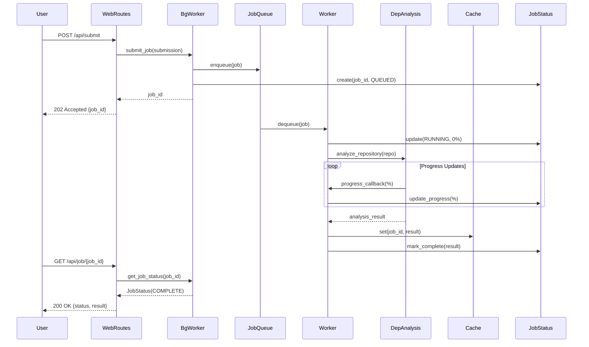

### Job Processing Workflow

1. **Job Submission**
   - User submits repository via API
   - `WebRoutes` validates submission
   - `BackgroundWorker` creates job and assigns unique ID
   - Job is added to processing queue
   - Job ID is returned to user immediately

2. **Job Execution**
   - Worker thread picks up job from queue
   - Job status updated to RUNNING
   - Repository is cloned (if needed)
   - Dependency analysis is performed
   - Progress updates are sent periodically

3. **Job Completion**
   - Results are stored in cache
   - Job status updated to COMPLETE
   - Temporary files are cleaned up
   - Results are available via API

4. **Error Handling**
   - Errors are caught and logged
   - Job status updated to FAILED
   - Error details stored for debugging
   - User receives error information via API

### Job Status States

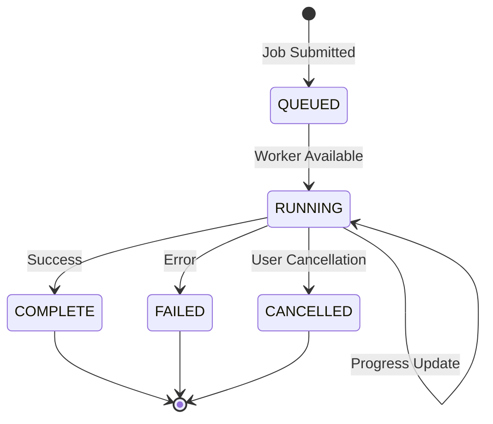

---

## Caching Strategy

The caching system optimizes performance by storing analysis results and avoiding redundant processing of previously analyzed repositories.

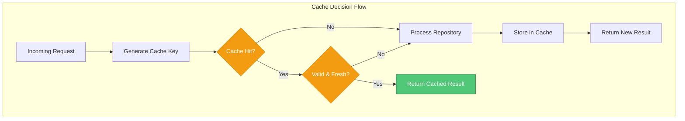

### Cache Key Generation

Cache keys are generated based on multiple factors to ensure uniqueness:

```
cache_key = hash(
    repository_url +
    branch +
    sorted(include_patterns) +
    sorted(exclude_patterns) +
    analysis_options
)
```

### Cache Entry Lifecycle

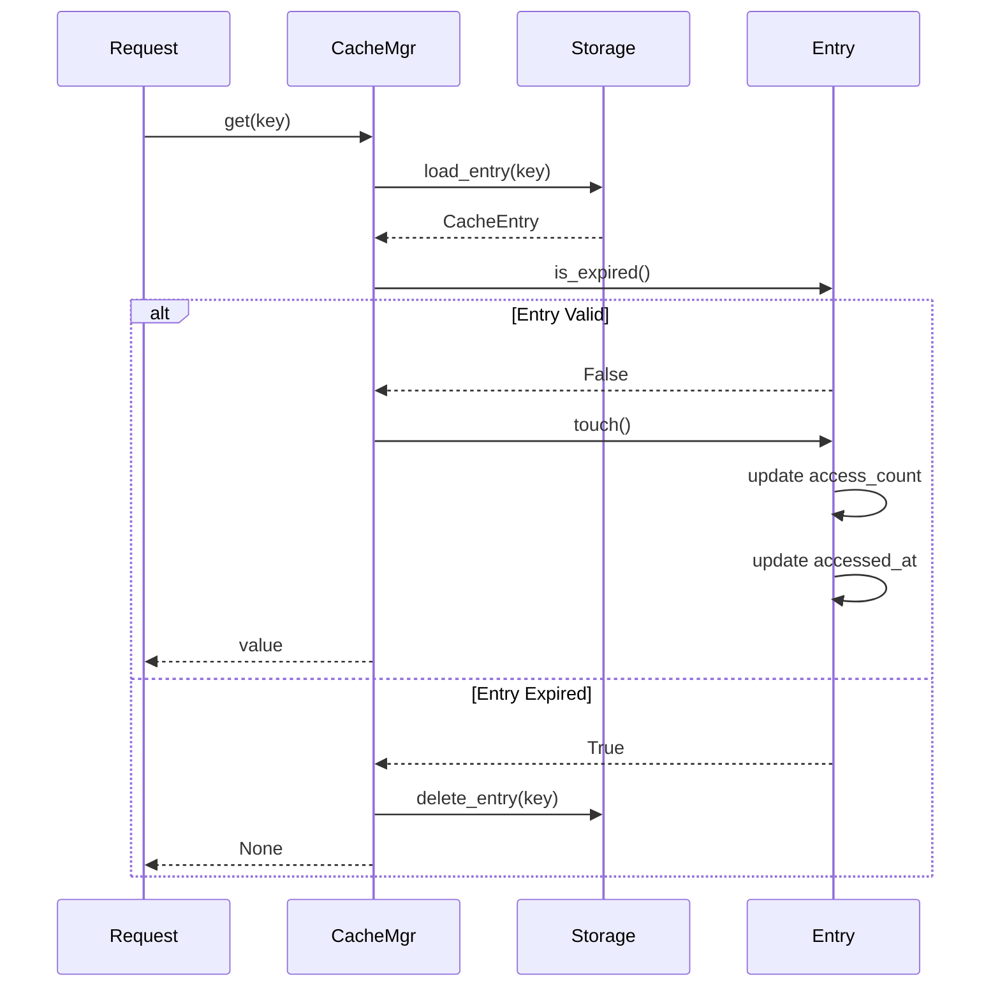

### Eviction Policies

1. **Time-Based (TTL)**
   - Entries expire after configured duration
   - Default: 24 hours for analysis results
   - Configurable per entry type

2. **Size-Based (LRU)**
   - Triggered when cache exceeds max size
   - Removes least recently accessed entries
   - Preserves frequently accessed results

3. **Manual Invalidation**
   - API endpoint for cache clearing
   - Selective invalidation by key pattern
   - Full cache flush capability

### Cache Statistics

The cache manager tracks comprehensive metrics:
- Hit rate (hits / total requests)
- Miss rate
- Average entry size
- Total cache size
- Entry count
- Eviction count
- Access patterns

---

## GitHub Integration

The GitHub integration layer provides seamless interaction with GitHub repositories, handling authentication, cloning, and metadata retrieval.

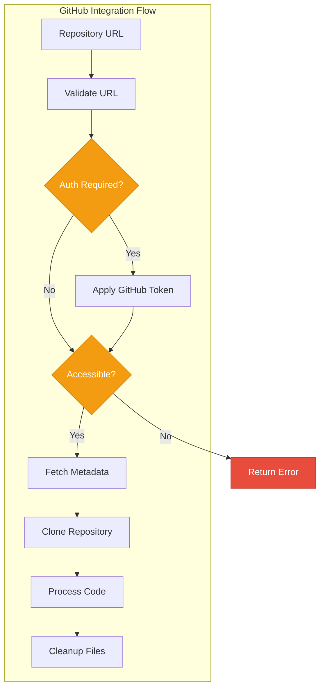

### GitHub URL Parsing

Supported URL formats:
- `https://github.com/owner/repo`
- `https://github.com/owner/repo.git`
- `https://github.com/owner/repo/tree/branch`
- `git@github.com:owner/repo.git`

### Repository Cloning

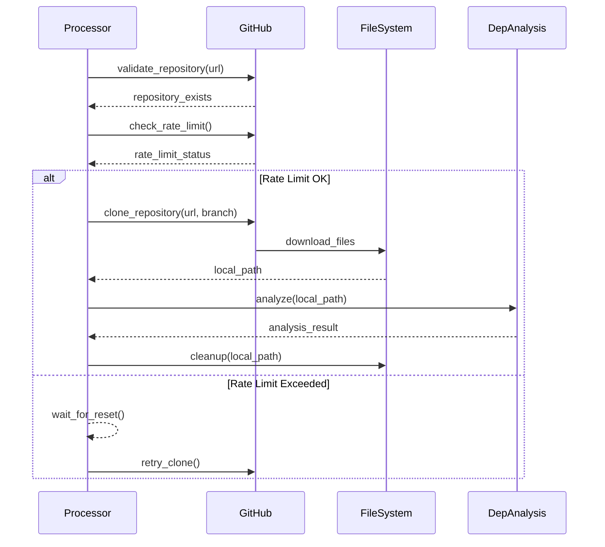

### Rate Limit Handling

GitHub API rate limits are carefully managed:
- **Unauthenticated**: 60 requests/hour
- **Authenticated**: 5,000 requests/hour
- **Monitoring**: Check remaining quota before operations
- **Backoff**: Exponential backoff when approaching limits
- **Caching**: Cache metadata to reduce API calls

---

## Web Routes and API

The web frontend exposes a RESTful API for interacting with the code analysis system.

### API Endpoints

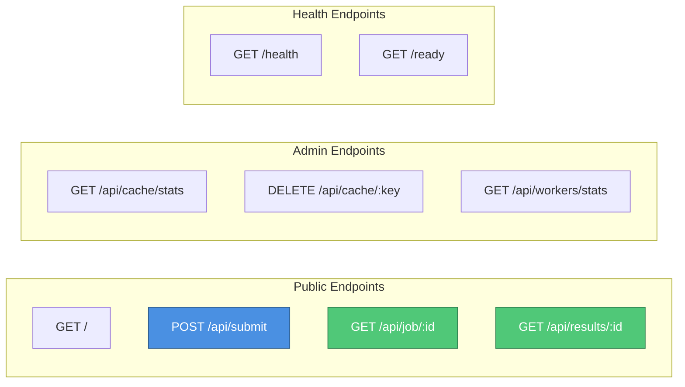

### Endpoint Specifications

#### POST /api/submit

Submit a repository for analysis.

**Request Body:**
```json
{
  "repository_url": "https://github.com/owner/repo",
  "branch": "main",
  "include_patterns": ["*.py", "*.js"],
  "exclude_patterns": ["tests/*", "*.test.js"],
  "options": {
    "max_depth": 5,
    "include_external": false
  }
}
```

**Response (202 Accepted):**
```json
{
  "job_id": "550e8400-e29b-41d4-a716-446655440000",
  "status": "queued",
  "message": "Repository submitted for analysis"
}
```

#### GET /api/job/:id

Get the status of a submitted job.

**Response (200 OK):**
```json
{
  "job_id": "550e8400-e29b-41d4-a716-446655440000",
  "status": "running",
  "progress": 45.5,
  "message": "Analyzing dependencies...",
  "started_at": "2024-01-15T10:30:00Z",
  "estimated_completion": "2024-01-15T10:35:00Z"
}
```

#### GET /api/results/:id

Retrieve analysis results for a completed job.

**Response (200 OK):**
```json
{
  "job_id": "550e8400-e29b-41d4-a716-446655440000",
  "repository": {
    "url": "https://github.com/owner/repo",
    "branch": "main",
    "analyzed_at": "2024-01-15T10:35:00Z"
  },
  "analysis": {
    "nodes": [...],
    "dependencies": [...],
    "statistics": {...}
  }
}
```

#### GET /api/cache/stats

Get cache statistics (admin endpoint).

**Response (200 OK):**
```json
{
  "total_entries": 150,
  "total_size_bytes": 52428800,
  "hit_rate": 0.85,
  "miss_rate": 0.15,
  "eviction_count": 23,
  "oldest_entry": "2024-01-10T08:00:00Z"
}
```

### Error Responses

All endpoints follow consistent error response format:

```json
{
  "error": {
    "code": "INVALID_REPOSITORY",
    "message": "Repository URL is invalid or inaccessible",
    "details": {
      "url": "https://github.com/invalid/repo",
      "reason": "Repository not found"
    }
  }
}
```

**Common Error Codes:**
- `INVALID_REQUEST` - Malformed request body
- `INVALID_REPOSITORY` - Repository URL invalid or inaccessible
- `JOB_NOT_FOUND` - Job ID does not exist
- `RATE_LIMIT_EXCEEDED` - GitHub API rate limit exceeded
- `PROCESSING_ERROR` - Error during analysis
- `CACHE_ERROR` - Cache operation failed

---

## Data Models

### RepositorySubmission (`codewiki.src.fe.models.RepositorySubmission`)

Represents a user's request to analyze a repository.

**Attributes:**
- `repository_url` (str): GitHub repository URL
- `branch` (str): Branch or tag to analyze (default: "main")
- `include_patterns` (List[str]): File patterns to include
- `exclude_patterns` (List[str]): File patterns to exclude
- `options` (Dict): Additional analysis options
- `submitted_at` (DateTime): Submission timestamp
- `submitted_by` (str): User identifier (if authenticated)

**Validation Rules:**
- Repository URL must be valid GitHub URL
- Branch must exist in repository
- Patterns must be valid glob expressions
- Options must conform to schema

**Example:**
```python
submission = RepositorySubmission(
    repository_url="https://github.com/owner/repo",
    branch="develop",
    include_patterns=["src/**/*.py"],
    exclude_patterns=["tests/**", "**/*.pyc"],
    options={"max_depth": 10}
)
```

### JobStatus (`codewiki.src.fe.models.JobStatus`)

Tracks the status and progress of an analysis job.

**Attributes:**
- `job_id` (str): Unique job identifier (UUID)
- `status` (str): Current status (QUEUED, RUNNING, COMPLETE, FAILED, CANCELLED)
- `progress` (float): Completion percentage (0-100)
- `message` (str): Human-readable status message
- `started_at` (DateTime): Job start timestamp
- `completed_at` (DateTime): Job completion timestamp
- `result` (Dict): Analysis results (when complete)
- `error` (Dict): Error information (when failed)

**Status Transitions:**
```
QUEUED → RUNNING → COMPLETE
                 → FAILED
                 → CANCELLED
```

**Example:**
```python
job = JobStatus(
    job_id="550e8400-e29b-41d4-a716-446655440000",
    status="RUNNING",
    progress=67.5,
    message="Analyzing module dependencies..."
)
```

### CacheEntry (`codewiki.src.fe.models.CacheEntry`)

Represents a cached analysis result with metadata.

**Attributes:**
- `key` (str): Cache key (hash of submission parameters)
- `value` (Any): Cached analysis result
- `created_at` (DateTime): Entry creation timestamp
- `accessed_at` (DateTime): Last access timestamp
- `expires_at` (DateTime): Expiration timestamp
- `metadata` (Dict): Additional metadata (size, version, etc.)
- `access_count` (int): Number of times accessed

**Cache Entry Lifecycle:**
1. Created when analysis completes
2. Accessed when matching request arrives
3. Touched on each access (updates `accessed_at`)
4. Expired based on TTL or evicted by LRU policy
5. Deleted when expired or invalidated

**Example:**
```python
entry = CacheEntry(
    key="abc123def456",
    value=analysis_result,
    created_at=datetime.now(),
    expires_at=datetime.now() + timedelta(hours=24),
    metadata={"size_bytes": 1024000, "version": "1.0"}
)
```

---

## Integration with Other Modules

The Web Frontend module integrates with multiple system modules to provide comprehensive functionality.

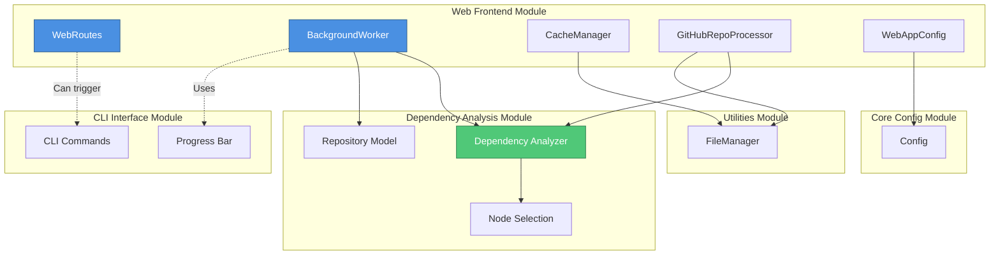

### Integration with Dependency Analysis Module

The web frontend relies heavily on the [Dependency Analysis](dependency_analysis.md) module for core analysis functionality:

- **Repository Processing**: `GitHubRepoProcessor` provides cloned repositories to the dependency analyzer
- **Analysis Execution**: `BackgroundWorker` invokes dependency analysis on submitted repositories
- **Result Handling**: Analysis results (Repository, Node, NodeSelection objects) are cached and returned via API
- **Progress Tracking**: Dependency analyzer provides progress callbacks to update job status

### Integration with Core Config Module

Configuration management is built on the [Core Config](core_config.md) module:

- **Configuration Inheritance**: `WebAppConfig` extends the base `Config` class
- **Shared Settings**: Common configuration values are inherited from core config
- **Environment Variables**: Both modules use consistent environment variable naming
- **Validation**: Configuration validation rules are shared across modules

### Integration with Utilities Module

File operations leverage the [Utilities](utilities.md) module:

- **Cache Storage**: `CacheManager` uses `FileManager` for persistent storage
- **Repository Cloning**: `GitHubRepoProcessor` uses `FileManager` for file operations
- **Temporary Files**: Background workers use `FileManager` for cleanup
- **Path Management**: All file path operations go through `FileManager`

### Integration with CLI Interface Module

The web frontend can optionally integrate with [CLI Interface](cli_interface.md):

- **Shared Progress Tracking**: Can use `ModuleProgressBar` for console output
- **Configuration Sharing**: Both modules can share configuration files
- **Command Triggering**: Web interface can trigger CLI commands programmatically
- **Result Format**: Both produce compatible output formats

---

## Request Flow

### Complete Request Flow Diagram

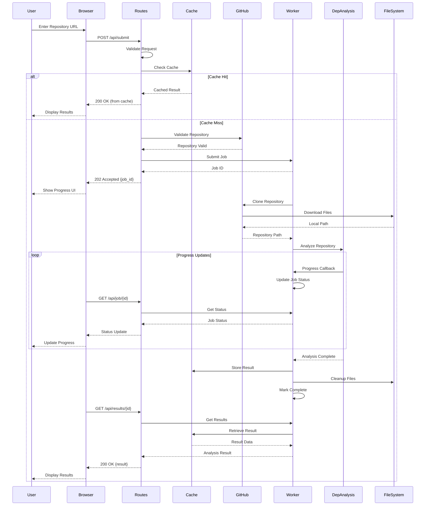

### Request Flow Stages

1. **Request Reception**
   - User submits repository URL via web interface
   - Browser sends POST request to `/api/submit`
   - `WebRoutes` receives and validates request
   - `RepositorySubmission` object is created

2. **Cache Check**
   - `CacheManager` generates cache key from submission
   - Cache is checked for existing results
   - If hit: Results returned immediately (fast path)
   - If miss: Processing continues (slow path)

3. **Repository Validation**
   - `GitHubRepoProcessor` validates repository URL
   - Checks repository accessibility
   - Verifies branch exists
   - Checks GitHub API rate limits

4. **Job Submission**
   - `BackgroundWorker` creates new job
   - Job assigned unique ID (UUID)
   - Job added to processing queue
   - Job ID returned to user (202 Accepted)

5. **Background Processing**
   - Worker thread picks up job
   - Repository is cloned to temporary directory
   - [Dependency Analysis](dependency_analysis.md) module analyzes code
   - Progress updates sent periodically
   - Results stored in cache upon completion

6. **Result Retrieval**
   - User polls job status endpoint
   - When complete, results endpoint is called
   - Results retrieved from cache
   - Formatted and returned to user

---

## Performance and Scalability

### Performance Optimization Strategies

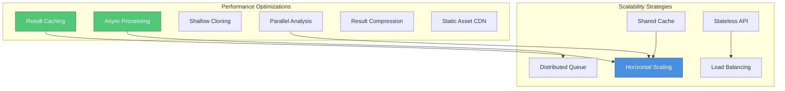

### Performance Metrics

**Target Performance:**
- API Response Time: < 100ms (cached)
- Job Submission: < 500ms
- Small Repository Analysis: < 30 seconds
- Medium Repository Analysis: < 2 minutes
- Large Repository Analysis: < 10 minutes
- Cache Hit Rate: > 80%
- Concurrent Jobs: 10+ simultaneous

### Scalability Considerations

1. **Horizontal Scaling**
   - Stateless API design enables multiple instances
   - Load balancer distributes requests
   - Shared cache (Redis) for multi-instance deployments
   - Distributed job queue (Celery/RabbitMQ)

2. **Resource Management**
   - Worker pool size configurable
   - Job timeout prevents resource exhaustion
   - Automatic cleanup of temporary files
   - Memory limits for large repositories

3. **Caching Strategy**
   - Multi-tier caching (memory + disk)
   - Cache warming for popular repositories
   - Intelligent eviction policies
   - Cache size monitoring and alerts

4. **Database Considerations**
   - Job status can be persisted to database
   - Cache index can use database for durability
   - Support for PostgreSQL, MySQL, SQLite
   - Connection pooling for efficiency

### Monitoring and Observability

**Key Metrics to Monitor:**
- Request rate and latency
- Job queue depth
- Worker utilization
- Cache hit/miss ratio
- GitHub API rate limit usage
- Error rates by endpoint
- Repository processing time distribution

**Logging:**
- Structured logging (JSON format)
- Request/response logging
- Job lifecycle events
- Error and exception tracking
- Performance profiling data

---

## Dependencies

### External Dependencies

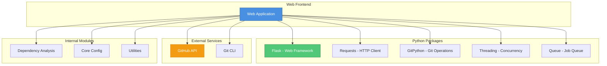

### Python Package Dependencies

- **Flask** (^2.0): Web framework for routing and request handling
- **Requests** (^2.28): HTTP client for GitHub API interactions
- **GitPython** (^3.1): Git repository operations
- **python-dotenv** (^0.19): Environment variable management
- **pydantic** (^1.10): Data validation and settings management
- **redis** (^4.3): Optional distributed cache backend
- **celery** (^5.2): Optional distributed task queue

### Internal Module Dependencies

- **[Dependency Analysis](dependency_analysis.md)**: Core analysis engine
  - Used by: `BackgroundWorker`, `GitHubRepoProcessor`
  - Provides: Repository analysis, dependency graphs

- **[Core Config](core_config.md)**: Configuration management
  - Used by: `WebAppConfig`
  - Provides: Base configuration class, validation

- **[Utilities](utilities.md)**: File and utility operations
  - Used by: `CacheManager`, `GitHubRepoProcessor`
  - Provides: File management, path operations

- **[CLI Interface](cli_interface.md)**: Command-line interface (optional)
  - Used by: `BackgroundWorker` (for progress tracking)
  - Provides: Progress bars, console output

### System Dependencies

- **Git**: Required for repository cloning
- **Python 3.8+**: Minimum Python version
- **File System**: Disk space for cache and temporary files
- **Network**: Internet access for GitHub API

---

## Summary

The Web Frontend module serves as the user-facing layer of the CodeWiki system, providing a modern web interface for code analysis. It orchestrates complex workflows involving repository validation, asynchronous processing, intelligent caching, and result delivery.

**Key Strengths:**
- **Asynchronous Architecture**: Non-blocking job processing ensures responsive UI
- **Intelligent Caching**: Reduces redundant processing and improves performance
- **GitHub Integration**: Seamless support for public and private repositories
- **Scalable Design**: Stateless API enables horizontal scaling
- **Comprehensive API**: RESTful endpoints for all operations
- **Robust Error Handling**: Graceful degradation and informative error messages

**Use Cases:**
- Interactive code exploration via web browser
- Automated repository analysis via API
- Team collaboration on code documentation
- Integration with CI/CD pipelines
- Code quality and dependency auditing

The module integrates seamlessly with the [Dependency Analysis](dependency_analysis.md) module for core functionality, [Core Config](core_config.md) for configuration management, and [Utilities](utilities.md) for file operations, creating a cohesive and powerful code analysis platform.
