# Web Routes API Module

## Overview

The **web_routes_api** module serves as the HTTP routing layer for the CodeWiki web application, providing RESTful endpoints and web interfaces for repository documentation generation. It acts as the primary interface between users and the documentation generation system, handling repository submissions, job status tracking, and documentation viewing.

This module implements a FastAPI-based routing system that orchestrates interactions between the background processing system, cache management, and GitHub integration components to deliver a seamless documentation generation experience.

---

## Architecture

### System Context

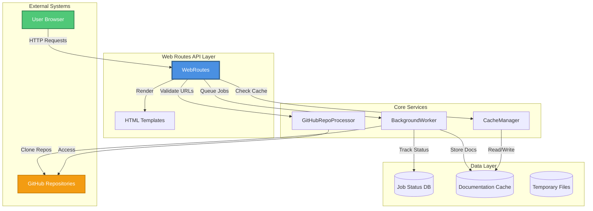

### Component Architecture

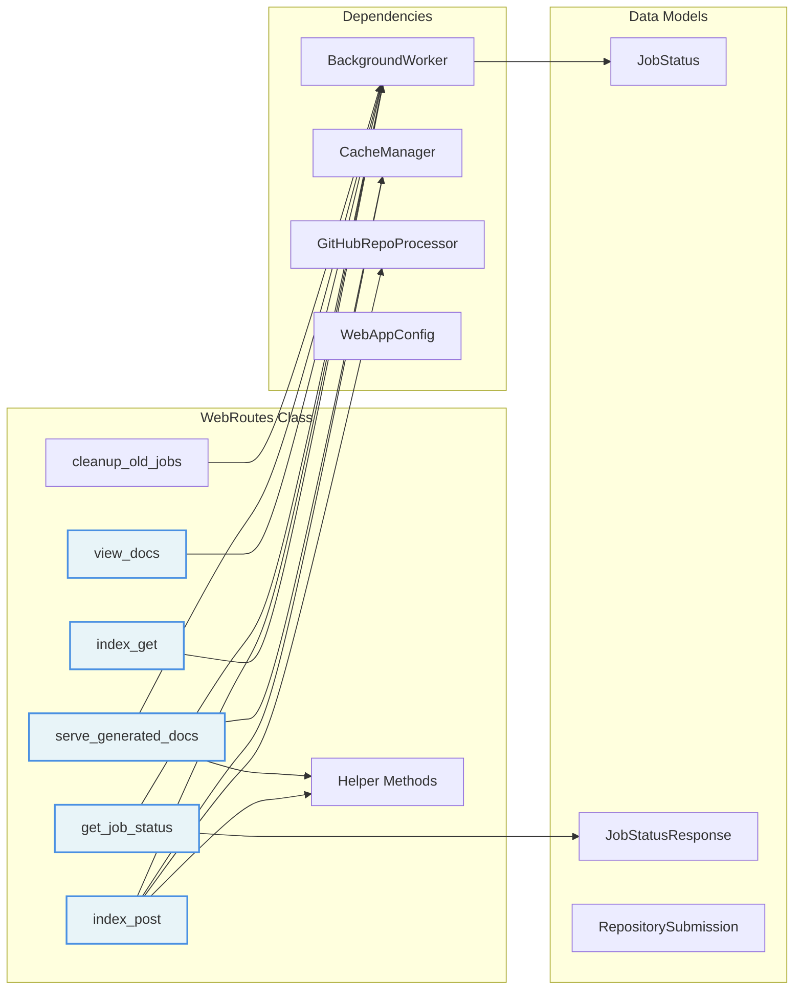

---

## Core Components

### WebRoutes Class

The central routing handler that manages all HTTP endpoints for the web application.

#### Initialization

```python
def __init__(self, background_worker: BackgroundWorker, cache_manager: CacheManager)
```

**Dependencies:**
- **BackgroundWorker**: Manages asynchronous documentation generation jobs (see [background_processing.md](background_processing.md))
- **CacheManager**: Handles documentation caching and retrieval (see [cache_management.md](cache_management.md))

#### Route Handlers

##### 1. Index Page (GET)
```python
async def index_get(self, request: Request) -> HTMLResponse
```

Displays the main landing page with repository submission form and recent job history.

**Workflow:**
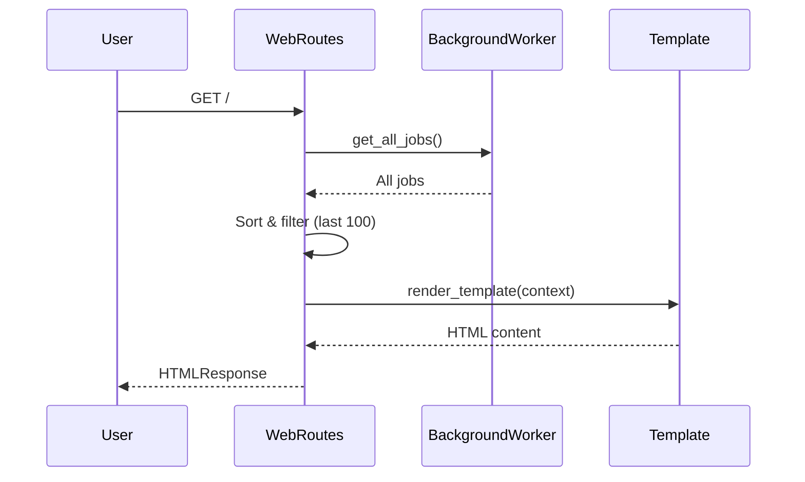

**Features:**
- Displays recent 100 jobs sorted by creation time
- Shows job status, progress, and completion information
- Provides form for new repository submissions

##### 2. Repository Submission (POST)
```python
async def index_post(self, request: Request, repo_url: str, commit_id: str) -> HTMLResponse
```

Handles repository submission requests with comprehensive validation and duplicate detection.

**Processing Flow:**
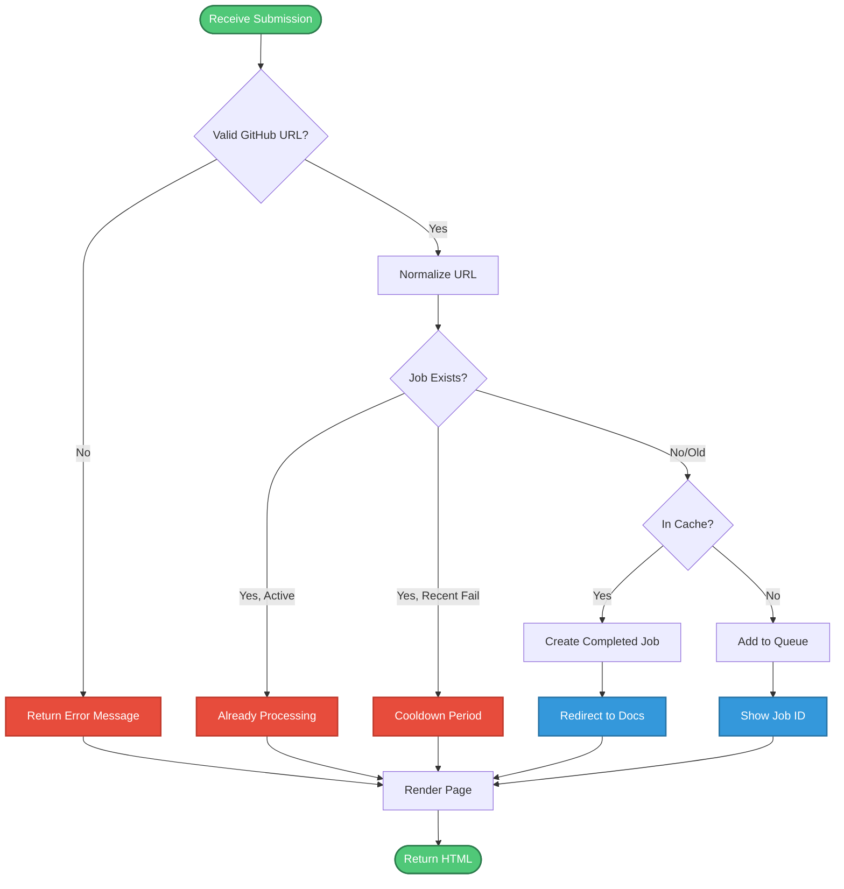

**Validation Steps:**
1. **URL Validation**: Ensures valid GitHub repository URL format
2. **Normalization**: Converts URL to canonical form for comparison
3. **Duplicate Detection**: Checks for existing jobs (queued, processing, or recently failed)
4. **Cooldown Enforcement**: Prevents retry within configured cooldown period
5. **Cache Check**: Verifies if documentation already exists in cache

**Job States Handled:**
- `queued`: Job waiting in processing queue
- `processing`: Job currently being processed
- `failed`: Job failed (with cooldown period)
- `completed`: Job successfully completed

##### 3. Job Status API (GET)
```python
async def get_job_status(self, job_id: str) -> JobStatusResponse
```

RESTful API endpoint for retrieving job status information.

**Response Model:**
```python
{
    "job_id": str,
    "repo_url": str,
    "status": str,  # queued, processing, completed, failed
    "created_at": datetime,
    "started_at": datetime | None,
    "completed_at": datetime | None,
    "error_message": str | None,
    "progress": str,
    "docs_path": str | None,
    "main_model": str | None,
    "commit_id": str | None
}
```

**Use Cases:**
- AJAX polling for real-time status updates
- External integrations and monitoring
- Client-side progress tracking

##### 4. Documentation Viewer (Redirect)
```python
async def view_docs(self, job_id: str) -> RedirectResponse
```

Redirects users to the documentation viewer for completed jobs.

**Validation:**
- Verifies job exists
- Ensures job status is `completed`
- Confirms documentation files exist on disk

##### 5. Documentation Server (GET)
```python
async def serve_generated_docs(self, job_id: str, filename: str) -> HTMLResponse
```

Serves generated documentation files with rich HTML rendering.

**Advanced Features:**
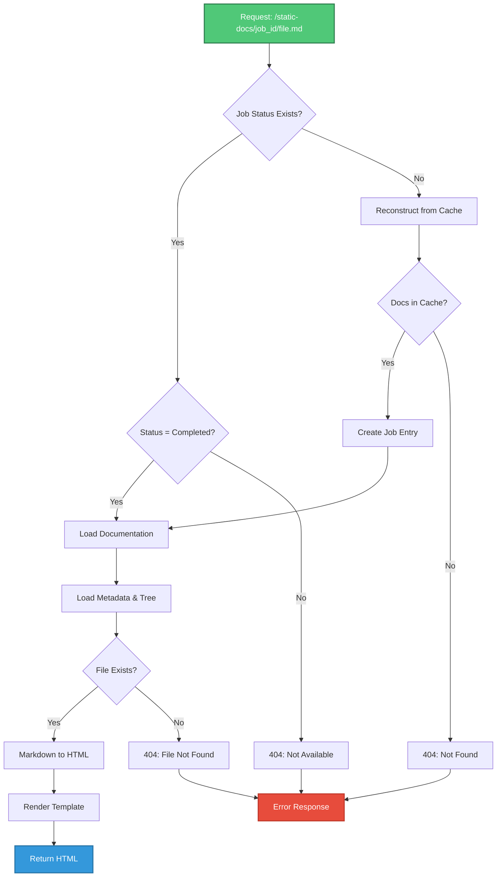

**Features:**
- **Job Reconstruction**: Automatically recreates job entries from cache for backward compatibility
- **Metadata Loading**: Loads module tree and repository metadata
- **Markdown Rendering**: Converts markdown to HTML with syntax highlighting
- **Navigation Support**: Provides module tree navigation structure

**Loaded Components:**
- `module_tree.json`: Hierarchical module structure
- `metadata.json`: Repository and generation metadata
- Requested markdown file (default: `overview.md`)

##### 6. Cleanup Operations
```python
def cleanup_old_jobs(self)
```

Removes expired job status entries to prevent database bloat.

**Cleanup Criteria:**
- Jobs older than configured cleanup hours (default: 24,000 hours / ~1000 days)
- Only removes `completed` or `failed` jobs
- Preserves active jobs (`queued`, `processing`)

---

## Helper Methods

### URL Normalization
```python
def _normalize_github_url(self, url: str) -> str
```

Converts GitHub URLs to canonical format for consistent comparison and caching.

**Normalization Process:**
1. Extract repository information using `GitHubRepoProcessor`
2. Construct standardized URL: `https://github.com/{owner}/{repo}`
3. Fallback to basic normalization (strip trailing slash, lowercase)

**Examples:**
```
https://github.com/owner/repo.git → https://github.com/owner/repo
https://GitHub.com/Owner/Repo/   → https://github.com/owner/repo
github.com/owner/repo            → https://github.com/owner/repo
```

### Job ID Conversion
```python
def _repo_full_name_to_job_id(self, full_name: str) -> str
def _job_id_to_repo_full_name(self, job_id: str) -> str
```

Bidirectional conversion between repository full names and URL-safe job identifiers.

**Conversion Logic:**
```
owner/repo ↔ owner--repo
```

This ensures job IDs are safe for use in URLs, file paths, and database keys.

---

## Data Flow

### Repository Submission Flow

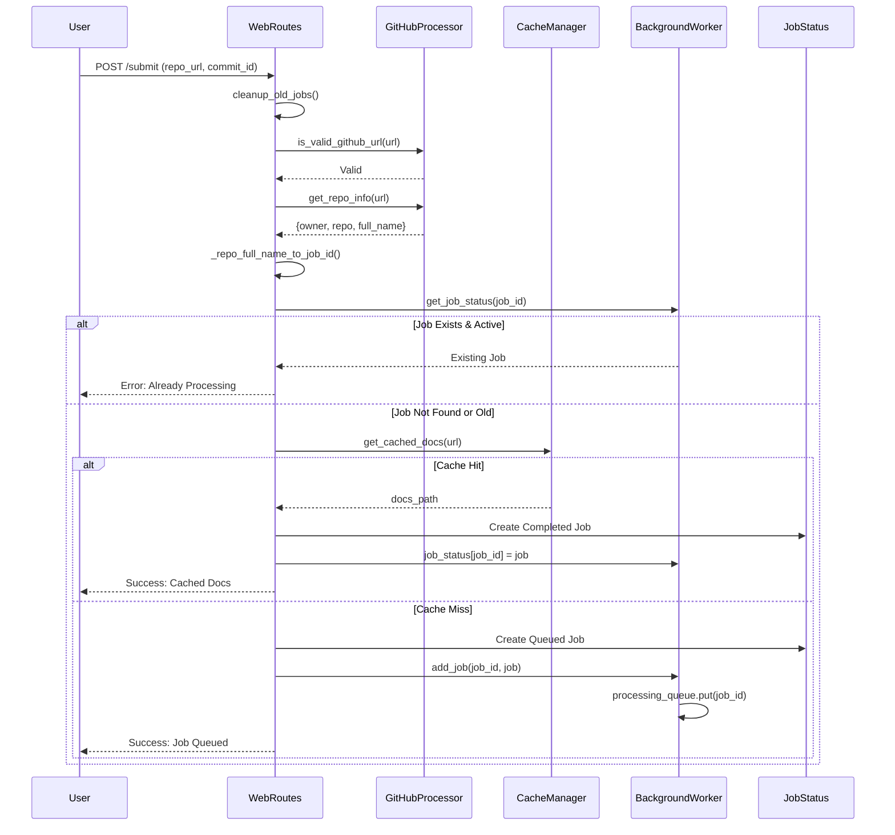

### Documentation Serving Flow

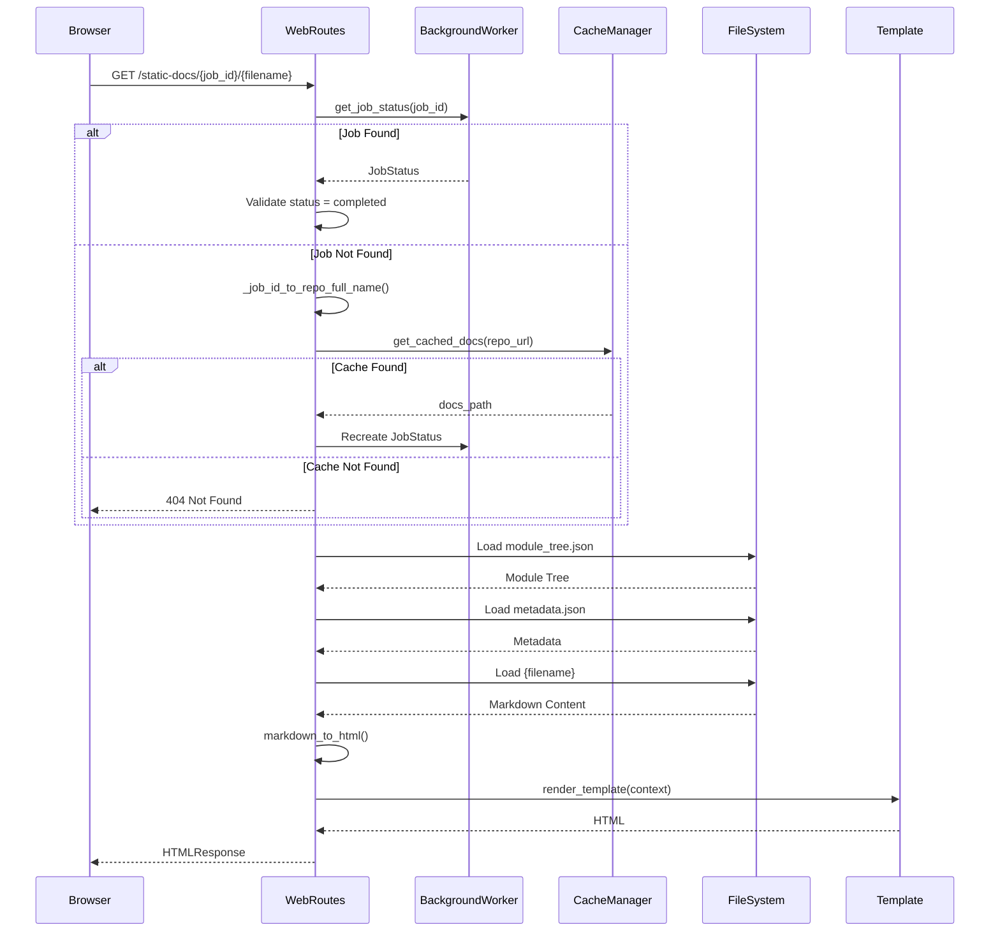

---

## Integration Points

### Background Processing Integration

The WebRoutes module integrates tightly with the [background_processing.md](background_processing.md) module:

**Job Management:**
- **Job Creation**: Creates `JobStatus` objects for new submissions
- **Queue Management**: Adds jobs to processing queue via `add_job()`
- **Status Tracking**: Retrieves job status via `get_job_status()`
- **Bulk Operations**: Fetches all jobs via `get_all_jobs()`

**Job Lifecycle:**
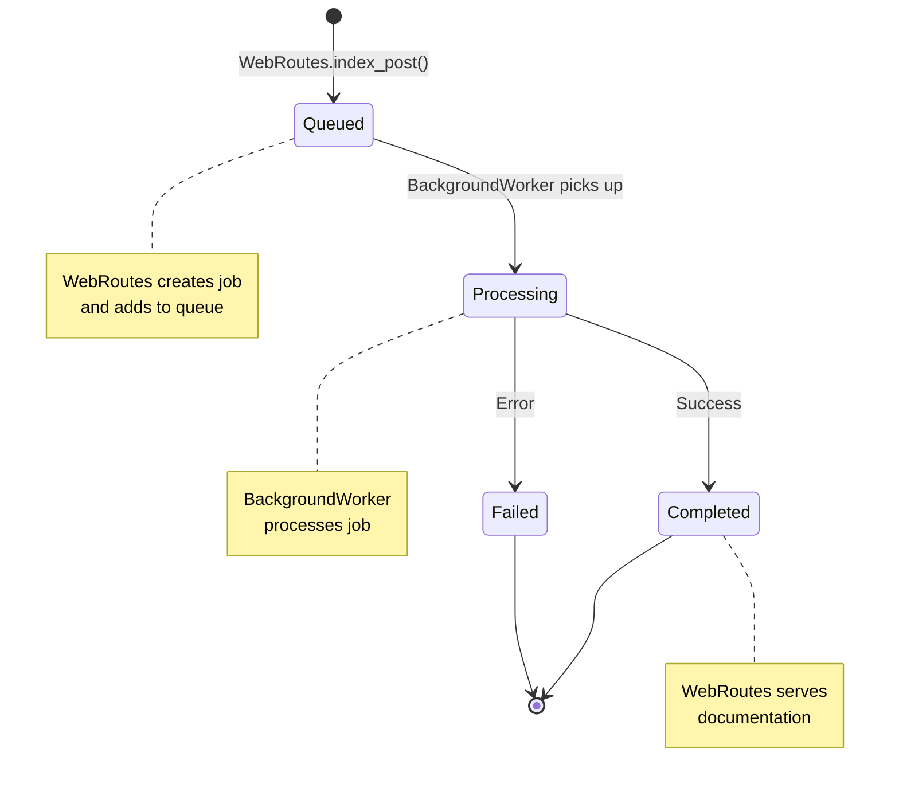

### Cache Management Integration

Integrates with [cache_management.md](cache_management.md) for performance optimization:

**Cache Operations:**
- **Cache Lookup**: Checks for existing documentation before queuing jobs
- **Cache Validation**: Verifies cached documentation exists on disk
- **Cache Reconstruction**: Rebuilds job status from cache entries

**Cache-First Strategy:**
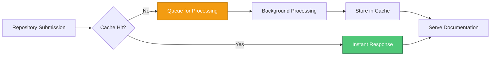

### GitHub Integration

Leverages [github_integration.md](github_integration.md) for repository validation:

**Validation Pipeline:**
1. **URL Validation**: `is_valid_github_url()` - Ensures proper GitHub URL format
2. **Repository Info**: `get_repo_info()` - Extracts owner, repo, and clone URL
3. **URL Normalization**: Standardizes URLs for consistent caching

### Configuration Integration

Uses [configuration_management.md](configuration_management.md) for application settings:

**Configuration Parameters:**
- `QUEUE_SIZE`: Maximum queue capacity
- `CACHE_EXPIRY_DAYS`: Cache retention period
- `JOB_CLEANUP_HOURS`: Job status retention period
- `RETRY_COOLDOWN_MINUTES`: Minimum time between retry attempts
- `CLONE_TIMEOUT`: Maximum time for repository cloning
- `CLONE_DEPTH`: Git clone depth for shallow clones

---

## Error Handling

### Error Categories

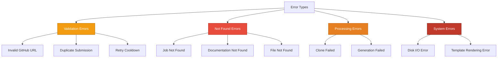

### Error Responses

| Error Type | HTTP Status | User Message | Action |
|------------|-------------|--------------|--------|
| Invalid URL | 200 (form error) | "Please enter a valid GitHub repository URL" | Display error in form |
| Duplicate Job | 200 (form error) | "Repository is already being processed" | Show existing job ID |
| Cooldown Active | 200 (form error) | "Please wait before retrying" | Display cooldown period |
| Job Not Found | 404 | "Job not found" | HTTPException |
| Docs Not Available | 404 | "Documentation not available" | HTTPException |
| File Not Found | 404 | "File {filename} not found" | HTTPException |
| Read Error | 500 | "Error reading {filename}: {error}" | HTTPException |

### Error Recovery

**Automatic Recovery Mechanisms:**
1. **Job Reconstruction**: Recreates missing job entries from cache
2. **Graceful Degradation**: Falls back to basic normalization if advanced fails
3. **Cleanup on Error**: Removes temporary files even on failure

---

## Performance Considerations

### Optimization Strategies

#### 1. Cache-First Architecture
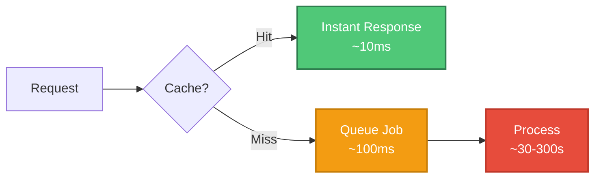

**Benefits:**
- Eliminates redundant processing for popular repositories
- Reduces server load and processing time
- Improves user experience with instant results

#### 2. Asynchronous Processing
- Non-blocking job submission
- Background worker handles heavy processing
- User receives immediate feedback with job ID

#### 3. Efficient Job Lookup
- In-memory job status dictionary
- O(1) lookup time for job status queries
- Periodic cleanup prevents memory bloat

#### 4. Lazy Loading
- Module tree and metadata loaded only when serving docs
- Markdown conversion performed on-demand
- Template rendering cached by FastAPI

### Scalability Considerations

**Current Limitations:**
- Single-threaded background worker
- In-memory job status storage
- File-based cache index

**Scaling Recommendations:**
1. **Horizontal Scaling**: Deploy multiple worker instances with shared queue (Redis/RabbitMQ)
2. **Database Migration**: Move job status to PostgreSQL/MongoDB for persistence
3. **Distributed Cache**: Use Redis for cache index and job status
4. **CDN Integration**: Serve static documentation via CDN
5. **Load Balancing**: Distribute web requests across multiple instances

---

## Security Considerations

### Input Validation

**URL Validation:**
```python
# Strict GitHub URL validation
if not GitHubRepoProcessor.is_valid_github_url(repo_url):
    return error_response("Invalid GitHub URL")
```

**Path Traversal Prevention:**
```python
# Ensure requested file is within docs directory
file_path = docs_path / filename
if not file_path.exists() or not file_path.is_relative_to(docs_path):
    raise HTTPException(status_code=404)
```

### Rate Limiting

**Cooldown Mechanism:**
- Prevents rapid retry attempts
- Configurable cooldown period (default: 3 minutes)
- Applies to failed jobs only

**Queue Size Limit:**
- Maximum queue capacity (default: 100 jobs)
- Prevents resource exhaustion
- Returns error when queue is full

### Resource Protection

**Timeout Controls:**
- Clone timeout: 300 seconds (configurable)
- Prevents hanging operations
- Automatic cleanup on timeout

**Disk Space Management:**
- Automatic cleanup of temporary files
- Cache expiry mechanism
- Job status cleanup

---

## Usage Examples

### Basic Repository Submission

**HTML Form:**
```html
<form method="POST" action="/">
    <input type="text" name="repo_url" placeholder="https://github.com/owner/repo">
    <input type="text" name="commit_id" placeholder="Optional commit SHA">
    <button type="submit">Generate Documentation</button>
</form>
```

**cURL Example:**
```bash
curl -X POST http://localhost:8000/ \
  -F "repo_url=https://github.com/owner/repo" \
  -F "commit_id=abc123"
```

### Job Status Polling

**JavaScript Example:**
```javascript
async function pollJobStatus(jobId) {
    const response = await fetch(`/api/job/${jobId}`);
    const status = await response.json();
    
    console.log(`Status: ${status.status}`);
    console.log(`Progress: ${status.progress}`);
    
    if (status.status === 'completed') {
        window.location.href = `/view-docs/${jobId}`;
    } else if (status.status === 'failed') {
        alert(`Error: ${status.error_message}`);
    } else {
        // Poll again in 2 seconds
        setTimeout(() => pollJobStatus(jobId), 2000);
    }
}
```

### Direct Documentation Access

**URL Patterns:**
```
# View documentation (redirects to overview)
GET /view-docs/{job_id}

# Serve specific documentation file
GET /static-docs/{job_id}/overview.md
GET /static-docs/{job_id}/module_name.md
GET /static-docs/{job_id}/architecture.md
```

---

## Configuration

### Environment Variables

The module respects configuration from [configuration_management.md](configuration_management.md):

```python
# Queue Configuration
QUEUE_SIZE = 100                    # Maximum jobs in queue

# Cache Configuration
CACHE_EXPIRY_DAYS = 365            # Cache retention period
CACHE_DIR = "./output/cache"       # Cache storage location

# Job Management
JOB_CLEANUP_HOURS = 24000          # Job status retention
RETRY_COOLDOWN_MINUTES = 3         # Minimum retry interval

# Server Configuration
DEFAULT_HOST = "127.0.0.1"         # Server bind address
DEFAULT_PORT = 8000                # Server port

# Git Configuration
CLONE_TIMEOUT = 300                # Clone timeout (seconds)
CLONE_DEPTH = 1                    # Shallow clone depth
```

### Runtime Configuration

**Initialization:**
```python
from codewiki.src.fe.routes import WebRoutes
from codewiki.src.fe.background_worker import BackgroundWorker
from codewiki.src.fe.cache_manager import CacheManager

# Initialize dependencies
cache_manager = CacheManager()
background_worker = BackgroundWorker(cache_manager)
background_worker.start()

# Initialize routes
routes = WebRoutes(background_worker, cache_manager)
```

---

## Testing Considerations

### Unit Testing

**Test Coverage Areas:**
1. **URL Validation**: Test various GitHub URL formats
2. **Job ID Conversion**: Verify bidirectional conversion
3. **Duplicate Detection**: Test job existence checks
4. **Cache Integration**: Mock cache hits and misses
5. **Error Handling**: Test all error paths

**Example Test:**
```python
def test_normalize_github_url():
    routes = WebRoutes(mock_worker, mock_cache)
    
    # Test various URL formats
    assert routes._normalize_github_url("https://github.com/owner/repo.git") == \
           "https://github.com/owner/repo"
    assert routes._normalize_github_url("github.com/owner/repo/") == \
           "https://github.com/owner/repo"
```

### Integration Testing

**Test Scenarios:**
1. **End-to-End Submission**: Submit repository and verify job creation
2. **Cache Retrieval**: Submit cached repository and verify instant response
3. **Documentation Serving**: Request documentation and verify rendering
4. **Job Status API**: Poll job status and verify state transitions

### Load Testing

**Performance Benchmarks:**
- Concurrent submissions: 100 requests/second
- Job status queries: 1000 requests/second
- Documentation serving: 500 requests/second
- Cache hit ratio: >80% for popular repositories

---

## Monitoring and Observability

### Key Metrics

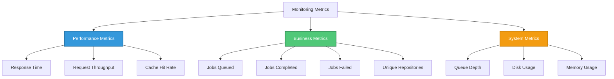

### Logging Strategy

**Log Levels:**
- **INFO**: Job submissions, completions, cache hits
- **WARNING**: Duplicate submissions, cooldown violations
- **ERROR**: Processing failures, file not found errors
- **DEBUG**: URL normalization, job ID conversions

**Example Logs:**
```
INFO: Job abc123: Repository added to queue
INFO: Job abc123: Using cached documentation
WARNING: Job abc123: Repository already being processed
ERROR: Job abc123: Failed with error: Clone timeout
```

---

## Future Enhancements

### Planned Features

1. **Webhook Support**: GitHub webhook integration for automatic updates
2. **API Authentication**: Token-based authentication for API endpoints
3. **Batch Processing**: Submit multiple repositories at once
4. **Custom Themes**: User-selectable documentation themes
5. **Export Formats**: PDF, EPUB, and static site generation
6. **Search Integration**: Full-text search across documentation
7. **Analytics Dashboard**: Usage statistics and insights
8. **Collaborative Features**: Comments and annotations

### Architecture Evolution

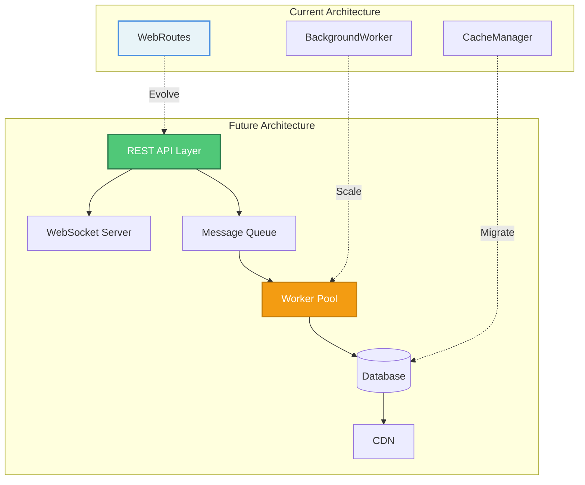

---

## Related Modules

- **[background_processing.md](background_processing.md)**: Asynchronous job processing and worker management
- **[cache_management.md](cache_management.md)**: Documentation caching and retrieval system
- **[github_integration.md](github_integration.md)**: GitHub repository validation and cloning
- **[configuration_management.md](configuration_management.md)**: Application configuration and settings
- **[data_models.md](data_models.md)**: Data structures for jobs, cache, and submissions
- **[web_application.md](web_application.md)**: Parent module containing all web components

---

## Conclusion

The **web_routes_api** module serves as the critical interface layer between users and the CodeWiki documentation generation system. By orchestrating interactions between background processing, cache management, and GitHub integration, it provides a robust, performant, and user-friendly web application.

Key strengths include:
- **Cache-first architecture** for optimal performance
- **Comprehensive validation** for security and reliability
- **Asynchronous processing** for scalability
- **Graceful error handling** for resilience
- **Flexible integration** with core services

The module's design prioritizes user experience while maintaining system stability and performance, making it the cornerstone of the CodeWiki web application.
